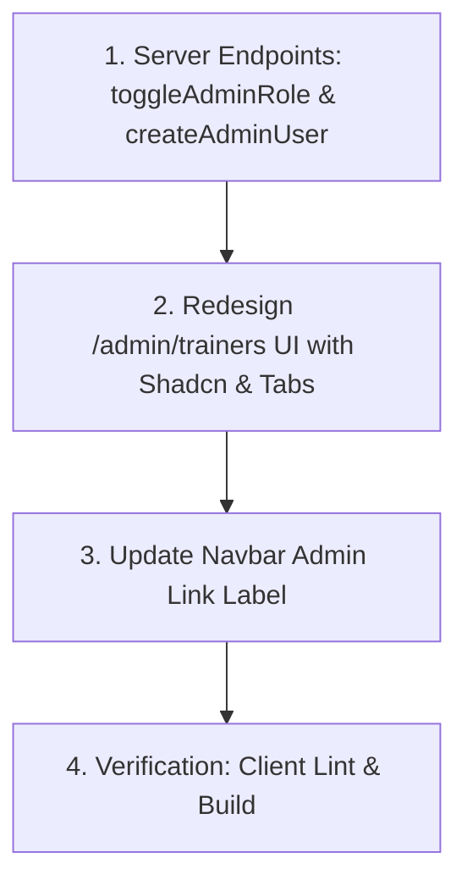

# Task Plan: Admin Trainers & Admin Roles Management

- **Document ID**: `docs/tasks/admin-trainers-and-roles-management-task-plan.md`
- **Date**: 2026-07-25
- **Status**: DRAFT (Awaiting User Approval)

## Task Graph & Dependencies

## Work Items

1. **Server Controller & Route Implementation**:
   - `server/src/controllers/classroomController.ts`: Implement `toggleAdminRole` and `createAdminUser` with authorization & self-demotion safety checks.
   - `server/src/routes/classroomRoute.ts`: Register `POST /admin/toggle-admin` and `POST /admin/create-admin`.

2. **Redesign `/admin/trainers` UI**:
   - `client/src/app/admin/trainers/TrainersManagementClient.js`:
     - Standardize design layout using Shadcn UI (`Card`, `CardHeader`, `CardTitle`, `CardDescription`, `CardContent`, `Table`, `Badge`, `Button`, `Input`, `Dialog`, `Tabs`).
     - Remove ad-hoc `--profile-accent-*` CSS variables and custom gradient backdrops.
     - Build Tabbed view: `Trainers` tab and `Admins` tab.
     - Add search and filtering capabilities.
     - Implement **Create Custom Trainer** modal form.
     - Implement **Create Custom Admin** modal form.
     - Implement **Grant / Revoke Trainer** action buttons.
     - Implement **Assign / Revoke Admin** action buttons with self-lockout warning safeguards.

3. **Navbar Navigation Label Update**:
   - `client/src/components/Navbar.js`: Update label for `/admin/trainers` under `adminTools` to `"Manage Trainers & Admins"`.

4. **Verification**:
   - Run `npm run lint` in `client/`.
   - Run `npm run build` in `client/` to verify zero build or compilation errors.

5. **Knowledge Base Update**:
   - Update `docs/knowledge-base/` with decision and pattern notes.
