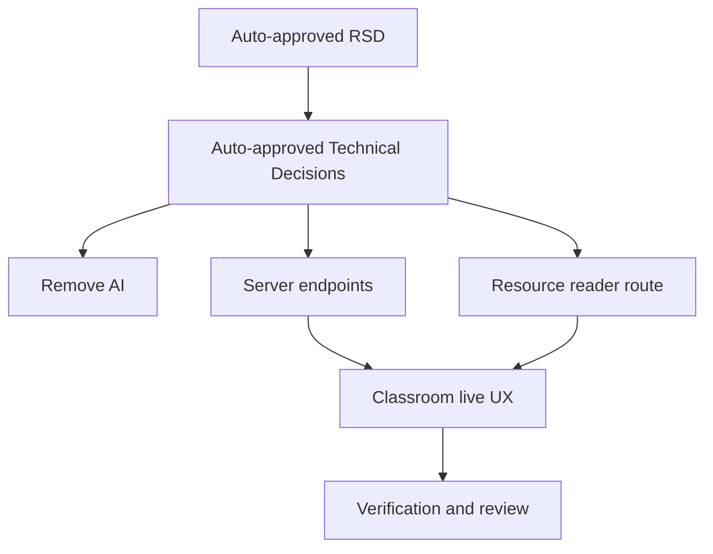

# Classroom Resource Reader and Problem Preview Task Plan

Status: Complete
Task ID: classroom-resource-reader-problem-preview-20260725
Last updated: 2026-07-25
Delivery mode: Auto

## Documentation and Knowledge Used

- Source: `docs/rsd/classroom-resource-reader-problem-preview-20260725-rsd.md`
  Used for: task scope.
  Evidence: remove AI, add reader route, improve lists, add preview card.
  Confidence: High

- Source: `docs/decisions/classroom-resource-reader-problem-preview-20260725-technical-decisions.md`
  Used for: implementation boundaries.
  Evidence: no AI, server-authorized resource detail, client-side list batching, explicit problem preview.
  Confidence: High

- Source: `client/src/app/classroom/live/[id]/ClassroomLiveClient.js`
  Used for: UI write scope.
  Evidence: current resource and problem UI are colocated here.
  Confidence: High

- Source: `server/src/controllers/classroomController.ts`
  Used for: server write scope.
  Evidence: existing resource and problem functions live here.
  Confidence: High

## Dependency Graph

## Tasks

### T1: Remove AI Writing Feature

Purpose:
Delete unused AI authoring feature and dependency.

Depends on:
Technical decisions.

Write scope:
- `client/package.json`
- `client/package-lock.json`
- `client/src/lib/trainer-writing-ai.js`
- `client/src/components/trainer/TrainerWritingAssistant.jsx`
- `client/src/app/trainer/dashboard/TrainerDashboardClient.js`
- `client/src/app/classroom/live/[id]/ClassroomLiveClient.js`
- `docs/adr/0001-browser-side-gemma-webgpu-writing-assistant.md`

Acceptance checks:
- [ ] No stale imports or references.
- [ ] Dependency removed.

Verification:
- Targeted ESLint/build.

### T2: Add Resource Detail and Problem Preview APIs

Purpose:
Support readable resource pages and assign-time metadata preview.

Depends on:
Technical decisions.

Write scope:
- `server/src/controllers/classroomController.ts`
- `server/src/routes/classroomRoute.ts`

Acceptance checks:
- [ ] Resource detail validates classroom access.
- [ ] Problem preview validates trainer access and returns metadata.

Verification:
- Server bundle check.

### T3: Add Resource Reader Route

Purpose:
Let students open resources as focused pages.

Depends on:
T2.

Write scope:
- `client/src/app/classroom/live/[id]/resources/[resourceId]/page.js`
- optional local client/view component in same folder.

Acceptance checks:
- [ ] Dedicated route renders title, metadata, external URL action, markdown body.
- [ ] Raw HTML is disabled.

Verification:
- Client build.

### T4: Improve Classroom Live Resource and Problem UX

Purpose:
Make resource authoring immersive, lists scalable, sections cleaner, and problem cards richer.

Depends on:
T1, T2, T3.

Write scope:
- `client/src/app/classroom/live/[id]/ClassroomLiveClient.js`

Acceptance checks:
- [ ] Resource studio has scope dropdown, preview, editor, and reader links.
- [ ] Resources/problems/history/students/teams have scroll/incremental display where relevant.
- [ ] Secondary actions use dropdowns where useful.
- [ ] Problem preview card appears before assign.
- [ ] Student problem cards are richer and motivating.

Verification:
- Targeted ESLint and build.

### T5: Verification, Review, and Knowledge Update

Purpose:
Record traceability, reviews, security checks, and project memory.

Depends on:
T1-T4.

Write scope:
- `docs/reviews/classroom-resource-reader-problem-preview-20260725-implementation-review.md`
- `docs/knowledge-base/*.md`

Acceptance checks:
- [ ] Review covers requirements, HCI, code quality, security, verification.
- [ ] Knowledge base records durable route/API/UI lessons and mistake note.

Verification:
- `git diff --check`

## Final Git Integration Plan

- Base ref: current working branch.
- Integration branch or main worktree: current workspace.
- Branches/worktrees to merge: none.
- Merge order: serial tasks T1-T5.
- Full verification after integration:
  - targeted ESLint for changed client files
  - `npm run build` from `client/` when feasible
  - server bundle check
  - `git diff --check`
