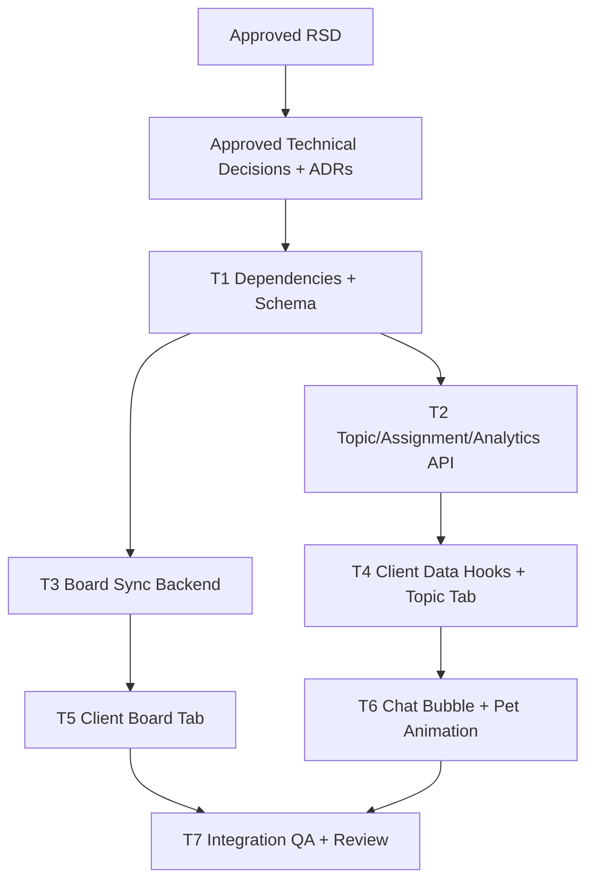

# Classroom Team Topic Board Chat Task Plan

Status: Approved
Task ID: classroom-team-topic-board-chat-20260725
Last updated: 2026-07-25
Delivery mode: Auto requested, repo task-plan gate enforced

## Mode and Gate Results

Gates waited on:
- RSD gate approved by user in chat on 2026-07-25.
- Technical decision gate approved by user in chat on 2026-07-25.
- Task-plan gate approved by user in chat on 2026-07-25.

Gates skipped:
- None for this task plan.

Waivers:
- None.

User approvals:
- Full task plan and dependency graph approved by user in chat on 2026-07-25.

## Documentation and Knowledge Used

- Source: `docs/rsd/classroom-team-topic-board-chat-20260725-rsd.md`
  Used for: requirements and acceptance criteria.
  Evidence: approved scope includes classroom topic/team assignment, analytics, tldraw board, and pet chat bubble.
  Confidence: High.

- Source: `docs/decisions/classroom-team-topic-board-chat-20260725-technical-decisions.md`
  Used for: task boundaries and dependency order.
  Evidence: approved decisions require classroom-scoped topics, sparse progress, derived analytics, app-hosted tldraw sync, polling chat bubble, and dotLottie runtime.
  Confidence: High.

- Source: `docs/adr/0003-classroom-topic-team-assignment-model.md`
  Used for: database and API tasks.
  Evidence: accepted model keeps topic/team progress separate from `class_problems`.
  Confidence: High.

- Source: `docs/adr/0004-ephemeral-tldraw-board-sync.md`
  Used for: board sync tasks.
  Evidence: accepted board model uses in-memory `TLSocketRoom` plus metadata only.
  Confidence: High.

- Source: `AGENTS.md`
  Used for: required gates, knowledge-base updates, and verification commands.
  Evidence: RSD-first gates and narrow verification are required.
  Confidence: High.

- Source: `docs/knowledge-base/project-index.md`
  Used for: entry points.
  Evidence: classroom live and API work centers on `ClassroomLiveClient.js`, `classroomController.ts`, and `classroomRoute.ts`.
  Confidence: High.

- Source: `docs/knowledge-base/decisions.md`
  Used for: architecture constraints.
  Evidence: approved decisions now record classroom-scoped topic model, separate team-topic assignment, and ephemeral tldraw sync.
  Confidence: High.

- Source: `docs/knowledge-base/patterns.md`
  Used for: UI patterns.
  Evidence: topic workflow should present "build topic unit" before "assign to team"; preview before assignment remains important.
  Confidence: High.

- Source: `docs/knowledge-base/quality-rules.md`
  Used for: review checks.
  Evidence: do not weaken `class_problems.class_id`; board WebSocket must use short-lived tokens.
  Confidence: High.

- Source: `docs/knowledge-base/hci-rules.md`
  Used for: UI and state checks.
  Evidence: topic assignment mental model and ephemeral board states must be visible.
  Confidence: High.

- Source: `C:\Users\Arik\.codex\skills\rsd-orchestrator-agent\references\worktree-parallelism.md`
  Used for: serial versus parallel plan.
  Evidence: parallel tasks require disjoint write scopes; this task has overlapping write scopes.
  Confidence: High.

## Dependency Graph

## Parallelism Decision

Implementation will run serially in the main workspace.

Reason:
The approved work touches overlapping files and contracts: `server/src/utils/dbInit.ts`, `server/src/controllers/classroomController.ts`, `server/src/routes/classroomRoute.ts`, `server/src/index.ts`, package files, and `client/src/app/classroom/live/[id]/ClassroomLiveClient.js`. Parallel worktrees would either duplicate controller/schema edits or force fragile integration across the same page component.

Branch/worktree:
- Base ref: `d1b472b` on `master`.
- Implementation target: current main workspace.
- No parallel worktrees.

Dirty-worktree note:
Repository already contains many unrelated uncommitted changes. Implementation must preserve them and edit only approved write scopes.

## Tasks

### T1: Dependencies and Database Shape

Purpose:
Install approved dependencies and add schema support for classroom topics, topic resources/problems, team-topic assignments, sparse progress, and board session metadata.

Depends on:
- Approved technical decisions.

Write scope:
- `client/package.json`
- `client/package-lock.json`
- `server/package.json`
- `server/bun.lock`
- `server/bun.lockb` if Bun updates it
- `server/src/utils/dbInit.ts`

Agent:
- Main agent.

Branch/worktree:
- Main workspace.

Acceptance checks:
- [ ] Client dependencies include `tldraw`, `@tldraw/sync`, and `@lottiefiles/dotlottie-react`.
- [ ] Server dependencies include `@tldraw/sync-core`.
- [ ] New tables and indexes are created idempotently with `CREATE TABLE IF NOT EXISTS`, `ALTER TABLE IF EXISTS`, and/or `CREATE INDEX IF NOT EXISTS`.
- [ ] Existing `class_problems.class_id` remains required.
- [ ] Board session table stores metadata only, not drawing snapshots.

HCI checks:
- [ ] Schema supports visible topic unit and assignment state.
- [ ] Board session status supports active/ended UI state.

Code-quality checks:
- [ ] New tables follow existing naming and PostgreSQL style.
- [ ] No broad migration rewrites or unrelated schema churn.

Verification:
- `Set-Location server; bun build src/index.ts --target=bun --outdir .codex-build`
- `Set-Location client; npm run lint -- --file src/app/classroom/live/[id]/ClassroomLiveClient.js` if supported by local ESLint, else use targeted `npx eslint`.

### T2: Topic, Team Assignment, Progress, and Analytics API

Purpose:
Add Hono controller/routes for topic CRUD, topic problem/resource management, team-topic assignment, student topic work, status updates, and trainer analytics.

Depends on:
- T1.

Write scope:
- `server/src/controllers/classroomController.ts`
- `server/src/routes/classroomRoute.ts`

Agent:
- Main agent.

Branch/worktree:
- Main workspace.

Acceptance checks:
- [ ] Trainer/admin can create/list/update topics in an authorized classroom.
- [ ] Trainer/admin can add resources and problems to a topic.
- [ ] Trainer/admin can assign a topic to a classroom team.
- [ ] Student can list only topic assignments available through their team membership.
- [ ] Student can update their own topic problem status.
- [ ] Trainer/admin can update or inspect member progress.
- [ ] Trainer/admin analytics endpoint returns team/member solve, tried, pending, and solve-rate counts from topic progress plus existing class problem rows.
- [ ] Cross-classroom and unauthorized access fail.

HCI checks:
- [ ] API returns enough labels/counts for preview and neutral analytics, not raw ids only.
- [ ] Errors are specific enough for field-level or panel-level UI feedback.

Code-quality checks:
- [ ] Access checks use or extend existing classroom helpers.
- [ ] Analytics derivation lives server-side, not duplicated in the client.
- [ ] Query helpers keep topic assignment policy separate from live-class problem mechanics.

Verification:
- `Set-Location server; bun build src/index.ts --target=bun --outdir .codex-build`
- Focused manual HTTP checks if auth token is available.

### T3: Ephemeral tldraw Board Backend

Purpose:
Add board session HTTP endpoints, short-lived join-token creation, and Bun/Hono WebSocket sync room lifecycle.

Depends on:
- T1.

Write scope:
- `server/src/index.ts`
- `server/src/controllers/classroomController.ts`
- `server/src/routes/classroomRoute.ts`
- New server module if useful, for example `server/src/utils/classroomBoardSync.ts`

Agent:
- Main agent.

Branch/worktree:
- Main workspace.

Acceptance checks:
- [ ] Trainer/admin can start and stop one active board session per classroom/class scope.
- [ ] Authorized classroom members can request a short-lived board join token.
- [ ] WebSocket validates join token, session status, classroom access, and role.
- [ ] Trainer/admin joins writable.
- [ ] Student joins readonly.
- [ ] Drawing data remains in memory only.
- [ ] Ended sessions reject new board connections.
- [ ] Image/video upload persistence is blocked or clearly unsupported.

HCI checks:
- [ ] Backend provides enough state for connecting, active, ended, readonly, and restart-lost messaging.

Code-quality checks:
- [ ] `TLSocketRoom` lifecycle is isolated from general classroom controller logic when practical.
- [ ] No long-lived app JWT appears directly in WebSocket URI.

Verification:
- `Set-Location server; bun build src/index.ts --target=bun --outdir .codex-build`
- Manual WebSocket smoke through browser after client task.

### T4: Client Data Hooks and Trainer Topics Tab

Purpose:
Add classroom live UI for topic library, topic resources/problems, topic assignment to teams, team/member analytics, and student topic work.

Depends on:
- T2.

Write scope:
- `client/src/app/classroom/live/[id]/ClassroomLiveClient.js`
- Small nearby client component files only if they reduce complexity, for example `client/src/app/classroom/live/[id]/ClassroomTopicsPanel.jsx`
- `client/src/lib/action.js` only if existing helper coverage is insufficient.

Agent:
- Main agent.

Branch/worktree:
- Main workspace.

Acceptance checks:
- [ ] Trainer sees `Topics` tab separate from `Live`.
- [ ] Trainer can create topic unit with module/title/description.
- [ ] Trainer can add topic resources and problems with trainer difficulty and tags.
- [ ] Trainer can preview included resources/problems before assigning.
- [ ] Trainer can assign topic to a team.
- [ ] Trainer sees team/member analytics with neutral labels.
- [ ] Student sees assigned topic work through their team membership.
- [ ] Existing individual/class problem assignment still works.

HCI checks:
- [ ] "Build topic unit" and "Assign to team" are visually distinct.
- [ ] Assignment preview clearly shows target team and included items.
- [ ] Empty/loading/error states exist near each panel.
- [ ] Responsive layout does not overflow into chat/board surfaces.

Code-quality checks:
- [ ] Keep endpoint strings localized.
- [ ] Use local helpers/components to contain repeated JSX without a global abstraction.
- [ ] Preserve existing polling and active/past problem state.

Verification:
- `Set-Location client; npx eslint "src/app/classroom/live/[id]/ClassroomLiveClient.js"`
- Manual browser scenario.

### T5: Client Board Tab

Purpose:
Add tldraw board tab/section using `useSync`, board session endpoints, short-lived join tokens, readonly student mode, and visible ephemeral state.

Depends on:
- T3.

Write scope:
- `client/src/app/classroom/live/[id]/ClassroomLiveClient.js`
- New client component if useful, for example `client/src/app/classroom/live/[id]/ClassroomBoardPanel.jsx`
- `client/src/app/globals.css` only if tldraw layout import/styling requires it.

Agent:
- Main agent.

Branch/worktree:
- Main workspace.

Acceptance checks:
- [ ] Trainer can start board broadcast.
- [ ] Trainer can draw in tldraw.
- [ ] Student can join active board and see trainer changes.
- [ ] Student board is readonly.
- [ ] Trainer can stop board broadcast.
- [ ] Board shows no-permanent-save notice.
- [ ] Connecting/error/ended states are visible.

HCI checks:
- [ ] Board state is visible near controls.
- [ ] Disconnect/retry path is clear.
- [ ] Board canvas has stable dimensions and does not render blank.

Code-quality checks:
- [ ] tldraw imports are client-only.
- [ ] Board logic is contained and does not pollute topic/chat state.

Verification:
- `Set-Location client; npx eslint "src/app/classroom/live/[id]/ClassroomLiveClient.js"`
- Browser/manual WebSocket scenario.

### T6: Floating Chat Bubble and Pet Animation

Purpose:
Move classroom chat into a bottom-right floating bubble, render `/pet.lottie`, preserve class scope/direct/broadcast/reaction behavior, and support reduced motion.

Depends on:
- T1 for dotLottie dependency.
- Existing chat API.
- T4/T5 layout integration.

Write scope:
- `client/src/app/classroom/live/[id]/ClassroomLiveClient.js`
- New small chat component if useful, for example `client/src/app/classroom/live/[id]/ClassroomChatBubble.jsx`
- `client/src/components/ui/bubble.jsx`
- `client/src/components/ui/message.jsx`
- `client/src/app/globals.css` only if fixed bubble layering/focus styling requires it.

Agent:
- Main agent.

Branch/worktree:
- Main workspace.

Acceptance checks:
- [ ] Chat sidebar is removed from the desktop grid.
- [ ] Bottom-right bubble opens/closes for trainer and student.
- [ ] Bubble includes `/pet.lottie` when motion is allowed.
- [ ] Reduced-motion fallback appears when needed.
- [ ] Chat class scope remains visible.
- [ ] Direct/broadcast target, reactions, send, empty, loading, error, and read-only completed-class behavior remain.
- [ ] Bubble does not cover critical controls on mobile/desktop.

HCI checks:
- [ ] Closed bubble signals unread/active state.
- [ ] Open bubble focus order is predictable and escape/close is clear.
- [ ] Animation does not steal focus or block send controls.

Code-quality checks:
- [ ] Keep chat fetch/send/reaction logic behavior-equivalent unless extraction requires prop wiring.
- [ ] No remote animation fetch.

Verification:
- `Set-Location client; npx eslint "src/app/classroom/live/[id]/ClassroomLiveClient.js"`
- Manual chat scenario for trainer/student.

### T7: Verification, Review, and Knowledge Base

Purpose:
Run focused verification, record implementation review, security/HCI/code-quality findings, and update durable knowledge/mistakes.

Depends on:
- T1-T6.

Write scope:
- `docs/reviews/classroom-team-topic-board-chat-20260725-implementation-review.md`
- `docs/knowledge-base/project-index.md`
- `docs/knowledge-base/patterns.md`
- `docs/knowledge-base/decisions.md`
- `docs/knowledge-base/hci-rules.md`
- `docs/knowledge-base/quality-rules.md`
- `docs/knowledge-base/doc-usage.md`
- `docs/knowledge-base/mistakes.md`

Agent:
- Main agent.

Branch/worktree:
- Main workspace.

Acceptance checks:
- [ ] Every RSD acceptance criterion has evidence or an explicit waiver.
- [ ] Security review covers auth, data exposure, WebSocket tokens, board room lifecycle, input validation, secrets, logs, dependency risk, and unsafe defaults.
- [ ] HCI review covers topic mental model, analytics labels, board state, chat bubble, focus, and reduced motion.
- [ ] Code-quality review covers schema boundaries, controller cohesion, tldraw room module, client component complexity, and no unrelated churn.
- [ ] Knowledge base and mistake note updated.

Verification:
- `Set-Location server; bun build src/index.ts --target=bun --outdir .codex-build`
- `Set-Location client; npm run lint`
- If full client lint hits unrelated blockers, run targeted ESLint on changed files and record blockers.
- `Set-Location client; npm run build` if package/dependency changes or tldraw SSR risk justify it.

## Final Git Integration Plan

- Base ref: `d1b472b`.
- Current branch: `master`.
- Integration branch/worktree: current main workspace.
- Branches/worktrees to merge: none planned.
- Merge order: not applicable; serial implementation.
- Full verification after integration:
  - `Set-Location server; bun build src/index.ts --target=bun --outdir .codex-build`
  - `Set-Location client; npm run lint`
  - `Set-Location client; npm run build` if dependency/SSR risk remains after implementation.

## Gate Summary

Task-plan gate approved by user in chat on 2026-07-25. Implementation may begin.
