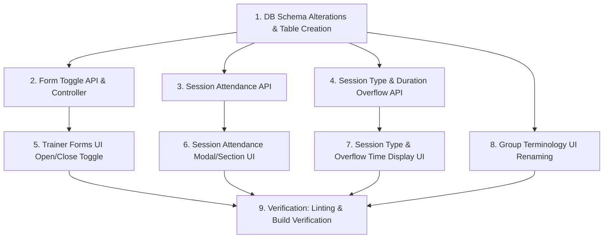

# Task Plan: Form Toggle, Session Attendance, Session Type/Overflow & Group Rename

- **Document ID**: `docs/tasks/form-toggle-session-attendance-group-rename-20260725-task-plan.md`
- **Date**: 2026-07-25
- **Status**: DRAFT (Awaiting User Approval)

## Task Graph & Dependencies

## Work Items

1. **DB Schema Migration** (`server/src/utils/dbInit.ts`):
   - Alter `trainer_forms` for `accepting_responses`.
   - Alter `classes` for `session_type`, `duration_minutes`, `overflow_minutes`.
   - Create `class_attendance` table with 5-level presence check constraint.

2. **Form Toggle API & UI**:
   - `server/src/controllers/trainerFormController.ts`: Handle `accepting_responses` in get, update, and submit functions.
   - `client/src/app/trainer/forms/[id]/page.jsx`: Add "Accepting Responses" toggle switch.

3. **Session Attendance API & UI**:
   - `server/src/controllers/classroomController.ts` & `classroomRoute.ts`: Add `getClassroomSessionAttendance` and `updateClassroomSessionAttendance`.
   - `client/src/app/classroom/live/[id]/ClassroomLiveClient.js`: Add Session Attendance dialog with 5 presence levels (`Present`, `Absent`, `Late`, `Very Late`, `Excused`) and automatic trainer info mapping.

4. **Session Type & Overflow**:
   - `server/src/controllers/classroomController.ts`: Support `sessionType`, `durationMinutes`, `overflowMinutes`.
   - `client/src/app/classroom/live/[id]/ClassroomLiveClient.js`: Add Onsite/Online select, duration config, and live overflow badge/alert (`+X mins Overflow`).

5. **Group Terminology Renaming**:
   - `ClassroomLiveClient.js`, `TeamMatrixClient.js`, `MyDashboardClient.js`: Rename user-facing text from "Team" / "Teams" to "Group" / "Groups".

6. **Verification**:
   - Run `npm run lint` and `npm run build` in `client/`.
