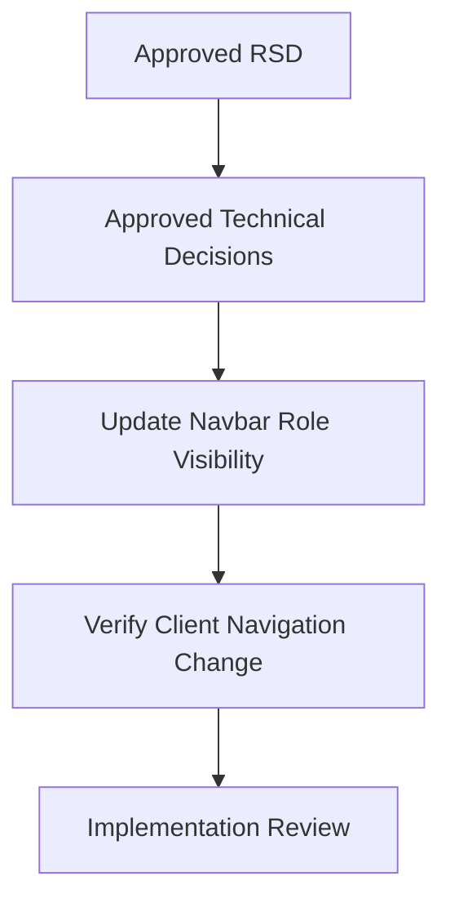

# Hide Classrooms Tab for Trainers Task Plan

Status: Complete
Task ID: hide-classrooms-tab-for-trainers
Last updated: 2026-07-25

## Dependency Graph

## Tasks

### T1: Update Navbar Role Visibility

Purpose:
Hide duplicate classroom navigation for trainer/admin users while preserving student classroom navigation.

Depends on:
Approved technical decisions.

Write scope:
`client/src/components/Navbar.js`

Agent:
Main agent.

Acceptance checks:

- [x] Desktop navbar renders `Classrooms` only when `isLoggedIn && !canUseTrainerDashboard`.
- [x] Mobile menu renders `Classrooms` only when `isLoggedIn && !canUseTrainerDashboard`.
- [x] `Trainer Dashboard` still renders when `canUseTrainerDashboard`.

Code-quality checks:

- [x] Keep change local to existing `Navbar.js` role flags.
- [x] Avoid new abstraction for one visibility rule.
- [x] Do not touch unrelated dirty worktree files.

Verification:
Inspect diff and run `npm run lint` from `client/` if dependencies are installed.

Merge notes:
Single-file UI change, no worktree parallelism needed.

### T2: Verify Client Navigation Change

Purpose:
Confirm the implementation satisfies the approved RSD and does not change authorization.

Depends on:
T1.

Write scope:
`docs/reviews/hide-classrooms-tab-for-trainers-implementation-review.md`

Agent:
Main agent reviewer/auditor/security pass.

Acceptance checks:

- [x] Requirement traceability recorded.
- [x] Lint/manual verification result recorded.
- [x] Security note confirms nav hiding is not authorization.

Code-quality checks:

- [x] Note remaining risks or none.
- [x] Add knowledge-base and mistake/near-miss note after review approval.

Verification:
Review changed file and command output.

Merge notes:
No merge operation required unless user requests commit/branch integration.
