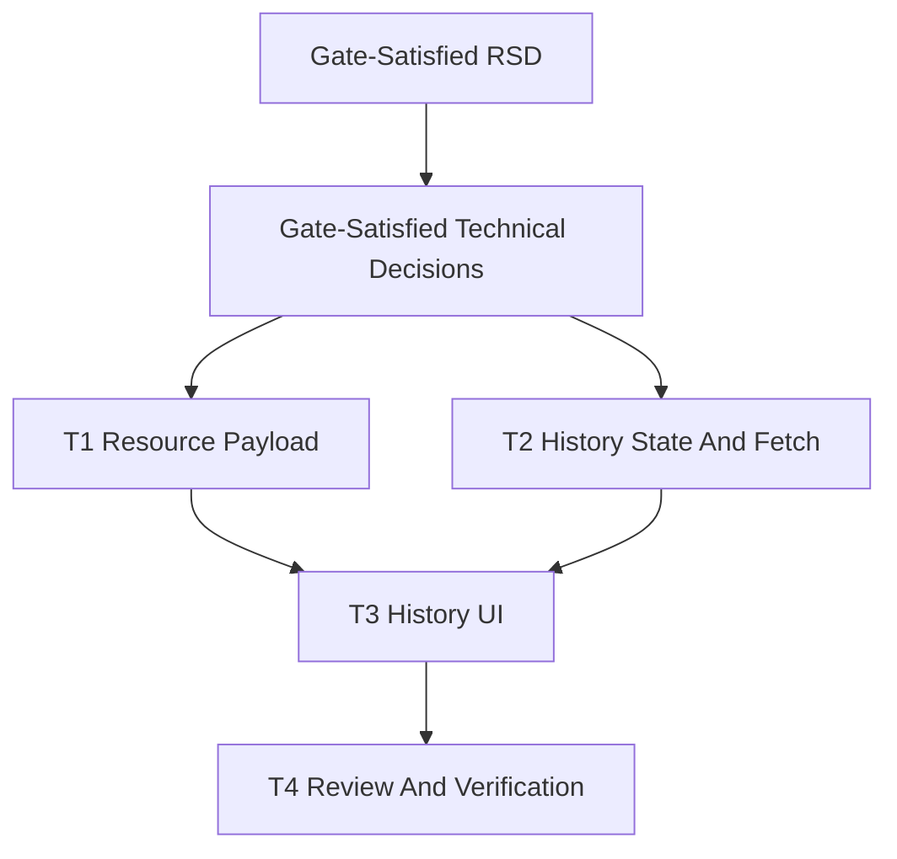

# Past Class Detail Visualization Task Plan

Status: Complete
Task ID: past-class-detail-visualization-20260725
Last updated: 2026-07-25
Delivery mode: Auto

## Mode and Gate Results

- Gates waited on: none.
- Gates skipped: RSD approval, technical decision approval, task-plan approval.
- Waivers: human approval gates skipped because the user requested Auto mode. Waiver limited to scoped classroom history UI and additive response shaping.

## Documentation and Knowledge Used

- Source: `docs/rsd/past-class-detail-visualization-20260725-rsd.md`
  Used for: task scope and acceptance checks.
  Evidence: selected completed class detail must show progress visualization, problems, and class-specific resources.
  Confidence: High

- Source: `docs/decisions/past-class-detail-visualization-20260725-technical-decisions.md`
  Used for: implementation sequencing.
  Evidence: in-page history, existing problems API, all-resource details response, and CSS progress bars are approved by auto-mode waiver.
  Confidence: High

- Source: `docs/knowledge-base/quality-rules.md`
  Used for: behavior guardrails.
  Evidence: preserve polling intervals, endpoint strings, and handlers for classroom live UI refreshes.
  Confidence: High

- Source: `client/src/app/classroom/live/[id]/ClassroomLiveClient.js`
  Used for: write scope and dependency graph.
  Evidence: one component owns classroom live, schedules, student/trainer views, resources, and chat.
  Confidence: High

- Source: `server/src/controllers/classroomController.ts`
  Used for: resource response shaping.
  Evidence: details query currently limits resources to `class_id IS NULL`.
  Confidence: High

## Dependency Graph

## Tasks

### T1: Resource Payload Adjustment

Purpose:
Expose class-specific resources to the classroom page so selected past classes can display their materials.

Depends on:
Gate-satisfied technical decisions.

Write scope:
- `server/src/controllers/classroomController.ts`

Agent:
Main agent.

Branch/worktree:
Main workspace, serial. Existing dirty files overlap the task, so no parallel worktree.

Acceptance checks:
- [ ] `getClassroomDetails` returns all classroom resources.
- [ ] No new route or schema change.
- [ ] Authorization posture is not widened beyond the existing detail endpoint.

HCI checks:
- [ ] Users can find class materials inside the relevant class detail.

Code-quality checks:
- [ ] Additive query change only.
- [ ] No unrelated controller refactor.

Verification:
Manual diff review and server syntax/type check if available.

### T2: Past Class State And Fetch

Purpose:
Track selected completed class and fetch its problems on demand without disturbing active class problem state.

Depends on:
Gate-satisfied technical decisions.

Write scope:
- `client/src/app/classroom/live/[id]/ClassroomLiveClient.js`

Agent:
Main agent.

Branch/worktree:
Main workspace, serial.

Acceptance checks:
- [ ] Completed classes derive from `classes`.
- [ ] First completed class is selected by default when appropriate.
- [ ] Selected past problems use existing `/api/classroom/class/${classId}/problems`.
- [ ] Live `problems` state remains separate.

HCI checks:
- [ ] Loading and empty states are visible.
- [ ] Selected class state is visible.

Code-quality checks:
- [ ] Progress math and status counts use small local helpers.
- [ ] No polling cadence change.

Verification:
Targeted ESLint and manual endpoint scan.

### T3: Past Class Visualization UI

Purpose:
Render a designed class history panel with rounded progress bars, detail metrics, problem rows, and class resources.

Depends on:
T1 and T2.

Write scope:
- `client/src/app/classroom/live/[id]/ClassroomLiveClient.js`

Agent:
Main agent.

Branch/worktree:
Main workspace, serial.

Acceptance checks:
- [ ] Completed class list is visible for trainers and students.
- [ ] Selected class detail shows counts, progress, rows, and resources.
- [ ] Classroom-level resource panel filters out class-specific resources.
- [ ] Markdown resources render with `allowRawHtml={false}`.
- [ ] Mobile and desktop layout avoid text overlap.

HCI checks:
- [ ] Discoverability, signifiers, mapping, feedback, status clarity, and accessibility reviewed.

Code-quality checks:
- [ ] Use existing UI components and lucide icons.
- [ ] Avoid new dependency or global abstraction.

Verification:
Targeted ESLint, diff review, `git diff --check`.

### T4: Review, Verification, Knowledge Update

Purpose:
Run checks, document implementation review, security review, HCI review, and durable lessons.

Depends on:
T1, T2, T3.

Write scope:
- `docs/reviews/past-class-detail-visualization-20260725-implementation-review.md`
- `docs/knowledge-base/project-index.md`
- `docs/knowledge-base/patterns.md`
- `docs/knowledge-base/decisions.md`
- `docs/knowledge-base/quality-rules.md`
- `docs/knowledge-base/doc-usage.md`
- `docs/knowledge-base/mistakes.md`

Agent:
Main agent.

Branch/worktree:
Main workspace, serial.

Acceptance checks:
- [ ] Review records requirement traceability.
- [ ] Review records security, HCI, code-quality, docs-learning, verification, and residual risk.
- [ ] Knowledge base receives compact durable lessons.

HCI checks:
- [ ] HCI pass answers discoverability, signifiers, feedback, mapping, and accessibility.

Code-quality checks:
- [ ] Existing dirty files not owned by this task are preserved.

Verification:
`git diff --check`, targeted client lint, broader client lint/build as feasible.

## Final Git Integration Plan

- Base ref: current dirty working tree.
- Integration branch or main worktree: main workspace.
- Branches/worktrees to merge: none.
- Merge order: T1, T2, T3, T4 in one serial workspace.
- Full verification after integration:
  - `Set-Location client; npx eslint "src/app/classroom/live/[id]/ClassroomLiveClient.js"`
  - `git diff --check`
  - `Set-Location client; npm run lint` if feasible, with unrelated blockers recorded.

## Completion Notes

- T1 complete: classroom details now returns all classroom resources.
- T2 complete: selected past class state and fetch are local and separate from active live problems.
- T3 complete: class history/detail UI renders completed classes, progress distribution, problem rows, and class resources.
- T4 complete: review, verification, and knowledge-base updates recorded.
