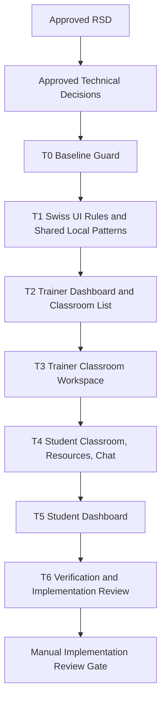

# Swiss Minimal Learning UI Refresh Task Plan

Status: Approved
Task ID: swiss-minimal-learning-ui-refresh-20260725
Last updated: 2026-07-25
Delivery mode: Manual

## Mode and Gate Results

Gates waited on:
- RSD approval: approved by user on 2026-07-25.
- Technical decision approval: approved by user on 2026-07-25.
- Full task plan and dependency graph approval: approved by user on 2026-07-25.

Gates still required:
- Implementation review approval before final integration.

Gates skipped:
- None.

Waivers:
- None.

## Documentation and Knowledge Used

- Source: `docs/rsd/swiss-minimal-learning-ui-refresh-20260725-rsd.md`
  Used for: task scope and acceptance checks.
  Evidence: approved scope covers `/trainer/dashboard`, `/classroom/list`, `/classroom/live/[id]`, and `/my_dashboard` with no logic/path changes.
  Confidence: High

- Source: `docs/decisions/swiss-minimal-learning-ui-refresh-20260725-technical-decisions.md`
  Used for: implementation boundaries and worktree plan.
  Evidence: decisions require client presentation-only edits, Swiss design via existing tools, in-place `ClassroomLiveClient.js` improvement, and serial main-workspace implementation.
  Confidence: High

- Source: `AGENTS.md`
  Used for: project shape, gates, verification, knowledge-base update requirements, and review standards.
  Evidence: trainer/classroom UI entry points live under `client/src/app/trainer/`, `client/src/app/classroom/`, and `client/src/components/Navbar.js`; client UI changes should run narrow verification first.
  Confidence: High

- Source: `C:\Users\Arik\.codex\skills\rsd-orchestrator-agent\references\worktree-parallelism.md`
  Used for: worktree decision.
  Evidence: parallel agents require disjoint write scopes; this task has overlapping classroom surfaces and will run serially.
  Confidence: High

- Source: `docs/knowledge-base/project-index.md`
  Used for: entry-point facts and approved scope.
  Evidence: current task scope is recorded for trainer dashboard, classroom entry/live classroom, and student dashboard.
  Confidence: High

- Source: `docs/knowledge-base/patterns.md`
  Used for: local helper strategy.
  Evidence: local presentational helpers are allowed when they reduce repeated JSX without creating global abstractions.
  Confidence: High

- Source: `docs/knowledge-base/decisions.md`
  Used for: dependency and serial-work decisions.
  Evidence: use existing Tailwind/shadcn/lucide and serial main-workspace implementation.
  Confidence: High

- Source: `docs/knowledge-base/quality-rules.md`
  Used for: Swiss minimal rule and behavior-preservation review.
  Evidence: UI-only diffs must preserve endpoint strings, route targets, state keys, submit handlers, validation branches, and authorization-bearing guards.
  Confidence: High

- Source: `docs/knowledge-base/mistakes.md`
  Used for: verification risk and search safety.
  Evidence: full lint may fail on unrelated existing errors; broad scans can hit `server/NUL`.
  Confidence: High

- Source: `client/src/app/trainer/dashboard/TrainerDashboardClient.js`
  Used for: trainer dashboard task scope.
  Evidence: owns trainer profile/classroom fetch, classroom creation, AI draft application, summary cards, live lane, and classroom workspace.
  Confidence: High

- Source: `client/src/app/classroom/list/ClassroomListClient.js`
  Used for: classroom list task scope.
  Evidence: owns classroom list/profile fetch, trainer-only create classroom dialog, live counts, and classroom cards.
  Confidence: High

- Source: `client/src/app/classroom/live/[id]/ClassroomLiveClient.js`
  Used for: classroom live task scope.
  Evidence: owns trainer tabs, live practice, schedule/setup, students/teams, student challenge view, resources, notes/hints, chat, and polling.
  Confidence: High

- Source: `client/src/app/my_dashboard/MyDashboardClient.js`
  Used for: student dashboard task scope.
  Evidence: owns Codeforces/VJudge verification forms, status badges, schedule placeholder, and performance placeholder.
  Confidence: High

## Dependency Graph

## Implementation Strategy

Implementation is serial in the main workspace. No parallel worktrees or delegated agents will be used because write scopes overlap in `ClassroomLiveClient.js` and the current worktree already contains related dirty changes.

Communication mode for any future delegated prompt, if the plan changes, must explicitly include caveman ultra for chat output while preserving full-fidelity artifacts.

## Tasks

### T0: Baseline Guard

Purpose:
Capture current behavior-sensitive strings and dirty state before UI edits so accidental behavior changes are easier to detect.

Depends on:
- Approved RSD.
- Approved technical decisions.

Write scope:
- No source edits expected.

Agent:
- Main agent.

Branch/worktree:
- Main workspace at `C:\Users\Arik\Desktop\mcc`.
- No new branch/worktree.

Acceptance checks:
- [ ] Record current `git status --short`.
- [ ] Inspect changed-file diffs before editing overlapping files.
- [ ] Record current endpoint strings, route targets, tab values, and handler names for changed components.

Code-quality checks:
- [ ] Preserve user/prior dirty work.
- [ ] Do not normalize unrelated line endings or formatting.

Verification:
- `git status --short`
- `git diff -- <approved files>`
- Scoped `Select-String`/`rg` checks for endpoints, route targets, and tab values.

Merge notes:
- None.

### T1: Swiss UI Rules and Shared Local Patterns

Purpose:
Define the local visual direction inside the approved files: compact headers, metric rows, section headings, status chips, empty states, and icon actions.

Depends on:
- T0.

Write scope:
- `client/src/app/trainer/dashboard/TrainerDashboardClient.js`
- `client/src/app/classroom/list/ClassroomListClient.js`
- `client/src/app/classroom/live/[id]/ClassroomLiveClient.js`
- `client/src/app/my_dashboard/MyDashboardClient.js`

Agent:
- Main agent.

Branch/worktree:
- Main workspace.

Acceptance checks:
- [ ] No global CSS/theme/dependency edits.
- [ ] Any helper is local and presentational.
- [ ] Visual rules remove decorative glow/orb/hero patterns without hiding required statuses or controls.

Code-quality checks:
- [ ] Helpers reduce repeated JSX or clarify repeated UI.
- [ ] Helpers do not hide endpoint, handler, state, or authorization logic.

Verification:
- Manual diff review after each file edit.

Merge notes:
- Serial only.

### T2: Trainer Dashboard and Classroom List

Purpose:
Make classroom overview surfaces cohesive and Swiss-minimal before tackling the large live classroom file.

Depends on:
- T1.

Write scope:
- `client/src/app/trainer/dashboard/TrainerDashboardClient.js`
- `client/src/app/classroom/list/ClassroomListClient.js`

Agent:
- Main agent.

Branch/worktree:
- Main workspace.

Acceptance checks:
- [ ] `/trainer/dashboard` preserves profile/classroom fetches, create-classroom submit behavior, AI draft application, role handling, and links.
- [ ] `/classroom/list` preserves classroom/profile fetches, trainer-only create-classroom behavior, modal validation, and links.
- [ ] Remove decorative hero/glow treatment and duplicate low-value copy.
- [ ] Keep live state, empty state, errors, create actions, and classroom entry actions clear.

Code-quality checks:
- [ ] Use existing components and icons only.
- [ ] Keep presentation helpers local.
- [ ] Avoid broad refactors of state or handlers.

Verification:
- Targeted ESLint after edits if feasible:
  - `npx eslint src/app/trainer/dashboard/TrainerDashboardClient.js src/app/classroom/list/ClassroomListClient.js`
- Manual diff review of `get_with_token`, `post_with_token`, `ProgressLink`, and dialog submit behavior.

Merge notes:
- No branch merge.

### T3: Trainer Classroom Workspace

Purpose:
Simplify trainer-facing `/classroom/live/[id]` into a compact command workspace while preserving live practice, schedule/setup, student/team, problem, note/hint, resource, and chat behavior.

Depends on:
- T2.

Write scope:
- `client/src/app/classroom/live/[id]/ClassroomLiveClient.js`

Agent:
- Main agent.

Branch/worktree:
- Main workspace.

Acceptance checks:
- [ ] Preserve tab values: `live`, `schedule`, `students`.
- [ ] Preserve polling and visibility behavior.
- [ ] Preserve every trainer handler and endpoint string.
- [ ] Trainer forms for class scheduling, problem assignment, note/hint creation, student add/remove, team creation, and resource sharing still render with required inputs.
- [ ] Reduce card clutter, glows, verbose copy, and scattered action hierarchy.

Code-quality checks:
- [ ] Local helpers stay presentational.
- [ ] Large-file edits remain scoped and reviewable.
- [ ] No behavior split into new modules.

Verification:
- Targeted ESLint on `ClassroomLiveClient.js`.
- Manual string diff/review for endpoint strings and handler names.

Merge notes:
- Serial work continues into T4 because same file owns student classroom.

### T4: Student Classroom, Resources, and Chat

Purpose:
Make student-facing classroom challenge view, classroom resources, and chat simpler and more focused without changing actions.

Depends on:
- T3.

Write scope:
- `client/src/app/classroom/live/[id]/ClassroomLiveClient.js`

Agent:
- Main agent.

Branch/worktree:
- Main workspace.

Acceptance checks:
- [ ] Student challenge cards/list preserve problem links, status toggle, tags, difficulty, points, timers, notes/hints dialog, and empty states.
- [ ] Resource display preserves URL-only, markdown-only, and URL-plus-markdown rendering with raw HTML disabled.
- [ ] Chat preserves recipient selection, message list, send form, and polling-fed data.
- [ ] Student view avoids decorative card excess and keeps action-critical status visible.

Code-quality checks:
- [ ] Do not alter `MarkdownRender allowRawHtml={false}` for classroom resources.
- [ ] Do not change chat data flow or polling.
- [ ] Keep labels concise but not ambiguous.

Verification:
- Targeted ESLint on `ClassroomLiveClient.js`.
- Manual review of `MarkdownRender`, chat send handler, and student status toggle.

Merge notes:
- Same file as T3; no split.

### T5: Student Dashboard

Purpose:
Redesign `/my_dashboard` as a minimal student account/verification workspace and reduce low-value placeholder prominence.

Depends on:
- T4.

Write scope:
- `client/src/app/my_dashboard/MyDashboardClient.js`

Agent:
- Main agent.

Branch/worktree:
- Main workspace.

Acceptance checks:
- [ ] Preserve Codeforces handle submission through `post_with_token('user/cf/submit', ...)`.
- [ ] Preserve VJudge handle submission through `post_with_token('user/vjudge/submit', ...)`.
- [ ] Preserve toast success/error behavior, pending status updates, status badge meanings, disabled verified inputs, and external profile links.
- [ ] Demote or remove first-order empty schedule/performance placeholders if they add no current value.
- [ ] Layout is Swiss-minimal, responsive, and focused.

Code-quality checks:
- [ ] Keep handlers and state shape intact.
- [ ] Avoid adding unused data fetches or placeholder abstractions.

Verification:
- Targeted ESLint on `MyDashboardClient.js`.
- Manual diff review of submission handlers and external links.

Merge notes:
- No branch merge.

### T6: Verification and Implementation Review

Purpose:
Verify changed UI files, review behavior preservation, run security/code-quality checks, and update artifacts/knowledge base.

Depends on:
- T5.

Write scope:
- `docs/reviews/swiss-minimal-learning-ui-refresh-20260725-implementation-review.md`
- `docs/knowledge-base/project-index.md`
- `docs/knowledge-base/patterns.md`
- `docs/knowledge-base/decisions.md`
- `docs/knowledge-base/quality-rules.md`
- `docs/knowledge-base/mistakes.md`

Agent:
- Main agent.

Branch/worktree:
- Main workspace.

Acceptance checks:
- [ ] Targeted ESLint runs for all changed client files.
- [ ] `git diff --check` runs.
- [ ] `npm run lint` in `client/` runs if feasible, with unrelated failures recorded.
- [ ] `npm run build` in `client/` runs if scope/risk justifies it, with blockers recorded.
- [ ] Implementation review maps every acceptance criterion to evidence.
- [ ] Security review confirms no auth/data/API/logging/secret/dependency/default changes.
- [ ] Knowledge base records durable lessons and a mistake/near-miss note.

Code-quality checks:
- [ ] Behavior-sensitive strings preserved unless explicitly justified.
- [ ] No new global abstractions/dependencies.
- [ ] No hidden behavior in presentational helpers.

Verification:
- From `client/`:
  - `npx eslint src/app/trainer/dashboard/TrainerDashboardClient.js src/app/classroom/list/ClassroomListClient.js "src/app/classroom/live/[id]/ClassroomLiveClient.js" src/app/my_dashboard/MyDashboardClient.js`
  - `npm run lint` if feasible
  - `npm run build` if risk justifies it
- From repo root:
  - `git diff --check`
  - `git status --short`

Merge notes:
- Manual implementation-review gate required before final integration/closeout.

## Final Git Integration Plan

- Base ref: current dirty main workspace at task-plan approval time.
- Integration target: current main workspace.
- Branches/worktrees to merge: none.
- Merge order: not applicable; serial edits occur directly in the main workspace after task-plan approval.
- Conflict strategy: preserve approved behavior and existing user/prior dirty changes.
- Full verification after integration:
  - Targeted ESLint command for changed client files.
  - `git diff --check`.
  - Full client lint/build as feasible and justified.
- Worktree removal: none.

## Ticket Creation

No ticket system was requested or connected. This task plan is the ticket source of truth.

## Approval Gate

Manual mode requires user approval of this task plan and dependency graph before implementation begins.
