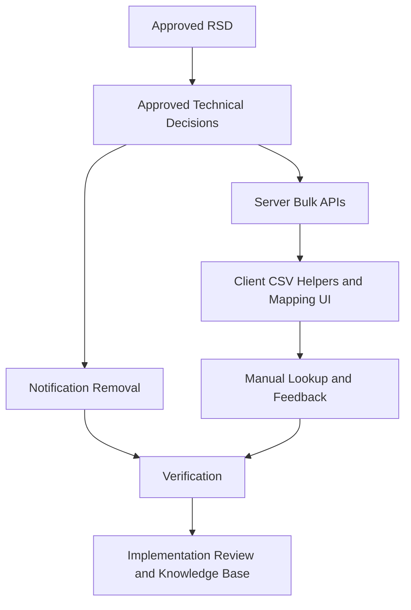

# Trainer Bulk Import, Feedback, and Notification Removal Task Plan

Status: Approved
Task ID: trainer-bulk-import-feedback-notifications-20260726
Last updated: 2026-07-26
Delivery mode: Auto

## Documentation and Knowledge Used

- Source: `docs/rsd/trainer-bulk-import-feedback-notifications-20260726-rsd.md`
  Used for: task boundaries and acceptance criteria
  Evidence: scope includes CSV import, lookup method selection, feedback, and classroom notification removal.
  Confidence: High
- Source: `docs/decisions/trainer-bulk-import-feedback-notifications-20260726-technical-decisions.md`
  Used for: implementation approach
  Evidence: local CSV mapping, batch APIs, Sonner feedback, and notification removal were selected.
  Confidence: High
- Source: `AGENTS.md`
  Used for: workflow and verification
  Evidence: task plan approval is required before implementation; narrow verification preferred.
  Confidence: High

## Dependency Graph

## Tasks

### T1: Remove Classroom Notification Path

Purpose:
Stop classroom notification fetch/write/broadcast/email work that causes performance cost.

Depends on:
Approved technical decisions.

Write scope:
`client/src/components/Navbar.js`, `client/src/components/NotificationBell.js`, `client/src/app/api/classroom/notifications/**`, `server/src/routes/classroomRoute.ts`, `server/src/controllers/classroomController.ts`.

Steps:
- Remove `NotificationBell` import/render from navbar.
- Delete notification route handlers under client API.
- Remove server notification routes and controller exports.
- Remove classroom notification helper functions and call sites.
- Remove unused imports after notification helper removal.

Acceptance checks:
- [x] Navbar no longer mounts notification bell or fetches notification APIs.
- [x] Server no longer inserts into `in_app_notifications` from classroom actions.
- [x] Classroom notification email side effects are gone.

### T2: Add Server Bulk Student Enrollment

Purpose:
Enroll many students by email or Student ID in one request.

Depends on:
T1 may run independently, but final controller integration must be reviewed.

Write scope:
`server/src/controllers/classroomController.ts`, `server/src/routes/classroomRoute.ts`.

Steps:
- Update manual `addStudentToClassroom` to accept `lookupMethod` and `studentIdentifier`, while preserving existing `studentEmail` compatibility inside current code path.
- Add `addStudentsToClassroom` handler for `lookupMethod` + identifiers array.
- Batch query `users` by `email` or `mist_id::text`.
- Reject trainer/admin accounts from enrollment.
- Batch insert valid students into `classroom_students` with `ON CONFLICT DO NOTHING`.
- Return structured summary: added, alreadyEnrolled/skipped where practical, notFound, invalidRole.

Acceptance checks:
- [x] Manual email add still works.
- [x] Manual Student ID add works.
- [x] Bulk add returns row-level summary and does not send notifications.

### T3: Add Server Bulk Problem Assignment

Purpose:
Assign many problem rows in one request while preserving target validation.

Depends on:
Approved technical decisions.

Write scope:
`server/src/controllers/classroomController.ts`, `server/src/routes/classroomRoute.ts`.

Steps:
- Add `assignProblemsBulk` handler.
- Validate class and trainer access once.
- Revalidate each target student/group against classroom roster and groups.
- Fetch metadata once per unique non-custom problem link/platform.
- Insert rows into `class_problems` in batches with normalized tags.
- Return structured summary with assigned and rejected rows.

Acceptance checks:
- [x] Valid student/group rows assign problems.
- [x] Invalid targets are rejected without blocking other valid rows.
- [x] Tags still flow through existing dictionary/tag storage.
- [x] No notifications are created.

### T4: Add Client CSV Mapping and Import UI

Purpose:
Provide local CSV upload, mapping, preview, and confirm flows.

Depends on:
T2 and T3 endpoints.

Write scope:
`client/src/app/classroom/live/[id]/ClassroomLiveClient.js`.

Steps:
- Add local CSV parser and column mapping helpers.
- Add student import dialog: file input, lookup method, column mapping, preview, confirm.
- Add problem import dialog: file input, required mappings, preview, confirm.
- Resolve problem targets against current `students` and `teams` for early feedback.
- Call bulk APIs once per confirmed import.
- Refresh affected classroom/problem data after successful import.

Acceptance checks:
- [x] CSV files parse locally before mutation.
- [x] Mapping UI requires needed columns.
- [x] Preview shows usable counts and row errors.
- [x] Confirm import shows loading and terminal feedback.

### T5: Manual Lookup and Processing Feedback

Purpose:
Reduce trainer misclicks and clarify async status.

Depends on:
T2, T4.

Write scope:
`client/src/app/classroom/live/[id]/ClassroomLiveClient.js`.

Steps:
- Add manual student lookup selector and identifier input type/placeholder changes.
- Add local loading states for student add and problem assign if not already present.
- Add Sonner toasts for touched manual and bulk actions.
- Disable buttons while corresponding request is in flight.

Acceptance checks:
- [x] Manual student add cannot double-submit while loading.
- [x] Manual problem assignment cannot double-submit while loading.
- [x] Bulk import buttons show progress and final result.

### T6: Verification, Review, Knowledge Base

Purpose:
Validate implementation and record durable project knowledge.

Depends on:
T1-T5 complete.

Steps:
- Run targeted ESLint on changed client files.
- Run server build/type check command.
- Run `git diff --check`.
- Create implementation review doc under `docs/reviews/`.
- Update knowledge base with final implementation facts, decisions, patterns, and quality notes.

Acceptance checks:
- [x] Verification results recorded.
- [x] Implementation review ready for final approval gate.

## Verification Commands

- `npx eslint src/components/Navbar.js 'src/app/classroom/live/[id]/ClassroomLiveClient.js'`
- `bun build src/index.ts --target=bun --outdir .opencode-build-trainer-bulk`
- `git diff --check`

## Task-Plan Gate

Approved by user on 2026-07-26 with request to continue in auto mode.
