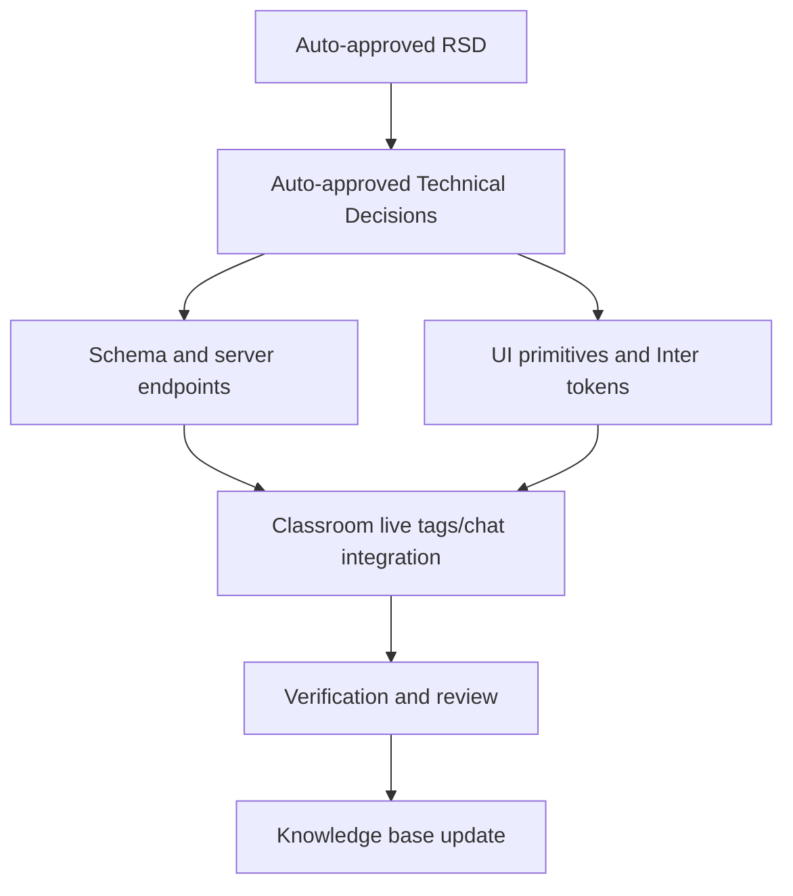

# Trainer Class Tags Chat Shadcn Refresh Task Plan

Status: Approved by Auto mode
Task ID: trainer-class-tags-chat-shadcn-refresh-20260725
Last updated: 2026-07-25
Delivery mode: Auto

## Documentation and Knowledge Used

- Source: `AGENTS.md`
  Used for: write scopes and verification
  Evidence: trainer/classroom UI and API entry points are listed.
  Confidence: High
- Source: `docs/decisions/trainer-class-tags-chat-shadcn-refresh-20260725-technical-decisions.md`
  Used for: task dependencies
  Evidence: decisions require dictionary schema, class chat schema, reactions, local primitives, and Inter tokens.
  Confidence: High
- Source: `docs/knowledge-base/quality-rules.md`
  Used for: risk controls
  Evidence: preserve live polling behavior unless behavior change is approved.
  Confidence: High

## Dependency Graph

## Tasks

### T1: Schema and Server Endpoints

Purpose:
Add durable dictionary, class chat scope, and persistent reactions.

Depends on:
RSD and technical decisions.

Write scope:
`server/src/utils/dbInit.ts`, `server/src/controllers/classroomController.ts`, `server/src/routes/classroomRoute.ts`.

Agent:
Main agent.

Branch/worktree:
Main workspace; dirty tree already contains overlapping classroom files.

Acceptance checks:
- [ ] `problem_tag_dictionary` is created and seeded from existing tags.
- [ ] `classroom_messages.class_id` exists.
- [ ] `classroom_message_reactions` exists.
- [ ] Dictionary endpoints are JWT-protected.
- [ ] Chat send/history/reaction validate class access.

HCI checks:
- [ ] Invalid recipients and missing class scope get clear errors.

Code-quality checks:
- [ ] Tag normalization is centralized server-side.
- [ ] Access helper stays local and cohesive.

Verification:
Targeted syntax/lint checks.

### T2: UI Primitives and Inter Tokens

Purpose:
Provide shadcn-compatible custom Bubble/Message primitives and global Inter/professional tokens.

Depends on:
Technical decisions.

Write scope:
`client/src/components/ui/bubble.jsx`, `client/src/components/ui/message.jsx`, `client/src/app/layout.js`, `client/src/app/globals.css`, `client/tailwind.config.js`.

Agent:
Main agent.

Acceptance checks:
- [ ] Bubble supports content and reactions.
- [ ] Message supports row/content/header/footer/avatar slots.
- [ ] Body font uses Inter.
- [ ] Theme tokens look custom, not stock neutral shadcn.

HCI checks:
- [ ] Focus rings and labels remain visible.

Code-quality checks:
- [ ] Components are small and className-customizable.

Verification:
Targeted ESLint.

### T3: Classroom Live Tags and Chat Integration

Purpose:
Replace comma tag input, wire dictionary creation, scope chat by class, and add reactions.

Depends on:
T1 and T2.

Write scope:
`client/src/app/classroom/live/[id]/ClassroomLiveClient.js`.

Agent:
Main agent.

Acceptance checks:
- [ ] Tag selector loads dictionary and creates new tags.
- [ ] Assignment sends selected tags array.
- [ ] Chat fetches messages for selected class only.
- [ ] Active class chat is writable.
- [ ] Completed selected class chat is read-only.
- [ ] Reaction buttons toggle and refresh aggregate counts.

HCI checks:
- [ ] Chat class scope is visible.
- [ ] Send disabled state explains why.
- [ ] Selected tags are visible as removable chips.

Code-quality checks:
- [ ] Keep existing polling intervals and classroom state flow.
- [ ] Avoid broad JSX churn outside assignment/chat sections.

Verification:
Targeted ESLint.

### T4: Verification, Review, and Knowledge Base

Purpose:
Confirm behavior traceability, record results, and update durable memory.

Depends on:
T1-T3.

Write scope:
`docs/reviews/`, `docs/knowledge-base/`.

Agent:
Main agent.

Acceptance checks:
- [ ] Implementation review records changed files, security, HCI, code quality, and verification.
- [ ] Knowledge base updated with future-use facts and near miss.

Verification:
`npm run lint` or targeted ESLint; server syntax check if available.

## Final Git Integration Plan

- Base ref: current dirty workspace.
- Integration branch or main worktree: main workspace.
- Branches/worktrees to merge: none.
- Merge order: serial only.
- Full verification after integration:
  - `Set-Location client; npm run lint`
  - Targeted checks if full lint is blocked by unrelated existing issues.
