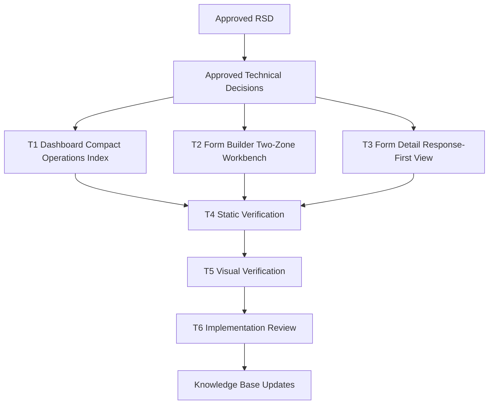

# Trainer Compact UI Cleanup Task Plan

Status: Approved
Task ID: trainer-compact-ui-cleanup-20260802
Last updated: 2026-08-02
Approved: 2026-08-02 by user

## Documentation and Knowledge Used

- Source: `docs/rsd/trainer-compact-ui-cleanup-20260802-rsd.md`
  Used for: approved scope, mini-laptop readability requirement, non-goals, and acceptance criteria.
  Confidence: High

- Source: `docs/decisions/trainer-compact-ui-cleanup-20260802-technical-decisions.md`
  Used for: implementation constraints and visual direction decisions.
  Confidence: High

- Source: `AGENTS.md`
  Used for: required gates, documentation locations, local command guidance, and review standards.
  Confidence: High

- Source: `docs/knowledge-base/project-index.md`, `patterns.md`, `quality-rules.md`, `hci-rules.md`, `mistakes.md`
  Used for: trainer operational UI guidance, bounded dense surfaces, responsive overflow rules, and no hidden behavior changes.
  Confidence: High

- Source: `client/src/app/trainer/dashboard/TrainerDashboardClient.js`
  Used for: dashboard write scope and behavior preservation.
  Confidence: High

- Source: `client/src/app/trainer/forms/TrainerFormsClient.js`
  Used for: form-builder write scope and behavior preservation.
  Confidence: High

- Source: `client/src/app/trainer/forms/[id]/TrainerFormDetailClient.js`
  Used for: form-detail write scope and behavior preservation.
  Confidence: High

## Dependency Graph

## Work Strategy

Work serially in the current workspace because all UI changes are presentation-only but share a single trainer visual direction. Parallel worktrees are unnecessary, and repository metadata is not currently exposed in this workspace, so Git-based checks may be unavailable.

## T1: Dashboard Compact Operations Index

Purpose:
Make `/trainer/dashboard` faster to scan on mini-laptop screens while preserving classroom creation, classroom entry, trainer forms/admin links, live-session entry, substitute trainer management, and the tour hook.

Write scope:
- `client/src/app/trainer/dashboard/TrainerDashboardClient.js`

Implementation steps:
- Replace the large header/action area with a compact command header and inline status chips.
- Rework live sessions into a calm static attention strip without pulsing animation.
- Replace tall repeated classroom cards with compact operational classroom items that show status, title, short description/metadata, primary entry action, and compact substitute action.
- Demote repeated trainer/date/detail text and clamp/truncate long content.
- Reduce the permanent tour launcher from a large pill into a quieter icon-first control while keeping `startTour` and element id.
- Keep dialog fields, submit handler, API strings, and route links unchanged.

Acceptance checks:
- [ ] Dashboard first viewport is visibly calmer and less vertically heavy.
- [ ] Classroom items remain readable around 1280-1366px width.
- [ ] Live state and empty/loading/error states remain clear.
- [ ] No route/API/handler behavior changes.

## T2: Form Builder Two-Zone Workbench

Purpose:
Make `/trainer/forms` cleaner by letting field construction and submit readiness lead while setup, library, and draft summary support the workflow.

Write scope:
- `client/src/app/trainer/forms/TrainerFormsClient.js`

Implementation steps:
- Tighten the page header, metrics, and status messaging.
- Reorganize setup/type/identity/target controls into compact workbench sections with less explanatory copy.
- Make mapped/custom presets easier to scan without large cards.
- Tighten field queue rows: compact header, stable icon buttons, clear source/type controls, and responsive grid constraints.
- Bound the existing forms library and draft summary so they support rather than dominate the page.
- Keep all field add/remove/duplicate/reorder/update logic, validation, copy/open/manage actions, and submit behavior unchanged.

Acceptance checks:
- [ ] Form builder has a clearer scan order and reduced repeated visual weight.
- [ ] Field queue editing remains complete.
- [ ] Existing form library actions still copy/open/manage the same targets.
- [ ] No route/API/handler behavior changes.

## T3: Form Detail Response-First View

Purpose:
Make `/trainer/forms/[id]` prioritize response inspection while preserving form sharing, acceptance toggle, analytics, explore, and JSON workflows.

Write scope:
- `client/src/app/trainer/forms/[id]/TrainerFormDetailClient.js`

Implementation steps:
- Compress the title/status/action header and keep semantic status badges readable.
- Slim down share URL and metrics into a compact status strip.
- Make tab controls visually clear without becoming a heavy card.
- Refine analytics timeline, field summary, dynamic track, response table, and JSON details spacing.
- Preserve horizontal table scroll and bounded JSON/pre content.
- Keep data loading, toggle, copy link, open form, tab state, query filtering, and rendering logic unchanged.

Acceptance checks:
- [ ] Response inspection leads the page.
- [ ] Share/toggle/open/copy controls remain easy to find.
- [ ] Analytics/explore/JSON states remain intact and readable.
- [ ] No route/API/handler behavior changes.

## T4: Static Verification

Purpose:
Catch syntax, lint, formatting, and accidental contract changes.

Commands:
- `cd client && npx eslint src/app/trainer/dashboard/TrainerDashboardClient.js src/app/trainer/forms/TrainerFormsClient.js 'src/app/trainer/forms/[id]/TrainerFormDetailClient.js'`
- `cd client && npm run lint` if feasible.
- `git diff --check` if Git metadata is available; otherwise record the environment blocker.

Checks:
- [ ] Targeted lint passes or only unrelated/existing warnings are documented.
- [ ] Full lint result is recorded if run.
- [ ] No endpoint strings, route targets, auth checks, or server files were changed.

## T5: Visual Verification

Purpose:
Verify the actual complaint: clutter and mini-laptop overload.

Steps:
- Start the client dev server if needed.
- Inspect screenshots/browser layout at a mini-laptop-like viewport, around `1366x768` or `1280x800`.
- Inspect one mobile viewport, around `390x844`.
- Check for overlap, unreadable truncation, excessive first-viewport vertical weight, broken sticky/scroll behavior, and visually noisy controls.

Checks:
- [ ] Dashboard mini-laptop layout is cleaner and actionable.
- [ ] Form builder mini-laptop layout does not overwhelm the first viewport.
- [ ] Form detail header/share/metric/tabs fit without crowding.
- [ ] Mobile stacking remains usable.

## T6: Implementation Review And Memory

Purpose:
Complete the repo workflow with traceability, review, and durable lessons.

Write scope:
- `docs/reviews/trainer-compact-ui-cleanup-20260802-implementation-review.md`
- `docs/knowledge-base/project-index.md`
- `docs/knowledge-base/patterns.md`
- `docs/knowledge-base/decisions.md`
- `docs/knowledge-base/quality-rules.md`
- `docs/knowledge-base/doc-usage.md`
- `docs/knowledge-base/mistakes.md` only if a real mistake or near miss is found.

Review checks:
- [ ] Requirement satisfaction.
- [ ] Correctness and route/API preservation.
- [ ] Maintainability and scope control.
- [ ] Security/privacy checklist confirms no auth/data/logging changes.
- [ ] Verification results and residual risks are recorded.

## Rollback

Revert the three touched trainer client files and this task's documentation changes. No database, API, migration, dependency, or route rollback is needed.

## Approval Gate

Full task plan and dependency graph approved by user on 2026-08-02.
