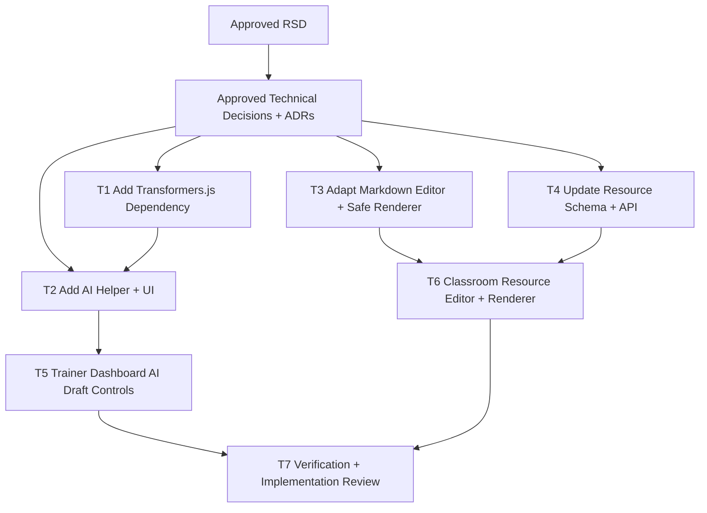

# Trainer Dashboard AI Resource Writing Assistant Task Plan

Status: Approved
Task ID: trainer-dashboard-ai-resource-writing-assistant
Last updated: 2026-07-25
Delivery mode: Auto requested; repository approval gates still required

## Mode and Gate Results

Gates waited on:
- Primary RSD approval: received from user in chat.
- Technical decision package approval: received from user in chat.
- Full task plan approval: received from user in chat.

Gates skipped:
- None. Repository `AGENTS.md` requires approval gates.

Waivers:
- Auto-mode gate skipping waived in favor of repository gate policy.

## Documentation and Knowledge Used

- Source: `docs/rsd/trainer-dashboard-ai-resource-writing-assistant-rsd.md`
  Used for: task scope and acceptance criteria.
  Evidence: AI assistance must be draft-only, browser-side, optional, and cover classroom/resource authoring.
  Confidence: High

- Source: `docs/decisions/trainer-dashboard-ai-resource-writing-assistant-technical-decisions.md`
  Used for: implementation boundaries.
  Evidence: use npm `@huggingface/transformers`, small reusable trainer writing assistant UI, markdown source storage, compact editor, and safe markdown rendering.
  Confidence: High

- Source: `docs/adr/0001-browser-side-gemma-webgpu-writing-assistant.md`
  Used for: AI architecture.
  Evidence: lazy client-only Gemma WebGPU helper using `onnx-community/gemma-3-270m-it-ONNX`.
  Confidence: High

- Source: `docs/adr/0002-markdown-source-classroom-resources.md`
  Used for: resource data model.
  Evidence: add nullable `content`, relax `url`, require title plus URL or content, store markdown source.
  Confidence: High

- Source: `docs/knowledge-base/project-index.md`
  Used for: entry points.
  Evidence: trainer/classroom UI lives under `client/src/app/trainer/` and `client/src/app/classroom/`; server classroom API lives in route/controller files.
  Confidence: High

- Source: `docs/knowledge-base/decisions.md`
  Used for: reusable decisions.
  Evidence: browser-side Gemma helper and markdown resource storage decisions are durable for this task.
  Confidence: High

- Source: `docs/knowledge-base/patterns.md`
  Used for: AI helper shape.
  Evidence: hide WebGPU/model lifecycle behind a small client boundary.
  Confidence: High

- Source: `docs/knowledge-base/quality-rules.md`
  Used for: security and verification.
  Evidence: resource markdown should render with raw HTML disabled; targeted lint may be used when unrelated full-lint failures remain.
  Confidence: High

- Source: `client/src/app/trainer/dashboard/TrainerDashboardClient.js`
  Used for: classroom-create write scope.
  Evidence: owns classroom name/description state and create submit.
  Confidence: High

- Source: `client/src/app/classroom/live/[id]/ClassroomLiveClient.js`
  Used for: resource authoring/display write scope.
  Evidence: owns resource title/url state, submit handler, and resource card rendering.
  Confidence: High

- Source: `server/src/controllers/classroomController.ts`
  Used for: resource API write scope.
  Evidence: `addResource` validates title/url and inserts resource rows.
  Confidence: High

- Source: `server/src/utils/dbInit.ts`
  Used for: schema write scope.
  Evidence: initializes `classroom_resources`.
  Confidence: High

- Source: `client/src/components/EditorWrapper.js`, `client/src/components/Editor.js`, `client/src/components/MarkdownRenderer.js`
  Used for: editor and rendering write scope.
  Evidence: existing markdown editor and renderer can be adapted instead of adding another editor stack.
  Confidence: High

## Dependency Graph

## Tasks

### T1: Add Transformers.js Dependency

Purpose:
Make official Transformers.js available through the client package manager instead of runtime CDN imports.

Depends on:
Approved technical decisions.

Write scope:
- `client/package.json`
- `client/package-lock.json`

Agent:
Main agent.

Branch/worktree:
Main workspace serial work. Parallel worktrees are not useful because later UI tasks share package and component files.

Acceptance checks:
- [ ] `@huggingface/transformers` is added to client dependencies.
- [ ] Lockfile reflects the installed version.

Code-quality checks:
- [ ] No unrelated package churn.

Verification:
- `npm install @huggingface/transformers@4.2.0` from `client/`.

Merge notes:
Do first so AI helper imports can resolve.

### T2: Add AI Helper and Reusable Trainer Writing UI

Purpose:
Create the client-only boundary for browser-side Gemma drafting and reusable trainer-facing controls.

Depends on:
T1.

Write scope:
- `client/src/lib/trainer-writing-ai.js` or equivalent focused helper.
- `client/src/components/trainer/TrainerWritingAssistant.jsx` or equivalent focused component.

Agent:
Main agent.

Branch/worktree:
Main workspace serial work.

Acceptance checks:
- [ ] Helper lazy-imports `@huggingface/transformers` only in browser/client flow.
- [ ] Helper uses `text-generation`, `onnx-community/gemma-3-270m-it-ONNX`, WebGPU, and deterministic generation options.
- [ ] Component shows compact loading/ready/error/unsupported states.
- [ ] Component returns drafts to parent form state and does not save.
- [ ] Manual fields remain usable if helper fails.

Code-quality checks:
- [ ] Model lifecycle and prompt templates are hidden behind a small interface.
- [ ] Public props are narrow and domain-named.
- [ ] No global copilot framework.

Verification:
- Targeted lint on new helper/component.
- Manual code review for client-only import behavior.

Merge notes:
Feeds T5 and T6.

### T3: Adapt Markdown Editor and Safe Renderer

Purpose:
Reuse existing markdown tooling for compact resource editing and safe resource rendering.

Depends on:
Approved technical decisions.

Write scope:
- `client/src/components/EditorWrapper.js`
- `client/src/components/Editor.js`
- `client/src/components/MarkdownRenderer.js`
- optional small resource renderer component if cleaner.

Agent:
Main agent.

Branch/worktree:
Main workspace serial work.

Acceptance checks:
- [ ] Markdown editor supports a compact dialog-friendly height/class without breaking existing callers.
- [ ] Resource markdown can render with raw HTML disabled.
- [ ] Existing markdown renderer behavior stays compatible for current non-resource callers.

Code-quality checks:
- [ ] Extend existing editor/renderer APIs instead of adding another editor dependency.
- [ ] Security behavior is explicit at resource call site.

Verification:
- Targeted lint on changed editor/renderer files.
- Manual review that raw HTML is disabled for resource rendering.

Merge notes:
Feeds T6.

### T4: Update Resource Schema and API

Purpose:
Persist markdown resource content while preserving URL-only resources.

Depends on:
Approved technical decisions.

Write scope:
- `server/src/utils/dbInit.ts`
- `server/src/controllers/classroomController.ts`
- possibly `server/src/routes/classroomRoute.ts` only if route shape changes, though no route change is expected.

Agent:
Main agent.

Branch/worktree:
Main workspace serial work.

Acceptance checks:
- [ ] `classroom_resources.content` nullable text is created for new and existing databases.
- [ ] `classroom_resources.url` can be null for markdown-only resources.
- [ ] `addResource` accepts title plus at least one of URL or content.
- [ ] Existing URL-only resources still insert/read.
- [ ] Notifications still point to URL when present or classroom page when markdown-only.

Code-quality checks:
- [ ] Keep validation near resource controller.
- [ ] Avoid broad classroom API refactor.
- [ ] Preserve authorization through `canManageClassroom`.

Verification:
- Bun/TypeScript syntax check where feasible.
- Manual review of SQL migration safety.

Merge notes:
Feeds T6.

### T5: Add AI Draft Controls to Trainer Dashboard Classroom Creation

Purpose:
Help trainers/admins quickly draft classroom name and description.

Depends on:
T2.

Write scope:
- `client/src/app/trainer/dashboard/TrainerDashboardClient.js`

Agent:
Main agent.

Branch/worktree:
Main workspace serial work.

Acceptance checks:
- [ ] Create-classroom dialog includes AI drafting for name/description.
- [ ] Generated text fills editable fields only.
- [ ] Existing create classroom validation and submit behavior remain unchanged.
- [ ] Unsupported/error AI states do not block manual classroom creation.

Code-quality checks:
- [ ] Keep dialog state readable.
- [ ] Avoid unrelated dashboard redesign.

Verification:
- Targeted lint on dashboard client.
- Manual review of form behavior.

Merge notes:
Can run after T2.

### T6: Add Markdown Resource Editor, Rendering, and AI Draft Controls

Purpose:
Upgrade classroom resources to markdown authoring/display with AI draft assistance.

Depends on:
T2, T3, T4.

Write scope:
- `client/src/app/classroom/live/[id]/ClassroomLiveClient.js`
- optional focused resource editor/viewer child component if the file becomes too large.

Agent:
Main agent.

Branch/worktree:
Main workspace serial work.

Acceptance checks:
- [ ] Resource dialog includes title, optional URL, and markdown content editor.
- [ ] AI can draft resource title and markdown content.
- [ ] Submit sends title, URL, content, and active class context.
- [ ] Resource cards render URL-only, markdown-only, and URL-plus-markdown states.
- [ ] Resource markdown uses raw HTML disabled rendering.
- [ ] Existing empty-resource state remains clear.

Code-quality checks:
- [ ] Extract a small child component if resource editor/viewer logic makes `ClassroomLiveClient.js` materially harder to read.
- [ ] Keep resource display dense and dashboard-like, not a landing-page section.

Verification:
- Targeted lint on changed classroom live client/components.
- Manual review of resource display states.

Merge notes:
Run after server/API and editor changes.

### T7: Verification, Review, Security Check, and Knowledge Update

Purpose:
Confirm implementation satisfies the RSD, record review findings, and update project memory.

Depends on:
T1-T6.

Write scope:
- `docs/reviews/trainer-dashboard-ai-resource-writing-assistant-implementation-review.md`
- `docs/knowledge-base/project-index.md`
- `docs/knowledge-base/patterns.md`
- `docs/knowledge-base/decisions.md`
- `docs/knowledge-base/quality-rules.md`
- `docs/knowledge-base/mistakes.md`

Agent:
Main agent reviewer/auditor/security pass.

Branch/worktree:
Main workspace serial work.

Acceptance checks:
- [ ] Requirement traceability recorded for each RSD acceptance criterion.
- [ ] Security review covers markdown raw HTML, auth, data exposure, dependency/model fetching, logging, and secrets.
- [ ] Verification commands and known unrelated failures recorded.
- [ ] Knowledge base updated with durable facts and near-miss/mistake note.

Code-quality checks:
- [ ] Review for bloat, duplicated prompt logic, unsafe abstractions, and resource schema coupling.

Verification:
- `npm run lint` from `client/` when feasible.
- Targeted `npx eslint` commands for changed client files.
- Server syntax/type check feasible with current scripts/tools.
- `git diff --check`.

Merge notes:
Repository requires implementation review approval before final merge/integration. Since this plan uses the main workspace serially, no parallel worktree merge is expected.

## Final Git Integration Plan

- Base ref: current working branch.
- Integration branch or main worktree: current main workspace.
- Branches/worktrees to merge: none planned.
- Merge order: serial tasks T1 through T7.
- Full verification after integration:
  - `npm run lint` from `client/` when feasible.
  - targeted lint for changed client files if full lint has unrelated pre-existing failures.
  - server syntax/type verification where feasible.
  - `git diff --check`.

## Known Worktree Notes

- Existing untracked `server/NUL` appears in `git status` and is outside this task plan. Do not edit or remove it unless the user explicitly asks.

## User Approval or Gate Waiver

Approved by: User
Date: 2026-07-25
Notes: Approved in chat.
