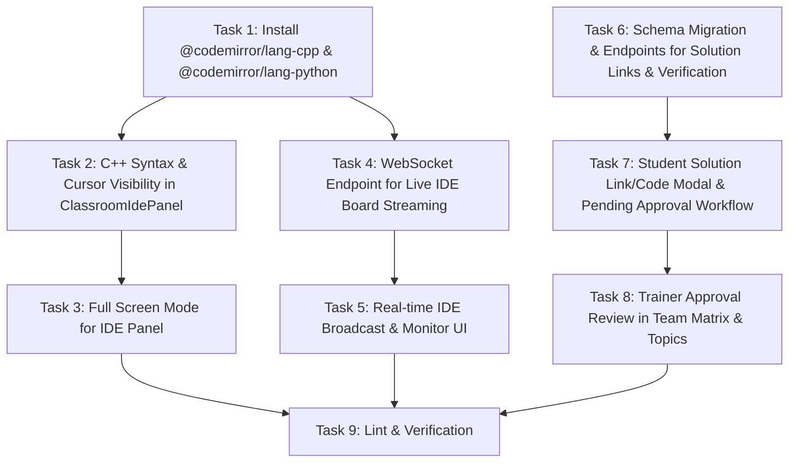

# Task Plan: Realtime IDE Board, Solution Links & Verification

- **Date**: 2026-07-25
- **Task**: Implement Realtime IDE Board, Solution Links & Trainer Approval Workflow

## Tasks & Dependency Graph

### Breakdown of Steps

1. **Task 1**: Install CodeMirror syntax dependencies (`@codemirror/lang-cpp`, `@codemirror/lang-python`).
2. **Task 2**: Update `ClassroomIdePanel.jsx` with C++ and Python syntax support and high-visibility cursor styling.
3. **Task 3**: Add full screen mode toggle button and layout in `ClassroomIdePanel.jsx`.
4. **Task 4**: Create WebSocket stream route `/classroom/:id/ide/stream` in `server/src/routes/classroomRoute.ts` for live student IDE broadcasts.
5. **Task 5**: Connect `ClassroomIdePanel` to WebSocket for instant student IDE tracking without 5s polling.
6. **Task 6**: Update DB migrations and API controllers to support `solution_link`, `solution_code`, and `pending_approval` status in `classroom_topic_problem_progress` and `class_problems`.
7. **Task 7**: Update student problem cards to allow attaching solution links/code and setting status to `pending_approval`.
8. **Task 8**: Add trainer approval & solution viewing controls in `ClassroomLiveClient.js` and `TeamMatrixClient.js`.
9. **Task 9**: Run client linting, server dev check, and build verification.
