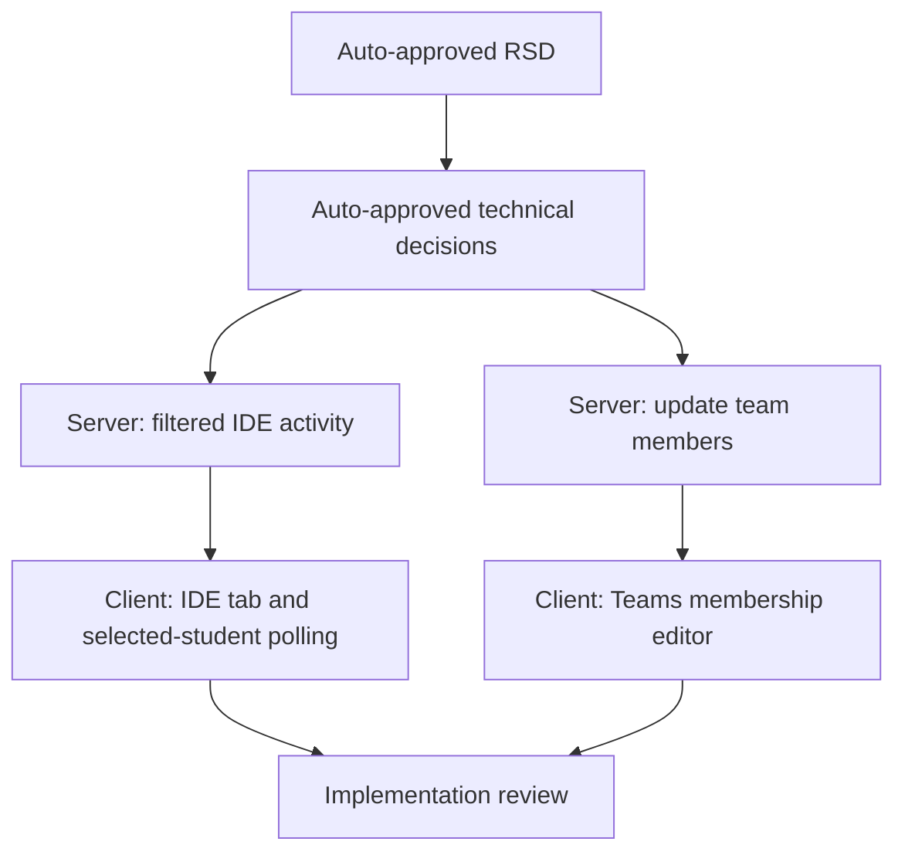

# Trainer IDE Tracking and Team Editing Task Plan

Status: Approved
Task ID: trainer-ide-tracking-team-edit-20260725
Last updated: 2026-07-25
Delivery mode: Auto

## Documentation and Knowledge Used

- Source: `docs/rsd/trainer-ide-tracking-team-edit-20260725-rsd.md`
  Used for: tasks and acceptance checks.
  Evidence: selected-student IDE tracking and team member editing are required.
  Confidence: High
- Source: `docs/decisions/trainer-ide-tracking-team-edit-20260725-technical-decisions.md`
  Used for: dependency graph and write scope.
  Evidence: use filtered endpoint, dedicated IDE tab, and membership replacement endpoint.
  Confidence: High
- Source: `AGENTS.md`
  Used for: serial implementation and verification.
  Evidence: keep scope tight and use narrow verification.
  Confidence: High

## Dependency Graph

## Tasks

### T1: Filter IDE Activity Reads

Purpose:
Reduce trainer IDE polling load by supporting selected-student reads.

Depends on:
TD-002.

Write scope:
`server/src/controllers/classroomController.ts`

Agent:
Main agent.

Branch/worktree:
Main workspace, serial. Existing dirty work overlaps target files.

Acceptance checks:

- [ ] Optional `studentId` filters sessions and events.
- [ ] Server rejects non-enrolled selected students.
- [ ] Whole-class fallback remains compatible.

Verification:
`bun build src/index.ts --outdir .dist/check --target=bun` in `server/`.

### T2: Update Team Members Endpoint

Purpose:
Let trainer change student list for an existing team.

Depends on:
TD-003.

Write scope:
`server/src/controllers/classroomController.ts`, `server/src/routes/classroomRoute.ts`

Agent:
Main agent.

Acceptance checks:

- [ ] Team belongs to classroom.
- [ ] Student IDs are valid classroom members.
- [ ] Existing members are replaced with selected members.

Verification:
Server bundle validation.

### T3: IDE Tab And Polling Guard

Purpose:
Make IDE activity a separate trainer workflow and poll only one selected student.

Depends on:
T1.

Write scope:
`client/src/app/classroom/live/[id]/ClassroomLiveClient.js`, `client/src/app/classroom/live/[id]/ClassroomIdePanel.jsx`

Agent:
Main agent.

Acceptance checks:

- [ ] `IDE` tab exists.
- [ ] Polling starts only on IDE tab with selected student.
- [ ] Latest code snapshot and event log render for selected student.
- [ ] Teams tab no longer embeds IDE activity log.

Verification:
Targeted client lint.

### T4: Team Membership Editor

Purpose:
Let trainer edit members in Teams.

Depends on:
T2.

Write scope:
`client/src/app/classroom/live/[id]/ClassroomLiveClient.js`

Agent:
Main agent.

Acceptance checks:

- [ ] Each team can open an edit-members mode.
- [ ] Checked enrolled students save to server.
- [ ] Cancel restores existing list.

Verification:
Targeted client lint.

## Final Git Integration Plan

- Base ref: current `master...origin/master` dirty workspace.
- Integration branch or main worktree: main workspace.
- Branches/worktrees to merge: none.
- Merge order: serial edits only.
- Full verification after integration:
  - `npx eslint src/app/classroom/live/[id]/ClassroomLiveClient.js src/app/classroom/live/[id]/ClassroomIdePanel.jsx`
  - `bun build src/index.ts --outdir .dist/check --target=bun`
