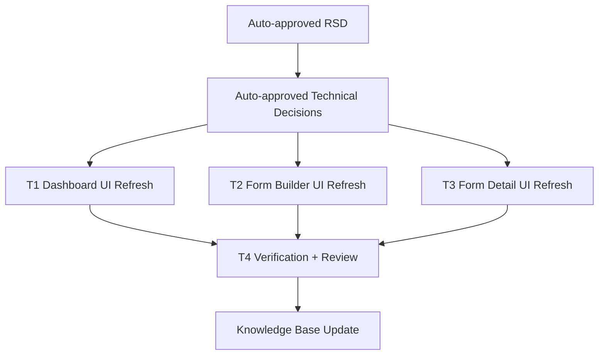

# Trainer Mode UI Refresh Task Plan

Status: Approved by auto-mode waiver
Task ID: trainer-mode-ui-refresh-20260725
Last updated: 2026-07-25
Delivery mode: Auto

## Documentation and Knowledge Used

- Source: `docs/rsd/trainer-mode-ui-refresh-20260725-rsd.md`
  Used for: task scope and acceptance criteria.
  Evidence: preserve routes/process while materially redesigning trainer dashboard, forms list, and form detail UI.
  Confidence: High

- Source: `docs/decisions/trainer-mode-ui-refresh-20260725-technical-decisions.md`
  Used for: write-scope and implementation constraints.
  Evidence: UI-only edits under trainer client components, no new dependencies, no server/API changes.
  Confidence: High

- Source: `AGENTS.md`
  Used for: verification.
  Evidence: client UI changes should prefer `npm run lint`, with `npm run build` when risk justifies it.
  Confidence: High

- Source: `docs/knowledge-base/project-index.md`
  Used for: existing trainer entry points.
  Evidence: trainer dashboard and trainer writing assistant are known trainer/classroom authoring entry points.
  Confidence: High

- Source: `client/src/app/trainer/dashboard/TrainerDashboardClient.js`
  Used for: T1 write scope.
  Evidence: dashboard owns classroom list, live classroom count, create dialog, trainer forms/admin trainers links.
  Confidence: High

- Source: `client/src/app/trainer/forms/TrainerFormsClient.js`
  Used for: T2 write scope.
  Evidence: form builder owns setup, field kit, field list, existing forms, and create submit.
  Confidence: High

- Source: `client/src/app/trainer/forms/[id]/TrainerFormDetailClient.js`
  Used for: T3 write scope.
  Evidence: form detail owns metrics, tabs, analytics, explore table, and JSON details.
  Confidence: High

## Dependency Graph

## Tasks

### T1: Dashboard UI Refresh

Purpose:
Make `/trainer/dashboard` a polished operational command view while preserving existing classroom fetch/create/link behavior.

Depends on:
Auto-approved technical decisions.

Write scope:
- `client/src/app/trainer/dashboard/TrainerDashboardClient.js`

Agent:
Main agent.

Branch/worktree:
Main workspace serial work. Parallel worktrees are not useful because current dirty state includes the same file and the task is UI-only.

Acceptance checks:
- [ ] New command header, metric row, live session lane, and classroom collection visual system.
- [ ] Existing API calls and create-classroom submit unchanged.
- [ ] Existing trainer forms, admin trainers, and classroom links unchanged.
- [ ] Loading, empty, live, and error states remain visible.

Code-quality checks:
- [ ] Local helper data only where it reduces repeated JSX.
- [ ] No new global design abstraction.
- [ ] No decorative orbs or hero-only layout.

Verification:
- Targeted ESLint for changed trainer files.

### T2: Form Builder UI Refresh

Purpose:
Make `/trainer/forms` easier to scan and operate while preserving the form creation process.

Depends on:
Auto-approved technical decisions.

Write scope:
- `client/src/app/trainer/forms/TrainerFormsClient.js`

Agent:
Main agent.

Branch/worktree:
Main workspace serial work.

Acceptance checks:
- [ ] Form setup, primary key, dynamic target, cell kit, field list, and existing forms are redesigned.
- [ ] Form type selection, field presets, mapped/custom field counts, field edit controls, validation, and submission behavior unchanged.
- [ ] Existing forms actions still copy, open, and manage the same routes.

Code-quality checks:
- [ ] Keep handler logic intact.
- [ ] Use stable button/icon dimensions for field controls.
- [ ] Avoid nested decorative card clutter.

Verification:
- Targeted ESLint for changed trainer files.

### T3: Form Detail UI Refresh

Purpose:
Make `/trainer/forms/[id]` analytics, response exploration, and JSON review feel coherent with the new trainer mode.

Depends on:
Auto-approved technical decisions.

Write scope:
- `client/src/app/trainer/forms/[id]/TrainerFormDetailClient.js`

Agent:
Main agent.

Branch/worktree:
Main workspace serial work.

Acceptance checks:
- [ ] Header, share URL strip, metrics, tabs, timeline, field summary, dynamic track, response table, and JSON details are redesigned.
- [ ] Data loading, copy link, open form, tab switching, search, and JSON rendering behavior unchanged.
- [ ] Empty/error/loading states remain visible.

Code-quality checks:
- [ ] Keep tab names and state values stable.
- [ ] Keep response table horizontally scrollable and mobile-safe.

Verification:
- Targeted ESLint for changed trainer files.

### T4: Verification, Review, and Knowledge Update

Purpose:
Prove route/process stability, record review results, and update durable project memory.

Depends on:
T1, T2, T3.

Write scope:
- `docs/reviews/trainer-mode-ui-refresh-20260725-implementation-review.md`
- `docs/knowledge-base/project-index.md`
- `docs/knowledge-base/patterns.md`
- `docs/knowledge-base/decisions.md`
- `docs/knowledge-base/quality-rules.md`
- `docs/knowledge-base/mistakes.md`

Agent:
Main agent reviewer/auditor/security pass.

Branch/worktree:
Main workspace serial work.

Acceptance checks:
- [ ] Review records changed files, traceability, code-quality review, security review, verification, and residual risk.
- [ ] Knowledge base records durable UI scope, decision, pattern, quality lesson, and mistake/near-miss note.
- [ ] `git diff --check` run.
- [ ] Targeted lint run; full lint/build run if feasible.

Code-quality checks:
- [ ] No unrelated dirty-file cleanup.
- [ ] No route/API/server/schema changes introduced.

Verification:
- `cd client; npx eslint src/app/trainer/dashboard/TrainerDashboardClient.js src/app/trainer/forms/TrainerFormsClient.js 'src/app/trainer/forms/[id]/TrainerFormDetailClient.js' src/components/trainer/TrainerWritingAssistant.jsx`
- `cd client; npm run lint` if feasible.
- `git diff --check`

## Final Git Integration Plan

- Base ref: current working branch and dirty worktree.
- Integration branch or main worktree: current main workspace.
- Branches/worktrees to merge: none.
- Merge order: serial edits T1 through T4.
- Full verification after integration:
  - targeted ESLint for changed trainer UI files.
  - `npm run lint` if feasible.
  - `git diff --check`.

## Known Worktree Notes

- `git status --short` already showed modified/untracked files, including trainer dashboard and docs from previous work. Preserve them and do not revert unrelated changes.
- No parallel worktrees are planned because write scopes overlap existing dirty files and the UI work is tightly coupled.
