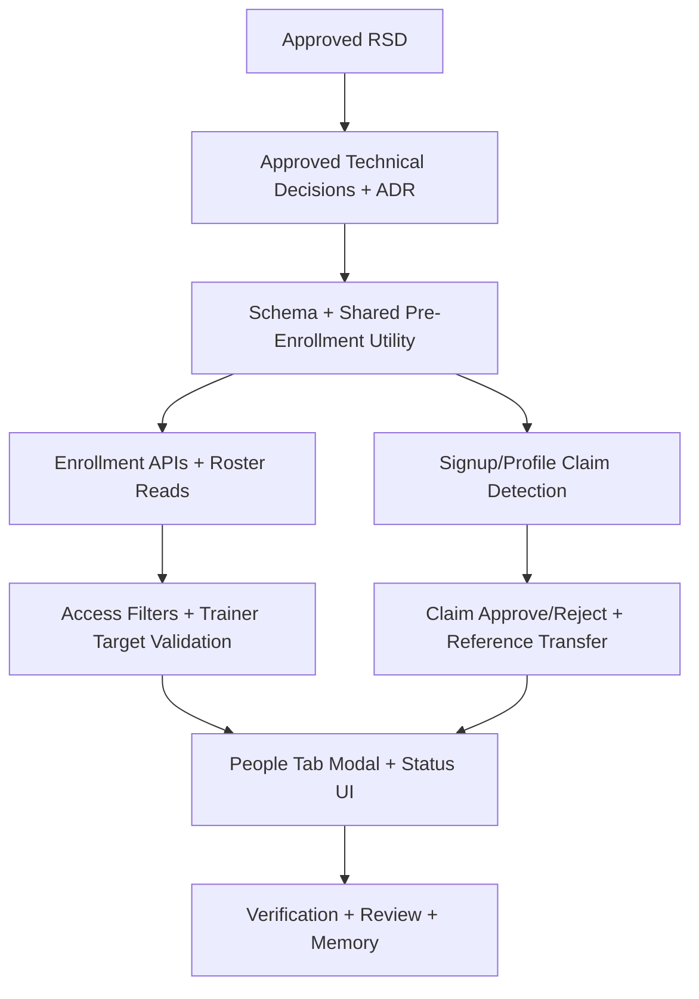

# Trainer Pre-Enrolled Students Task Plan

Status: Approved
Task ID: trainer-pre-enrolled-students-20260727
Last updated: 2026-07-27
Delivery mode: Manual gates

## Documentation and Knowledge Used

- Source: `docs/rsd/trainer-pre-enrolled-students-20260727-rsd.md`
  Used for: scope and acceptance criteria.
  Evidence: People tab missing students require pre-enrollment review; pre-enrolled rows must be trainer-selectable; student access stays protected.
  Confidence: High.

- Source: `docs/decisions/trainer-pre-enrolled-students-20260727-technical-decisions.md`
  Used for: data model, access boundary, endpoint shape, and UI approach.
  Evidence: approved disabled placeholder identities, `classroom_students.enrollment_status`, pending claims, trainer approval, and local People tab changes.
  Confidence: High.

- Source: `docs/adr/0006-classroom-pre-enrolled-student-identities.md`
  Used for: durable architecture constraints.
  Evidence: trainer workflows can include pre-enrolled/link-pending rows; student access requires active real membership.
  Confidence: High.

- Source: `docs/knowledge-base/patterns.md`
  Used for: CSV import interaction.
  Evidence: local CSV parsing, explicit mapping, preview, then single batch API call.
  Confidence: High.

- Source: `docs/knowledge-base/quality-rules.md` and `docs/knowledge-base/mistakes.md`
  Used for: security, role-clean roster rules, and verification.
  Evidence: avoid trainer/admin roster pollution, preserve single-request feedback, avoid hidden classroom polling.
  Confidence: High.

## Dependency Graph

## Parallelism Decision

Implementation should run serially in the main workspace.

Reason:
`classroomController.ts`, `ClassroomLiveClient.js`, and shared access semantics overlap across enrollment, roster, groups, attendance, assignment, and claims. Parallel agents would create high merge and logic-conflict risk.

## Tasks

### T1: Add Schema Guard and Shared Pre-Enrollment Helpers

Purpose:
Add idempotent schema setup and centralize pre-enrollment/claim logic.

Depends on:
Approved technical decisions and ADR-0006.

Write scope:
- `server/src/utils/classroomPreEnrollment.ts` (new)

Steps:
- Add `ensurePreEnrollmentSchema()` for new `users` and `classroom_students` columns plus narrow indexes where safe.
- Add helpers/constants for enrollment statuses: `active`, `pre_enrolled`, `link_pending`.
- Add helper for generated placeholder email values that are never displayed as real contact addresses.
- Add helper to create disabled placeholder users and classroom membership rows in one transaction.
- Add helper to detect claim candidates by real user `mist_id` and/or email.
- Add helper to promote matching pre-enrolled rows to `link_pending` with `claimed_user_id`.

Acceptance checks:
- [ ] Schema guard is idempotent.
- [ ] Placeholder users have `is_pre_enrolled=true`, `granted=false`, trainer/admin false, and non-login intent.
- [ ] Helpers keep CSV/name data out of logs.

### T2: Update Enrollment APIs and Roster Reads

Purpose:
Return missing students for review, create pre-enrolled rows after confirmation, and expose enrollment status to trainer UI.

Depends on:
T1.

Write scope:
- `server/src/controllers/classroomController.ts`
- `server/src/routes/classroomRoute.ts`

Steps:
- Call schema guard before pre-enrollment-aware enrollment operations.
- Update `addStudentToClassroom` to return structured missing data instead of only terminal 404 when identifier has no account.
- Update `addStudentsToClassroom` to return `notFound` entries carrying identifier, lookup method, row number, and optional name/email from CSV payload.
- Add `preEnrollStudents` endpoint to create placeholders from trainer-confirmed missing rows.
- Update `getClassroomDetails` roster/team member reads to include `enrollment_status`, `is_pre_enrolled`, `claimed_user_id`, `pre_enrollment_identifier`, and display email safely.
- Preserve blocking of trainer/admin accounts in enrollment and pre-enrollment flows.

Acceptance checks:
- [ ] Existing active users still enroll normally.
- [ ] Missing rows are returned for modal review.
- [ ] Confirmed missing rows become visible pre-enrolled roster entries.
- [ ] Re-imported rows deduplicate instead of creating duplicate memberships.

### T3: Add Signup and Profile Claim Detection

Purpose:
Surface real account matches without granting access.

Depends on:
T1.

Write scope:
- `server/src/controllers/authController.ts`
- `server/src/controllers/userController.ts`
- `server/src/controllers/trainerFormController.ts`

Steps:
- Reject login for `users.is_pre_enrolled=true` placeholders.
- After signup creates a real user, detect matching pre-enrolled rows by Student ID/email and mark them `link_pending`.
- After `setMistId`, detect matching pre-enrolled rows and mark them `link_pending`.
- Update trainer form user lookup paths to ignore placeholder users as real MCC accounts.
- Keep signup/profile behavior otherwise unchanged.

Acceptance checks:
- [ ] Placeholder users cannot log in.
- [ ] Matching real accounts create pending claims, not active classroom access.
- [ ] Trainer forms do not treat placeholder identities as real submitted-user accounts.

### T4: Harden Student Access Filters and Trainer Target Validation

Purpose:
Let trainers use pre-enrolled students while only active real students can access student surfaces.

Depends on:
T1 and T2.

Write scope:
- `server/src/controllers/classroomController.ts`
- `server/src/utils/classroomIdeStream.ts`
- `server/src/controllers/trainerFormController.ts`

Steps:
- Update `getClassrooms`, `canAccessClassroom`, `getClassAccess`, `isClassroomParticipant`, and direct classroom membership checks so student access requires `enrollment_status='active'` and non-placeholder real user.
- Keep trainer/admin/substitute access unchanged.
- Update trainer-side group creation/edit validation to accept `active`, `pre_enrolled`, and `link_pending` student rows, still rejecting trainer/admin users.
- Update attendance roster and save validation to accept pre-enrolled/link-pending rows for trainer operations.
- Update live problem assignment and bulk assignment target validation to accept pre-enrolled/link-pending roster rows for trainer operations.
- Update student-facing problem/topic/chat/IDE access checks so placeholders and link-pending real users cannot access classroom data.

Acceptance checks:
- [ ] Trainer can select pre-enrolled students for groups, attendance, and problem assignment.
- [ ] Student routes reject pre-enrolled placeholders and link-pending real accounts.
- [ ] Trainer/admin role pollution stays blocked.

### T5: Add Claim Approve/Reject and Reference Transfer

Purpose:
Let trainers safely activate a matched account and preserve pre-signup trainer work.

Depends on:
T1, T2, and T3.

Write scope:
- `server/src/controllers/classroomController.ts`
- `server/src/routes/classroomRoute.ts`

Steps:
- Add trainer-only endpoint to approve a pending claim.
- Add trainer-only endpoint to reject a pending claim.
- In approval transaction, transfer classroom-scoped references from placeholder `student_id` to claimed real user ID where needed.
- Handle duplicate conflicts in team members, attendance, class problems, and topic progress safely.
- Mark final `classroom_students` membership active for real user and remove/archive placeholder membership in that classroom.
- On rejection, clear claim metadata and return membership to `pre_enrolled`.

Acceptance checks:
- [ ] Approving claim gives real student active classroom access.
- [ ] Existing groups, attendance, assigned problems, and progress follow the real student where possible.
- [ ] Rejecting claim does not grant access and preserves pre-enrolled row.

### T6: Add People Tab Pre-Enrollment Modal and Status UI

Purpose:
Implement trainer-facing flow for missing students and visible roster states.

Depends on:
T2 and T5.

Write scope:
- `client/src/app/classroom/live/[id]/ClassroomLiveClient.js`

Steps:
- Extend student CSV mapping with optional name column and preview data.
- Track missing manual/CSV rows returned from enrollment APIs.
- Add modal warning for missing students with editable name fields and per-row validation.
- Confirm modal by calling `pre-enroll-students` once with valid rows.
- Show status badges in People roster for active, pre-enrolled, and link-pending rows.
- Show approve/reject actions for link-pending rows.
- Preserve existing loading/toast feedback and avoid per-row network loops.
- Preserve existing responsive layout and avoid broad People tab redesign.

Acceptance checks:
- [ ] Modal opens when missing rows exist.
- [ ] CSV name mapping auto-fills modal names.
- [ ] Blank required names block confirmation.
- [ ] Pre-enrolled rows show in roster and selection controls.
- [ ] Link-pending rows expose trainer approval actions.

### T7: Verification, Review, and Knowledge Base

Purpose:
Verify behavior and record durable lessons.

Depends on:
T1-T6 complete.

Write scope:
- `docs/reviews/trainer-pre-enrolled-students-20260727-implementation-review.md`
- `docs/knowledge-base/project-index.md`
- `docs/knowledge-base/patterns.md`
- `docs/knowledge-base/decisions.md`
- `docs/knowledge-base/quality-rules.md`
- `docs/knowledge-base/mistakes.md` if any issue occurs.

Steps:
- Run targeted client lint for `ClassroomLiveClient.js`.
- Run server build/type check using Bun where feasible.
- Run `git diff --check`.
- Review authorization, data exposure, input validation, secret handling, and unsafe defaults.
- Create implementation review and update knowledge base.

Acceptance checks:
- [ ] Verification results recorded with failures/blockers if any.
- [ ] Implementation review ready for final approval gate.
- [ ] Knowledge base updated.

## Verification Commands

- `npx eslint 'src/app/classroom/live/[id]/ClassroomLiveClient.js'`
- `bun build src/index.ts --target=bun --outdir .opencode-build-pre-enrollment`
- `git diff --check`

## Task-Plan Gate

Approved by user on 2026-07-27.
