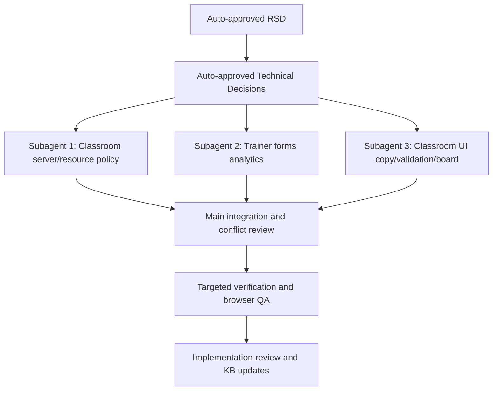

# Trainer QA Fixes Task Plan

Status: Approved
Task ID: trainer-qa-fixes-20260726
Last updated: 2026-07-26
Delivery mode: Auto

## Documentation and Knowledge Used

- Source: `docs/rsd/trainer-qa-fixes-20260726-rsd.md`
  Used for: task boundaries and acceptance checks
  Evidence: fixes span roster, topic resources, forms, terminology, validation, board, and preview metadata.
  Confidence: High
- Source: `docs/decisions/trainer-qa-fixes-20260726-technical-decisions.md`
  Used for: implementation approach and write scopes
  Evidence: no destructive cleanup, route compatibility for topic resources, client-side form metric fix, UI-only terminology, honest metadata fallback, board UI cleanup.
  Confidence: High
- Source: `rsd-orchestrator-agent/references/worktree-parallelism.md`
  Used for: subagent strategy
  Evidence: parallel agents require disjoint write scopes and review before integration.
  Confidence: High
- Source: `AGENTS.md`
  Used for: verification
  Evidence: narrow verification is preferred; client lint/build and Bun server commands are standard.
  Confidence: High

## Dependency Graph

## Tasks

### T1: Classroom Server Role and Topic Resource Fixes

Purpose:
Prevent trainer/admin accounts from being treated as classroom students and make topic-resource reader links resolve.

Depends on:
Auto-approved RSD and technical decisions.

Write scope:
`server/src/controllers/classroomController.ts`, `server/src/routes/classroomRoute.ts` only if needed.

Agent:
Parallel subagent.

Branch/worktree:
Subagent fork/workspace; integrate via reviewed diff.

Acceptance checks:
- [x] `addStudent` rejects trainer/admin accounts with a clear error.
- [x] classroom detail/student list excludes trainer/admin rows from student roster candidates.
- [x] attendance and team/group source data no longer includes trainer/admin as students.
- [x] resource detail endpoint resolves topic resources after validating classroom access.

HCI checks:
- [x] Wrong-role enrollment gives actionable feedback.
- [x] `Read` link opens content instead of a dead-end.

Code-quality checks:
- [x] Role policy is server-side and SQL remains parameterized.
- [x] Resource normalization is localized.

Verification:
`bun build src/index.ts --target=bun --outdir .codex-build-trainer-qa-server`

### T2: Trainer Form Detail Analytics and JSON Visibility

Purpose:
Fix mapped/custom metrics and response JSON rendering on trainer form detail pages.

Depends on:
Auto-approved RSD and technical decisions.

Write scope:
`client/src/app/trainer/forms/[id]/TrainerFormDetailClient.js`.

Agent:
Parallel subagent.

Branch/worktree:
Subagent fork/workspace; integrate via reviewed diff.

Acceptance checks:
- [x] mapped/custom response counts reflect saved `response_json` data.
- [x] JSON tab shows readable payload, not only primary key/date.
- [x] Empty states remain readable with no responses.

HCI checks:
- [x] Trainers can evaluate whether the form response data was saved.
- [x] JSON view is readable and scoped to trainer detail.

Code-quality checks:
- [x] Use small local normalization helpers.
- [x] Do not change public form routes or submit behavior.

Verification:
`npx eslint 'src/app/trainer/forms/[id]/TrainerFormDetailClient.js'`

### T3: Classroom Client UI Copy, Validation, Board, Preview Fallback

Purpose:
Fix user-facing Group copy, validation feedback, checkbox label association, duplicate board start button, tldraw CTA suppression, and misleading preview fallback.

Depends on:
Auto-approved RSD and technical decisions.

Write scope:
`client/src/app/classroom/live/[id]/ClassroomLiveClient.js`, `client/src/app/classroom/live/[id]/ClassroomBoardCanvas.jsx`, `client/src/app/classroom/live/[id]/teams/[teamId]/TeamMatrixClient.js` only for visible group copy if needed.

Agent:
Parallel subagent.

Branch/worktree:
Subagent fork/workspace; integrate via reviewed diff.

Acceptance checks:
- [x] affected visible Team/Teams labels become Group/Groups.
- [x] group member labels toggle checkboxes.
- [x] missing group members and missing assignment target show visible feedback.
- [x] Board empty state has one `Start broadcast` action.
- [x] tldraw license CTA is hidden/suppressed if feasible.
- [x] preview display no longer shows fake Standard limits.

HCI checks:
- [x] Invalid actions are prevented or explained.
- [x] Duplicate controls are removed.
- [x] Labels match trainer mental model.

Code-quality checks:
- [x] No broad rewrite of `ClassroomLiveClient.js`.
- [x] Keep changes near affected handlers/sections.

Verification:
`npx eslint 'src/app/classroom/live/[id]/ClassroomLiveClient.js' 'src/app/classroom/live/[id]/ClassroomBoardCanvas.jsx' 'src/app/classroom/live/[id]/teams/[teamId]/TeamMatrixClient.js'`

## Final Git Integration Plan

- Base ref: current `master...origin/master` checkout.
- Integration branch or main worktree: main workspace.
- Branches/worktrees to merge: subagent diffs after review.
- Merge order: T1, T2, T3, then manual integration fixes.
- Full verification after integration:
  - Server Bun bundle if server changed.
  - Targeted ESLint for changed client files.
  - `git diff --check`.
  - Browser QA on trainer classroom and form detail.
