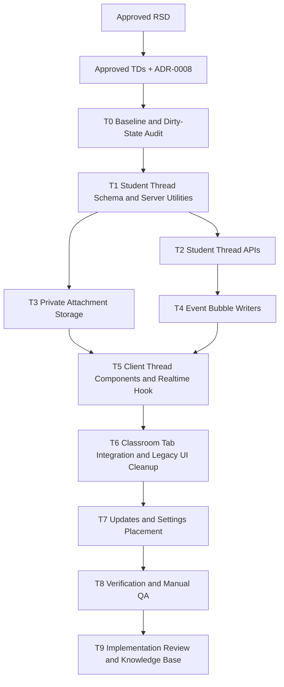

# Trainer Student Classroom Threads Realtime Task Plan

Status: Approved
Task ID: trainer-student-classroom-threads-realtime-20260731
Last updated: 2026-07-31
Delivery mode: Manual

## Mode and Gate Results

RSD gate was approved by the user on 2026-07-31. Technical decisions and ADR-0008 were approved by the user on 2026-07-31. The full task plan and dependency graph were approved by the user on 2026-07-31.

Gates waited on:
- RSD approval.
- Technical decisions and ADR approval.
- Full task plan and dependency graph approval.

Gates not yet satisfied:
- Implementation review before final merge.

## Documentation and Knowledge Used

- Source: `docs/rsd/trainer-student-classroom-threads-realtime-20260731-rsd.md`
  Used for: acceptance criteria and scope
  Evidence: `Updates` remains first/default, `Threads` is one classroom chat per student, `Settings` owns priority, files are safe-type only, and Supabase Realtime is required.
  Confidence: High
- Source: `docs/decisions/trainer-student-classroom-threads-realtime-20260731-technical-decisions.md`
  Used for: implementation boundaries
  Evidence: student-thread tables, server-authorized APIs, private attachments, opaque realtime invalidation, and legacy problem-thread UI treatment are approved.
  Confidence: High
- Source: `docs/adr/0008-classroom-student-thread-realtime-model.md`
  Used for: durable architecture
  Evidence: `Threads` becomes the only active classroom conversation surface and old problem threads become legacy/inert UI.
  Confidence: High
- Source: `docs/adr/0007-classroom-problem-thread-update-model.md`
  Used for: legacy compatibility
  Evidence: old problem-thread model remains useful for Updates/read-receipt history but is superseded for visible thread UI.
  Confidence: High
- Source: `AGENTS.md`
  Used for: process, review, and verification rules
  Evidence: required approval gates, artifact locations, narrow verification, and security checklist.
  Confidence: High
- Source: `docs/knowledge-base/project-index.md`
  Used for: entry points and current implementation state
  Evidence: current Updates/problem-thread implementation spans classroom live UI, Updates/Priority components, classroom controller/routes, user settings, and update schema helper.
  Confidence: High
- Source: `docs/knowledge-base/decisions.md`
  Used for: accepted architecture and non-goals
  Evidence: student-thread realtime model uses server-authorized refetch and private safe attachments; old problem-thread data is not destructively deleted.
  Confidence: High
- Source: `docs/knowledge-base/patterns.md`
  Used for: read receipts and no-polling pattern
  Evidence: visible update keys are server-generated/validated, and classroom live should not add hidden polling.
  Confidence: High
- Source: `docs/knowledge-base/quality-rules.md`
  Used for: implementation shape
  Evidence: lazy thread UI and server-owned authorization are expected.
  Confidence: High
- Source: `client/src/app/classroom/live/[id]/ClassroomLiveClient.js`
  Used for: tab and old UI integration plan
  Evidence: trainer/student tab state already defaults to `updates`; old problem-thread buttons and floating dock are wired here.
  Confidence: High
- Source: `client/src/components/UpdatesTab.js`
  Used for: preserving notification UI
  Evidence: existing component handles update load, refresh, unread state, mark-one-read, and mark-all-read.
  Confidence: High
- Source: `client/src/components/PrioritySettings.js`
  Used for: Settings tab placement
  Evidence: existing component handles priority reorder and classroom email toggle.
  Confidence: High
- Source: `client/src/components/ProblemThread.js`
  Used for: legacy thread replacement
  Evidence: current component is problem-scoped and lacks student-thread, file, and realtime behavior.
  Confidence: High
- Source: `client/src/components/FloatingThreadDock.js`
  Used for: legacy UI cleanup
  Evidence: current floating problem-thread dock reinforces the confusing problem-thread model.
  Confidence: High
- Source: `server/src/controllers/classroomController.ts`
  Used for: server API, event source, and authorization plan
  Evidence: current controller owns Updates, problem-thread helpers, problem assignment, student submissions, trainer verification, and classroom access checks.
  Confidence: High
- Source: `server/src/routes/classroomRoute.ts`
  Used for: route placement
  Evidence: classroom routes are JWT-protected after WebSocket endpoints and already include Updates/problem-thread APIs.
  Confidence: High
- Source: `server/src/utils/classroomUpdatesSchema.ts`
  Used for: schema helper pattern
  Evidence: runtime schema helper already creates user settings, old problem-thread tables, reactions, and update read receipts.
  Confidence: High
- Source: `https://supabase.com/docs/guides/realtime/authorization`
  Used for: realtime task safety
  Evidence: Realtime private channels require RLS policies on `realtime.messages`, and permissions are calculated from topic/JWT/header context.
  Confidence: High
- Source: `https://supabase.com/docs/guides/realtime/broadcast`
  Used for: broadcast task shape
  Evidence: Broadcast sends JSON payloads over WebSockets and protected use requires Realtime Authorization.
  Confidence: High
- Source: `https://supabase.com/docs/guides/storage`
  Used for: attachment storage task shape
  Evidence: file buckets support documents/general files with URL access and RLS.
  Confidence: High
- Source: `https://supabase.com/docs/reference/javascript/v1/storage-from-createsignedurl`
  Used for: attachment access task shape
  Evidence: signed URLs provide fixed-duration access to private objects when object select permission allows it.
  Confidence: Medium
- Source: `references/hci-design-rules.md`
  Used for: HCI checks
  Evidence: visible state, feedback, signifiers, mapping, constraints, error recovery, and accessibility are blocking for user-facing workflows.
  Confidence: High
- Source: `references/code-quality-rules.md`
  Used for: maintainability checks
  Evidence: keep interfaces small, hide volatile implementation details, avoid speculative abstractions, and verify changes.
  Confidence: High

## Dependency Graph

## Parallelism Decision

Implementation will run serially in the current workspace. No parallel worktrees are planned because the highest-risk tasks share `client/src/app/classroom/live/[id]/ClassroomLiveClient.js`, `server/src/controllers/classroomController.ts`, and classroom thread/update semantics. Existing dirty workspace changes must be preserved and inspected before editing; unrelated changes must not be reverted.

## Tasks

### T0: Baseline and Dirty-State Audit

Purpose:
Capture the current working tree, identify which existing dirty files are part of the previous Updates/problem-thread work, and map all active problem-thread UI entry points before changing code.

Depends on:
None.

Write scope:
No source edits expected. Findings may be recorded later in `docs/reviews/trainer-student-classroom-threads-realtime-20260731-implementation-review.md`.

Agent:
Main agent.

Branch/worktree:
Current workspace. No branch switch before confirming dirty-state scope.

Acceptance checks:
- [ ] `git status --short --branch` captured.
- [ ] Existing problem-thread imports/usages are listed before removal/hiding.
- [ ] Unrelated dirty changes are identified and preserved.

HCI checks:
- [ ] Identify all visible surfaces that currently signal "Thread" so the final UI has one clear conversation model.

Code-quality checks:
- [ ] Avoid deleting or reverting files only because they are dirty.

Verification:
- `git status --short --branch`
- `rg -n "ProblemThread|FloatingThreadDock|Thread" client/src/app/classroom/live client/src/components`

Merge notes:
No merge action.

### T1: Student Thread Schema and Server Utilities

Purpose:
Create a cohesive server utility for student-thread schema, event/message constants, active-student authorization helpers, safe attachment validation, and optional Supabase storage configuration checks.

Depends on:
T0.

Write scope:
- `server/src/utils/classroomStudentThreadsSchema.ts` or equivalent new utility.
- Minimal imports in `server/src/controllers/classroomController.ts`.

Agent:
Main agent.

Branch/worktree:
Current workspace.

Acceptance checks:
- [ ] `classroom_student_threads` has one row per `(classroom_id, student_id)`.
- [ ] `classroom_student_thread_messages` supports human messages and system event bubbles.
- [ ] `classroom_student_thread_attachments` stores private attachment metadata without public URLs.
- [ ] Safe file type/extension/size constants are centralized.
- [ ] Runtime schema code is additive only; no destructive `DROP TABLE` or legacy data cleanup.

HCI checks:
- [ ] Message and event kinds provide enough metadata for clear bubble labels and attachment states.

Code-quality checks:
- [ ] Keep schema/helper names domain-specific and avoid mixing new student-thread schema into unrelated pre-enrollment helpers.

Verification:
- Server bundle smoke after server tasks: `bun build src/index.ts --target=bun --outdir <temp-dir>`.

Merge notes:
Must land before APIs or event writers.

### T2: Student Thread APIs

Purpose:
Add JWT-secured classroom APIs for listing threads, reading one student thread, sending human messages, and returning message/reaction/attachment metadata through server-side authorization.

Depends on:
T1.

Write scope:
- `server/src/controllers/classroomController.ts`
- `server/src/routes/classroomRoute.ts`
- New server utility from T1 if needed.

Agent:
Main agent.

Branch/worktree:
Current workspace.

Acceptance checks:
- [ ] Trainer/admin/approved manager can list active student threads for the classroom.
- [ ] Active real student can read only their own classroom thread.
- [ ] Pre-enrolled/link-pending placeholder identities cannot chat as students.
- [ ] Unrelated users receive 403/404 without thread content.
- [ ] Human messages are trimmed, length-bounded, and persisted.
- [ ] Responses include the authorized realtime channel name or opaque thread revision data needed by the client.

HCI checks:
- [ ] API error messages support useful UI states: unavailable student, unauthorized, empty thread, load failure.

Code-quality checks:
- [ ] Centralize thread access checks; do not repeat role/membership SQL in each endpoint.

Verification:
- Server bundle smoke after T2/T3/T4.
- Targeted API smoke through available local server if feasible.

Merge notes:
Required before client thread UI.

### T3: Private Attachment Storage

Purpose:
Implement safe file upload and access for classroom student threads using private Supabase Storage, server validation, and short-lived authorized access.

Depends on:
T1.

Write scope:
- `server/src/controllers/classroomController.ts`
- `server/src/routes/classroomRoute.ts`
- `server/src/utils/classroomStudentThreadsSchema.ts` or a focused storage helper.
- Optional environment documentation in implementation review if required.

Agent:
Main agent.

Branch/worktree:
Current workspace.

Acceptance checks:
- [ ] Allowed extensions/MIME categories match the RSD safe file list.
- [ ] Default max file size is 10 MB unless stricter deployment constraints are discovered.
- [ ] Server rejects archives, executables, unknown binaries, oversized files, and mismatched unsafe metadata.
- [ ] Storage path is classroom/thread scoped and not treated as authorization.
- [ ] Attachment access rechecks classroom/thread authorization before returning a signed URL or stream.
- [ ] Missing Supabase storage configuration produces a clear server error and UI recovery state.

HCI checks:
- [ ] Upload errors can be shown near the composer and preserve unsent message text.

Code-quality checks:
- [ ] Do not reuse public-image helpers such as `uploadImage` for private classroom attachments.
- [ ] Keep storage configuration explicit and server-only.

Verification:
- Server bundle smoke.
- Manual allowed/rejected upload scenarios if Supabase storage env and bucket are available.

Merge notes:
Can be validated after T5 client attachment UI exists.

### T4: Event Bubble Writers

Purpose:
Mirror successful classroom actions into affected student-thread system bubbles without changing existing problem/submission authority.

Depends on:
T2.

Write scope:
- `server/src/controllers/classroomController.ts`
- New server utility from T1.

Agent:
Main agent.

Branch/worktree:
Current workspace.

Acceptance checks:
- [ ] Student live problem submission creates `student_solution_submitted` in that student's thread.
- [ ] Student topic problem submission creates `student_solution_submitted` in affected student's thread.
- [ ] Trainer live problem assignment creates `trainer_problem_added` for affected active students.
- [ ] Bulk/group live assignment batches event creation for affected active students.
- [ ] Trainer topic/resource/problem updates create `topic_or_resource_updated` only for affected active students.
- [ ] Trainer feedback/status changes create `trainer_feedback` or `solution_status_changed`.
- [ ] Event helper filters out trainer/admin, pre-enrolled, link-pending, and unaffected students.
- [ ] Existing final-verdict protections remain unchanged.

HCI checks:
- [ ] Event body copy distinguishes submitted-for-review, feedback, approved, rejected/tried, and new assignment states.

Code-quality checks:
- [ ] One shared event helper handles fan-out and batching; controllers do not duplicate message insertion details.

Verification:
- Server bundle smoke.
- Manual/API event scenarios after client UI exists.

Merge notes:
Must precede realtime client QA so inbound system bubbles can be observed.

### T5: Client Thread Components and Realtime Hook

Purpose:
Build the new `Threads` user experience with an iMessage-inspired layout, student picker for trainers, direct student own-thread view, latest-update strip, composer, safe attachment controls, and Supabase Realtime invalidation.

Depends on:
T2 and T3 and T4.

Write scope:
- `client/src/components/ClassroomThreadsTab.js`
- `client/src/components/StudentThreadList.js` if split from tab.
- `client/src/components/StudentThreadPanel.js` if split from tab.
- `client/src/hooks/useClassroomThreadRealtime.js`
- Shared local helpers inside these files as needed.

Agent:
Main agent.

Branch/worktree:
Current workspace.

Acceptance checks:
- [ ] Trainer can select an active student thread from a bounded searchable list.
- [ ] Student opens directly to their own thread.
- [ ] Messages render with left/right iMessage-like bubbles and distinct system event bubbles.
- [ ] Top `Latest updates` strip shows newest/high-priority thread events while the main timeline remains readable.
- [ ] Composer sends text messages and supports attach/remove-before-send.
- [ ] Attachment UI shows progress, success, failure, retry, metadata, and safe open/download action.
- [ ] Realtime signals refetch the active thread without `setInterval` or visibility refetch.
- [ ] Realtime connected/reconnecting/disconnected state is visible.
- [ ] New off-screen messages do not force-scroll the reader; a jump-to-latest control appears.

HCI checks:
- [ ] Scope labels show classroom/student/trainer-side audience.
- [ ] Color is not the only signifier for own/system/error/realtime/upload states.
- [ ] Keyboard users can pick a thread, send, attach/remove, refresh, and jump to latest.

Code-quality checks:
- [ ] Keep Supabase channel setup/cleanup inside `useClassroomThreadRealtime`.
- [ ] Do not copy typing-room realtime code that includes unrelated room/game state.

Verification:
- Targeted ESLint for new components/hook.
- Browser visual/manual checks on desktop and mobile if local app can run.

Merge notes:
Must be integrated before tab wiring.

### T6: Classroom Tab Integration and Legacy Problem-Thread UI Cleanup

Purpose:
Wire `Threads` and `Settings` into trainer/student classroom tabs, move `PrioritySettings` out of `Updates`, and remove active problem-thread buttons/floating dock from classroom UI.

Depends on:
T5.

Write scope:
- `client/src/app/classroom/live/[id]/ClassroomLiveClient.js`
- `client/src/app/classroom/live/[id]/teams/[teamId]/TeamMatrixClient.js` if active problem-thread entry points remain there.
- `client/src/components/ProblemThread.js` and `client/src/components/FloatingThreadDock.js` only if confirmed unused and safe to remove from active code.

Agent:
Main agent.

Branch/worktree:
Current workspace.

Acceptance checks:
- [ ] Trainer tab order begins with `Updates`, includes `Threads`, and includes `Settings`.
- [ ] Student tab order begins with `Updates`, includes `Threads`, and includes `Settings`.
- [ ] `PrioritySettings` renders under `Settings`, not inside `Updates`.
- [ ] Old problem-thread buttons/floating dock are removed or hidden from active classroom screens.
- [ ] Updates remains notification/read-state only and does not launch chats.
- [ ] Existing non-thread classroom workflows remain routed through their current handlers.

HCI checks:
- [ ] Users see one clear conversation place: `Threads`.
- [ ] Tab labels and empty states explain notification versus conversation versus settings without instructional clutter.

Code-quality checks:
- [ ] Keep tab integration small; do not rewrite unrelated classroom panels.
- [ ] Preserve endpoint strings and handlers for unrelated classroom features.

Verification:
- Targeted ESLint for `ClassroomLiveClient.js` and changed thread components.
- Client build if syntax/integration risk warrants it.

Merge notes:
High-conflict file. Complete after component work is stable.

### T7: Updates and Settings Preservation

Purpose:
Ensure Updates still works as first/default notification UI after `Settings` is separated and new thread events are introduced.

Depends on:
T6.

Write scope:
- `client/src/components/UpdatesTab.js`
- `client/src/components/PrioritySettings.js`
- `server/src/controllers/userController.ts` and `server/src/routes/userRoute.ts` only if settings API changes are necessary.
- `server/src/controllers/classroomController.ts` only if update sources need small adjustments for student-thread event keys.

Agent:
Main agent.

Branch/worktree:
Current workspace.

Acceptance checks:
- [ ] Mark-one-read and mark-all-read still work.
- [ ] Priority order persists and affects Updates ordering.
- [ ] Classroom email toggle remains namespaced to classroom update emails.
- [ ] New student-thread event sources do not duplicate or break existing stable update keys.
- [ ] Updates initial load/refresh remains action-driven, with no interval polling.

HCI checks:
- [ ] Updates header remains focused on notification state and not chat controls.
- [ ] Settings save feedback uses Sonner lifecycle feedback.

Code-quality checks:
- [ ] Reuse existing settings/read-receipt logic; do not create a second settings store.

Verification:
- Targeted client lint.
- Manual mark-read/settings scenarios.

Merge notes:
Run after tab movement to catch regressions from relocation.

### T8: Verification and Manual QA

Purpose:
Run the narrowest verification that covers changed files, then broaden because this feature touches shared classroom API and UI workflows.

Depends on:
T1 through T7.

Write scope:
No source edits unless fixes are required.

Agent:
Main agent.

Branch/worktree:
Current workspace.

Acceptance checks:
- [ ] Server bundle smoke passes or blockers are documented.
- [ ] Targeted client lint passes or blockers are documented.
- [ ] Client build passes or blockers are documented.
- [ ] No new hidden polling/visibility refetch is introduced.
- [ ] Manual trainer and student scenarios from the RSD are exercised where local credentials/env allow it.
- [ ] Supabase attachment/realtime checks are run when env/bucket support is available; otherwise residual risk is documented.

HCI checks:
- [ ] Desktop and mobile layout checks confirm no overlapping chat/sidebar/content.
- [ ] Upload/realtime/error states are visible and recoverable.

Code-quality checks:
- [ ] `git diff --check` run; CRLF-only warnings recorded if present.
- [ ] Review changed files for duplicated auth/file-validation/event-fanout logic.

Verification:
- `Set-Location server; bun build src/index.ts --target=bun --outdir <temp-dir>`
- `Set-Location client; npm run lint`
- `Set-Location client; npm run build`
- `git diff --check`
- Manual browser QA if the local app can run with required services.

Merge notes:
Any failing changed-file check blocks implementation review unless explicitly waived.

### T9: Implementation Review and Knowledge Base

Purpose:
Record requirement traceability, reviewer/security/HCI/code-quality findings, verification results, residual risks, changed files, and durable project learning before the final manual gate.

Depends on:
T8.

Write scope:
- `docs/reviews/trainer-student-classroom-threads-realtime-20260731-implementation-review.md`
- `docs/knowledge-base/project-index.md`
- `docs/knowledge-base/decisions.md`
- `docs/knowledge-base/patterns.md`
- `docs/knowledge-base/hci-rules.md`
- `docs/knowledge-base/quality-rules.md`
- `docs/knowledge-base/doc-usage.md`
- `docs/knowledge-base/mistakes.md`

Agent:
Main agent.

Branch/worktree:
Current workspace.

Acceptance checks:
- [ ] Review covers RSD acceptance criteria.
- [ ] Security review covers auth, data exposure, file access, realtime payloads, secret handling, and unsafe defaults.
- [ ] HCI review covers discoverability, signifiers, feedback, mapping, constraints, error recovery, accessibility, and realtime/upload state.
- [ ] Code-quality review covers module boundaries, duplication, complexity, old UI cleanup, and event fan-out.
- [ ] Documentation-learning audit identifies docs used, stale docs, and KB updates.
- [ ] Final mistake/near-miss note is added.

HCI checks:
- [ ] Any UI compromise is named as a waiver before final approval.

Code-quality checks:
- [ ] Any remaining smell or broad file complexity is recorded with scope limits.

Verification:
- Review artifact inspection.

Merge notes:
Implementation-review gate must be approved before final merge/stage/commit actions.

## Final Git Integration Plan

- Base ref: current `master` workspace, preserving existing dirty changes.
- Integration branch/worktree: current workspace unless the user requests a dedicated branch before implementation; if a branch is created, use `codex/trainer-student-threads-realtime-20260731`.
- Branches/worktrees to merge: none planned.
- Merge order: serial tasks T0 through T9.
- Staging/commit/push: not part of this task-plan gate unless the user later asks for Git delivery.
- Full verification after integration:
  - Server Bun bundle smoke.
  - Client lint/build as above.
  - `git diff --check`.
  - Manual classroom trainer/student QA where credentials and services are available.

## Approval Result

Manual-mode task-plan gate was approved by the user on 2026-07-31. Implementation may proceed in the current workspace according to this plan.
