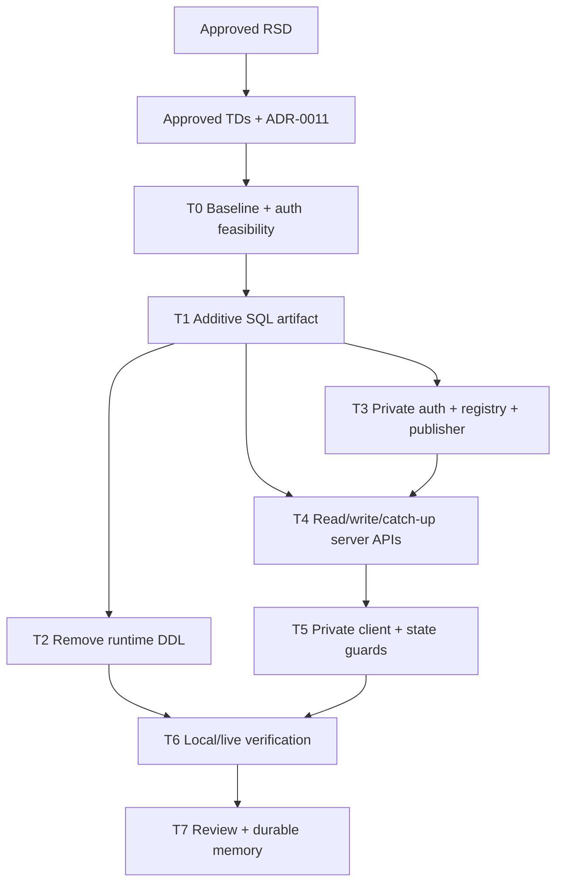

# Trainer Student Thread Instant Realtime Task Plan

Status: Approved under the user's 2026-08-02 full-auto instruction
Task ID: trainer-student-thread-instant-realtime-20260802
Last updated: 2026-08-02
Delivery mode: Auto

## Gate State

Satisfied gates:

- Primary RSD approved by the user on 2026-08-02.
- Technical decisions and ADR-0011 approved under the user's full-auto instruction.
- This task plan and dependency graph are approved under the same instruction.

Current gate:

- Implementation and verification are complete.
- Implementation review is approved under the user's full-auto instruction.

## Dependency Graph

Implementation is serial because the SQL contract, server payload/auth contract, and client subscription/catch-up contract share the same revision and credential semantics.

## Tasks

### T0 — Baseline and Safety Audit

Status: Completed

Actions:

- Record current Realtime, PostgreSQL, advisor, channel, row-count, and `pg_stat_statements` evidence.
- Confirm current public/private policies and browser-role grants.
- Verify a temporary server-managed Auth user can obtain an `anon` access token with a chosen MCC UUID, then delete the exact probe user.
- Confirm no existing `anon`/`public` policy grants extra application rows based on non-null `auth.uid()`.

Verification:

- Auth probe returns `role=anon`, matching subject, and cleanup HTTP 200.
- No test user remains.

### T1 — Create and Apply the Additive SQL Artifact

Status: Completed

Write scope:

- `docs/sql/trainer-student-thread-instant-realtime-20260802.sql`
- Remote Supabase schema through one reviewed migration

Actions:

- Move the Updates and pre-enrollment schema baseline into SQL.
- Add thread/message revisions, explicit client-message idempotency, indexes, backfills, and constraints safely.
- Backfill missing active-real-student threads.
- Add membership lifecycle provisioning trigger.
- Add scoped registry uniqueness/renewal fields and remove duplicate active rows deterministically.
- Add private-schema authorization helper and receive-only `realtime.messages` policy.
- Preserve RLS and revoked browser DML on thread/registry tables.

Verification:

- Inspect tables/policies/grants/constraints/indexes after apply.
- Run advisors and representative `EXPLAIN`/queries.
- Prove an unrelated UUID/topic cannot pass the helper and an owned active row can.

Rollback:

- Application rollback leaves additive schema in place.
- No automatic destructive down migration.

### T2 — Remove Request-Time DDL

Status: Completed

Write scope:

- `server/src/utils/classroomUpdatesSchema.ts`
- `server/src/utils/classroomPreEnrollment.ts`
- Any remaining scoped classroom request-time schema guard found by source scan

Actions:

- Replace compatibility ensure functions with no-op promises after SQL becomes the deployment prerequisite.
- Remove unused schema-only imports/state.
- Confirm no thread/Updates/pre-enrollment classroom request executes DDL.

Verification:

- Scoped source scan for DDL templates and ensure-function bodies.
- Server bundle/parse check.

### T3 — Implement Private Realtime Auth, Registry Renewal, and Awaited Publisher

Status: Completed

Write scope:

- New focused server Realtime auth utility if needed
- `server/src/utils/classroomStudentThreadsSchema.ts`
- Environment documentation only; do not expose or add secrets to public env

Actions:

- Implement collision-safe shadow Auth user provisioning and server-side token exchange.
- Cache only still-valid access tokens in memory; return access token/expiry without refresh material.
- Atomically reuse one scoped registry row/topic and extend it before expiry.
- Publish canonical payloads through the documented REST batch endpoint with `private: true` per topic, a timeout, and explicit result telemetry.
- Add exact-object Storage cleanup helper.

Verification:

- Unit-like helper checks with mocked fetch where practical.
- Live authorized/unauthorized private subscribe and client-publish denial tests when authenticated browser sessions are available.
- Confirm logs never contain tokens/payload content.

### T4 — Implement Read-Only Access, Transactions, Idempotency, and Catch-Up APIs

Status: Completed

Write scope:

- `server/src/controllers/classroomController.ts`
- `server/src/routes/classroomRoute.ts`

Actions:

- Collapse access to one active-membership/manager/thread query.
- Replace list construction with read-only joined summaries.
- Implement total-order history cursor `(created_at, id)`.
- Add bounded `afterRevision` catch-up endpoint.
- Make text and attachment sends short transactions with server-enforced idempotency.
- Return the canonical saved message/summary from the atomic persistence path without post-commit rereads, await private publication, and return delivery status.
- Keep storage upload outside DB transaction and compensate exact failed uploads.
- Parallelize independent initial message/event/credential reads.

Verification:

- Duplicate client ID returns one persisted message/revision.
- Equal-timestamp history cursor does not skip.
- Forced publish failure preserves DB message and catch-up returns it.
- Statement inspection shows reads issue no thread insert/upsert.

### T5 — Implement Private Subscription, Catch-Up, Renewal, and State Isolation

Status: Completed

Write scope:

- `client/src/hooks/useClassroomThreadRealtime.js`
- `client/src/components/ClassroomThreadsTab.js`
- `client/src/lib/action.js` only if the scoped fetch helper defect remains relevant

Actions:

- Authenticate Realtime before joining `private: true` channels.
- Validate canonical envelopes and merge messages/summaries directly.
- Run catch-up after every `SUBSCRIBED` state and loop bounded pages when needed.
- Renew topic/credential before expiry and catch up after the new subscription.
- Use complete older-history cursors.
- Add active thread/request generation checks and immediate state isolation on selection.
- Reconcile optimistic messages by client ID and persisted ID/revision.
- Preserve visible connection/pending/failure states and no-polling behavior.

Verification:

- Targeted ESLint.
- Delayed-response A → B → A state test/source review.
- Simulated duplicate/out-of-order envelope and reconnect catch-up tests where the current test harness permits.

### T6 — Local and Live Verification

Status: Completed

Actions:

- Run targeted client lint and server bundle/parse checks.
- Run full client lint/build when practical and record unrelated blockers separately.
- Re-run source scans for public thread channels, public fallback, fire-and-forget broadcast, read-path upsert, one-column cursor, runtime DDL, and secret logging.
- Re-run Supabase security/performance advisors and inspect policies/grants/logs/statement statistics.
- Conduct two-session trainer/student QA if valid sessions are available: healthy sends, attachment, initial gap, disconnect/reconnect, renewal, rapid selection, duplicate retry, unauthorized topic, and forced publication failure.
- Record sample count, test environment, sender feedback, p50, and p95 commit-to-render timing.

Expected limitations:

- If authenticated trainer/student browser sessions are unavailable, code/schema verification can complete but measured two-browser latency and long-session renewal remain documented live-QA gaps.

### T7 — Implementation Review and Knowledge Base

Status: Completed

Write scope:

- `docs/reviews/trainer-student-thread-instant-realtime-20260802-implementation-review.md`
- Relevant `docs/knowledge-base/` files

Actions:

- Review requirement satisfaction, correctness, maintainability, test coverage, authorization/data exposure, secret handling, dependency risk, and migration/rollback safety.
- Record files changed, SQL applied, verification evidence, residual risks, and any manual deployment/session QA still required.
- Mark the implementation-review gate approved under the user's full-auto instruction only after all safe in-scope work is complete.

## Planned Files

- `docs/sql/trainer-student-thread-instant-realtime-20260802.sql`
- `server/src/utils/classroomStudentThreadRealtimeAuth.ts` (new if retained after implementation)
- `server/src/utils/classroomStudentThreadsSchema.ts`
- `server/src/utils/classroomUpdatesSchema.ts`
- `server/src/utils/classroomPreEnrollment.ts`
- `server/src/controllers/classroomController.ts`
- `server/src/routes/classroomRoute.ts`
- `client/src/hooks/useClassroomThreadRealtime.js`
- `client/src/components/ClassroomThreadsTab.js`
- Focused documentation, review, and knowledge-base artifacts

## Completion Conditions

- All RSD acceptance criteria that can be exercised in the available environment are evidenced.
- Any missing two-browser or deployment-only verification is explicit and does not get reported as passed.
- No secret or service credential is added to browser code, tracked docs, or logs.
- Remote SQL is additive and verified before code relies on it.
- Implementation review is complete and approved before final handoff.
