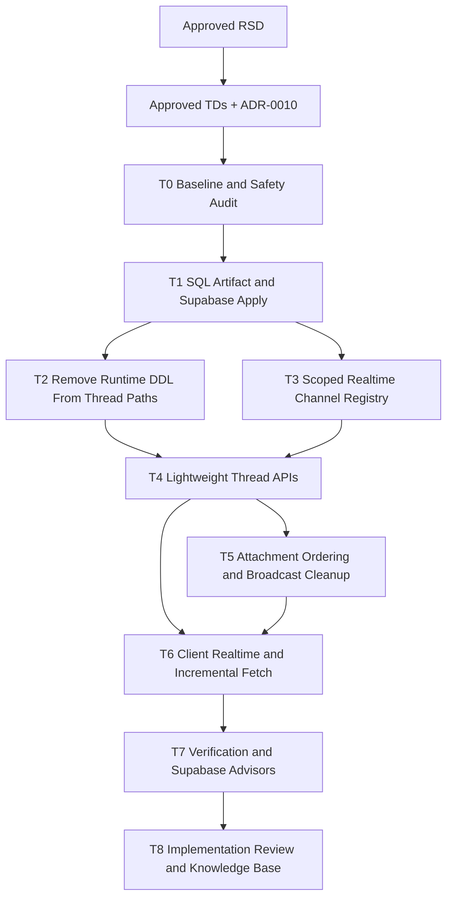

# Trainer Student Thread Realtime Hardening and Performance Task Plan

Status: Approved
Task ID: trainer-student-thread-realtime-hardening-performance-20260802
Last updated: 2026-08-02
Delivery mode: Manual

## Gate State

Satisfied gates:
- RSD approved by the user on 2026-08-02.
- Technical decisions and ADR-0010 approved by the user on 2026-08-02.

Current gate:
- Approved by the user on 2026-08-02. Implementation may begin.

## Documentation and Knowledge Used

- Source: `docs/rsd/trainer-student-thread-realtime-hardening-performance-20260802-rsd.md`
  Used for: approved scope and acceptance criteria.
  Confidence: High
- Source: `docs/decisions/trainer-student-thread-realtime-hardening-performance-20260802-technical-decisions.md`
  Used for: RLS/grants, scoped Realtime, migration, index, fetch, and attachment decisions.
  Confidence: High
- Source: `docs/adr/0010-classroom-student-thread-realtime-hardening.md`
  Used for: durable Realtime hardening model.
  Confidence: High
- Source: `docs/adr/0008-classroom-student-thread-realtime-model.md`
  Used for: preserving server-authorized thread content and opaque Realtime invalidation.
  Confidence: High
- Source: Supabase MCP advisors and SQL inspection on 2026-08-02
  Used for: current RLS, grants, policies, indexes, private bucket, and topic-assignment column state.
  Confidence: High
- Source: Supabase and Supabase Postgres skill references
  Used for: current docs, RLS in exposed schema, migration care, index selection, and lock minimization.
  Confidence: High
- Source: `server/src/utils/classroomStudentThreadsSchema.ts`
  Used for: current DDL, broadcast, storage, and validation implementation.
  Confidence: High
- Source: `server/src/controllers/classroomController.ts`
  Used for: API, authorization, message insertion, attachment ordering, and topic DDL paths.
  Confidence: High
- Source: `server/src/routes/classroomRoute.ts`
  Used for: route placement.
  Confidence: High
- Source: `client/src/components/ClassroomThreadsTab.js`
  Used for: current full refetch behavior and selected-thread-only realtime.
  Confidence: High
- Source: `client/src/hooks/useClassroomThreadRealtime.js`
  Used for: Supabase channel setup/cleanup.
  Confidence: High
- Source: `client/src/lib/action.js`
  Used for: authenticated server-action fetch helpers.
  Confidence: High

## Dependency Graph

## Parallelism Decision

Run serially in the current workspace. The changed code overlaps in `classroomController.ts`, `classroomRoute.ts`, `classroomStudentThreadsSchema.ts`, `ClassroomThreadsTab.js`, and the realtime hook. Parallel agents would create conflict risk and make database/code ordering harder to review.

## Tasks

### T0: Baseline and Safety Audit

Purpose:
Capture workspace state, confirm no unrelated source changes need to be touched, and refresh the current Supabase advisor/log baseline.

Write scope:
- No source edits expected.
- Notes may be recorded later in the implementation review.

Acceptance checks:
- [ ] `git status --short --branch` captured.
- [ ] Current thread/realtime files inspected before edits.
- [ ] Supabase security/performance advisor baseline captured.
- [ ] Private attachment bucket state confirmed without printing secrets.

Verification:
- `git status --short --branch`
- Supabase MCP `get_advisors` security/performance.

### T1: SQL Artifact and Supabase Apply

Purpose:
Create one reviewed SQL deployment artifact and apply it to Supabase after this task-plan gate is approved.

Write scope:
- `docs/sql/trainer-student-thread-realtime-hardening-20260802.sql`
- Supabase remote database through MCP `apply_migration`, unless Arik requests manual SQL instead.

SQL scope:
- Enable RLS on the three student-thread tables.
- Revoke direct privileges from `anon` and `authenticated` for the three student-thread tables.
- Create `classroom_student_thread_realtime_channels` for server-issued scoped channel names.
- Enable RLS and revoke browser-role privileges on the scoped channel registry.
- Drop duplicate `classroom_student_threads_classroom_student_idx`.
- Add/replace thread-message, event, nullable FK, student FK, and topic-assignment lookup indexes approved in TD-008.
- Do not change unrelated advisor findings outside the student-thread scope.

Acceptance checks:
- [ ] SQL is idempotent where practical.
- [ ] No destructive table drops or data deletion.
- [ ] RLS/grant changes are scoped to student-thread tables and the new channel registry.
- [ ] Thread indexes match active query shapes.
- [ ] Supabase MCP apply succeeds, or exact manual SQL instructions are documented.

Verification:
- Supabase MCP SQL checks for RLS/grants/indexes/channel table.
- Supabase MCP advisors after apply, noting unrelated remaining findings.

Manual note:
Approval of this task plan authorizes Codex to apply the scoped SQL through Supabase MCP. If Arik wants to run SQL manually, say so before approving this task plan.

### T2: Remove Runtime DDL From Thread Paths

Purpose:
Stop normal classroom thread requests from executing schema DDL.

Write scope:
- `server/src/utils/classroomStudentThreadsSchema.ts`
- `server/src/controllers/classroomController.ts`

Acceptance checks:
- [ ] `ensureClassroomStudentThreadsSchema()` no longer runs `CREATE EXTENSION`, `CREATE TABLE`, `ALTER TABLE`, or `CREATE INDEX` during requests.
- [ ] Thread read/write paths no longer call `ensurePreEnrollmentSchema()` just to read active student rows.
- [ ] `getStudentIdsForAssignedTopic()` no longer runs `ALTER TABLE classroom_team_topic_assignments ADD COLUMN IF NOT EXISTS student_id`.
- [ ] Existing fresh-environment setup requirement is covered by the SQL artifact/manual step.

Verification:
- `rg -n "CREATE TABLE|ALTER TABLE|CREATE INDEX|CREATE EXTENSION" server/src/utils/classroomStudentThreadsSchema.ts server/src/controllers/classroomController.ts`
- Server bundle smoke after server tasks.

### T3: Scoped Realtime Channel Registry

Purpose:
Replace stable public per-thread channels with server-issued scoped opaque channels and broadcast fan-out.

Write scope:
- `server/src/utils/classroomStudentThreadsSchema.ts`
- `server/src/controllers/classroomController.ts`

Acceptance checks:
- [ ] Authorized thread detail responses issue an expiring `thread` scoped channel.
- [ ] Authorized manager list responses issue an expiring `manager_list` scoped channel.
- [ ] Expired channels are cleaned opportunistically without hidden background polling.
- [ ] Broadcast fan-out sends only opaque invalidations to active scoped channels.
- [ ] Broadcast helper uses the current documented Supabase REST RPC shape, with a safe fallback if the existing project only accepts the prior endpoint.
- [ ] No private content appears in Realtime payloads.

Verification:
- Source review of broadcast payload shape.
- Supabase realtime logs after local/manual QA if available.

### T4: Lightweight Thread APIs

Purpose:
Let the client fetch one changed message or one changed summary after a Realtime signal.

Write scope:
- `server/src/controllers/classroomController.ts`
- `server/src/routes/classroomRoute.ts`

Acceptance checks:
- [ ] Add authorized endpoint to fetch one message by `message_id` for the selected student thread.
- [ ] Add authorized endpoint to fetch one student-thread summary for trainer/admin/manager list updates.
- [ ] Existing list/detail endpoints remain backward compatible.
- [ ] Access checks still reject unrelated students, unrelated users, and inactive/pre-enrolled placeholders.
- [ ] Server responses include renewed scoped Realtime metadata where useful without relying on hidden polling.

Verification:
- Server bundle smoke.
- Targeted API smoke if local server can run.

### T5: Attachment Ordering and Broadcast Cleanup

Purpose:
Remove the attachment race and avoid extra file-share invalidation noise.

Write scope:
- `server/src/controllers/classroomController.ts`
- `server/src/utils/classroomStudentThreadsSchema.ts`

Acceptance checks:
- [ ] Message insertion can be done without immediate broadcast.
- [ ] Attachment upload path inserts message plus attachment metadata before broadcasting.
- [ ] Recipient fetch by message ID returns attachment metadata immediately after signal.
- [ ] Ordinary attachment send does not create a second `attachment_shared` system bubble unless future requirements request audit events.
- [ ] Text message behavior remains unchanged from the user's perspective.

Verification:
- Server bundle smoke.
- Manual/live upload check where credentials and running app allow it.

### T6: Client Realtime and Incremental Fetch

Purpose:
Use scoped channels in the UI and avoid full refetches for normal live message/list updates.

Write scope:
- `client/src/hooks/useClassroomThreadRealtime.js`
- `client/src/components/ClassroomThreadsTab.js`
- `client/src/lib/action.js` only for scoped uncached thread helpers if needed.

Acceptance checks:
- [ ] Active thread panel subscribes to the scoped channel returned by the server.
- [ ] Trainer list subscribes to one scoped manager-list channel when visible.
- [ ] Active-thread signal with `message_id` fetches and merges one message.
- [ ] Manager-list signal fetches and merges one summary.
- [ ] Full refresh remains for initial load, explicit refresh, reconnect recovery, older-page loads, and unknown/invalid signals.
- [ ] No `setInterval`, visibility refetch, or hidden polling is added.
- [ ] Realtime and error states remain visible.

Verification:
- Targeted ESLint for changed client files.
- Browser QA if local app and credentials are available.

### T7: Verification and Supabase Advisors

Purpose:
Run local verification and remote checks that cover the changed code and database state.

Write scope:
- No source edits unless fixes are required.

Acceptance checks:
- [ ] Server bundle smoke passes.
- [ ] Targeted client lint passes.
- [ ] Broader client lint/build run if scope/risk warrants it.
- [ ] `git diff --check` passes.
- [ ] Supabase advisor rerun documents resolved thread findings and unrelated remaining findings.
- [ ] Supabase logs checked for repeated DDL and realtime errors where available.

Verification:
- `cd server && bun build src/index.ts --target=bun --outdir ../build-check-thread-hardening`
- Targeted client ESLint command for changed files.
- `git diff --check`
- Supabase MCP `get_advisors`.
- Supabase MCP logs if live QA is possible.

### T8: Implementation Review and Knowledge Base

Purpose:
Record requirement traceability, security review, verification, manual actions, residual risks, and durable project lessons.

Write scope:
- `docs/reviews/trainer-student-thread-realtime-hardening-performance-20260802-implementation-review.md`
- `docs/knowledge-base/project-index.md`
- `docs/knowledge-base/decisions.md`
- `docs/knowledge-base/patterns.md`
- `docs/knowledge-base/quality-rules.md`
- `docs/knowledge-base/mistakes.md` if a mistake/near-miss is found

Acceptance checks:
- [ ] Review covers all RSD acceptance criteria.
- [ ] Security review covers RLS/grants, Realtime topics, payload content, authorization, attachment access, and secret handling.
- [ ] Performance review explains before/after behavior and any remaining slow path.
- [ ] Manual steps are explicitly listed.
- [ ] Implementation-review gate is ready for user approval before any final merge/stage/commit.

Verification:
- Review artifact inspection.

## Expected Manual Actions

None required for the bucket: Supabase MCP confirmed `classroom-thread-attachments` exists and is private.

Manual action may be required if Arik does not want Codex to apply the approved SQL through Supabase MCP. In that case Codex will provide the exact SQL from `docs/sql/trainer-student-thread-realtime-hardening-20260802.sql` and verification queries.

Operational note: local env files contain Supabase server credentials. If those files were ever committed, shared, or uploaded, rotate the Supabase service/secret key and database password.

## Final Gate Request

Approve this task plan and dependency graph to begin implementation. Approval also authorizes Codex to apply the scoped SQL through Supabase MCP unless Arik explicitly asks for manual SQL execution.
