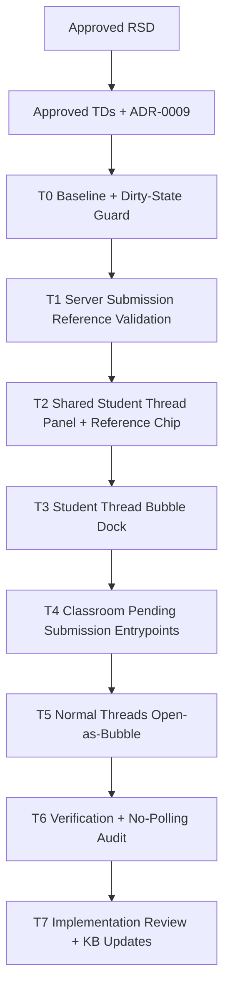

# Trainer Submission Thread Bubbles Task Plan

Status: Implemented - Pending Implementation Review Approval
Task ID: trainer-submission-thread-bubbles-20260801
Last updated: 2026-08-01
Delivery mode: Manual

## Mode and Gate Results

RSD gate was approved by the user on 2026-08-01. Technical decisions and ADR-0009 were approved by the user on 2026-08-01. The full task plan and dependency graph were approved by the user on 2026-08-01.

Gates waited on:
- RSD approval.
- Technical decisions and ADR approval.
- Full task plan and dependency graph approval.

Gates not yet satisfied:
- User approval of the implementation review before final merge.

## Documentation and Knowledge Used

- Source: `docs/rsd/trainer-submission-thread-bubbles-20260801-rsd.md`
  Used for: acceptance criteria and scope
  Evidence: both live and topic pending submissions need student-thread bubbles; referenced messages must show validated submission context to trainer and student.
  Confidence: High
- Source: `docs/decisions/trainer-submission-thread-bubbles-20260801-technical-decisions.md`
  Used for: task boundaries
  Evidence: student-thread bubbles replace legacy problem bubbles; message metadata holds server-validated `submission_reference`.
  Confidence: High
- Source: `docs/adr/0009-student-thread-submission-reference-metadata.md`
  Used for: durable metadata contract
  Evidence: references are display context only and must be resolved from authoritative submission rows.
  Confidence: High
- Source: `docs/adr/0008-classroom-student-thread-realtime-model.md`
  Used for: communication model constraints
  Evidence: `Threads` is the only active classroom conversation surface and old problem-thread UI is legacy.
  Confidence: High
- Source: `AGENTS.md`
  Used for: process, verification, and review rules
  Evidence: manual gates, artifact locations, narrow verification, and security checklist are required.
  Confidence: High
- Source: `docs/knowledge-base/project-index.md`
  Used for: current entry points
  Evidence: active student-thread server routes/components and this task's approved requirement scope are recorded.
  Confidence: High
- Source: `docs/knowledge-base/decisions.md`
  Used for: implementation constraints
  Evidence: active classroom conversation is student-scoped and submission references must be server validated.
  Confidence: High
- Source: `docs/knowledge-base/patterns.md`
  Used for: reference-validation pattern
  Evidence: client provides compact reference request; server resolves canonical metadata before insert.
  Confidence: High
- Source: `docs/knowledge-base/hci-rules.md`
  Used for: UI checks
  Evidence: communication surfaces must keep scope visible and separate notification/conversation/settings concepts.
  Confidence: High
- Source: `docs/knowledge-base/quality-rules.md`
  Used for: maintainability and auth checks
  Evidence: student-thread policy remains server-owned and classroom live should not add hidden polling.
  Confidence: High
- Source: `client/src/components/ClassroomThreadsTab.js`
  Used for: client task shaping
  Evidence: current component owns thread panel, composer, attachment flow, realtime, and message rendering.
  Confidence: High
- Source: `client/src/components/FloatingThreadDock.js`
  Used for: bubble task shaping
  Evidence: current dock renders legacy problem-thread UI and should not be reused unchanged.
  Confidence: High
- Source: `client/src/app/classroom/live/[id]/ClassroomLiveClient.js`
  Used for: pending-submission entry points
  Evidence: live pending rows and topic pending cards already render review/thread button areas.
  Confidence: High
- Source: `server/src/controllers/classroomController.ts`
  Used for: server task shaping
  Evidence: student-thread message/attachment endpoints and live/topic submission status flows are implemented here.
  Confidence: High
- Source: `server/src/utils/classroomStudentThreadsSchema.ts`
  Used for: metadata helper placement
  Evidence: student-thread messages already support `metadata jsonb` and safe attachment helpers live here.
  Confidence: High
- Source: `references/hci-design-rules.md`
  Used for: task HCI checks
  Evidence: discoverability, feedback, mapping, constraints, error recovery, and accessibility are blocking checks.
  Confidence: High
- Source: `references/code-quality-rules.md`
  Used for: task code-quality checks
  Evidence: small, test-backed, requirement-driven changes with no duplicated policy or drive-by churn.
  Confidence: High

## Dependency Graph

## Parallelism Decision

Implementation will run serially in the current workspace. No parallel worktrees are planned because the tasks share `server/src/controllers/classroomController.ts`, `client/src/components/ClassroomThreadsTab.js`, `client/src/app/classroom/live/[id]/ClassroomLiveClient.js`, and the student-thread mental model. Existing dirty and untracked files must be preserved.

## Tasks

### T0: Baseline and Dirty-State Guard

Purpose:
Capture the current source state and identify active student-thread, pending-submission, and legacy problem-thread bubble entry points before editing.

Depends on:
None.

Write scope:
No source edits expected.

Agent:
Main agent.

Branch/worktree:
Current workspace.

Acceptance checks:
- [ ] `git status --short --branch` captured.
- [ ] Current imports/usages of `FloatingThreadDock`, `ProblemThread`, `ClassroomThreadsTab`, and pending submission helpers are listed.
- [ ] Existing dirty/untracked work is treated as preserved context.

HCI checks:
- [ ] Identify all current "Thread" actions so the new UI has one clear student-thread model.

Code-quality checks:
- [ ] Avoid deleting legacy files or reverting dirty changes outside approved scope.

Verification:
- `git status --short --branch`
- `rg -n "FloatingThreadDock|ProblemThread|ClassroomThreadsTab|pendingSubmissions" client/src server/src`

Merge notes:
No merge action.

### T1: Server Submission Reference Validation

Purpose:
Allow optional submission reference data on student-thread message and attachment sends, then validate and canonicalize it server-side before storing message metadata.

Depends on:
T0.

Write scope:
- `server/src/controllers/classroomController.ts`
- `server/src/utils/classroomStudentThreadsSchema.ts`
- `server/src/routes/classroomRoute.ts` only if route signatures need documentation-compatible tweaks.

Agent:
Main agent.

Branch/worktree:
Current workspace.

Acceptance checks:
- [ ] `POST /classroom/:id/student-threads/:studentId/messages` accepts optional `submissionReference`.
- [ ] `POST /classroom/:id/student-threads/:studentId/attachments` accepts optional `submissionReference`.
- [ ] Live references validate route classroom, selected thread student, `class_problems.id`, and `pending_approval`.
- [ ] Topic references validate route classroom, selected thread student, `classroom_topic_problem_progress.id`, active assignment/problem relationship, and `pending_approval`.
- [ ] Server persists canonical `metadata.submission_reference`.
- [ ] Server rejects invalid, stale, cross-student, and cross-classroom references without inserting a referenced message.
- [ ] Attachment upload does not persist attachment metadata if reference validation fails.
- [ ] Message sending without a reference remains unchanged.

HCI checks:
- [ ] Validation failures return recoverable copy explaining whether the submission is unavailable, no longer pending, or unauthorized.

Code-quality checks:
- [ ] Keep reference normalization in one helper near student-thread access/message insertion.
- [ ] Do not store solution code, storage paths, or hidden trainer notes in metadata.

Verification:
- Server Bun bundle smoke after server changes.
- API smoke/manual negative cases if local services are available.

Merge notes:
Must land before client sends referenced messages.

### T2: Shared Student Thread Panel and Reference Chip

Purpose:
Refactor `ClassroomThreadsTab.js` only enough to reuse the message panel/composer in both the full tab and bubble dock, and render submission-reference chips on returned messages.

Depends on:
T1.

Write scope:
- `client/src/components/ClassroomThreadsTab.js`
- Optional focused new component file such as `client/src/components/StudentThreadPanel.js` if extraction makes the file clearer.

Agent:
Main agent.

Branch/worktree:
Current workspace.

Acceptance checks:
- [ ] Full `Threads` tab still lists/selects trainer student threads.
- [ ] Student view still opens own thread.
- [ ] Human messages, attachments, latest events, realtime status, explicit refresh, and jump-to-latest still work.
- [ ] Messages with `metadata.submission_reference` render a compact visible reference chip for both trainer and student.
- [ ] Chip includes type, problem title, optional topic/class label, status, and submitted time where available.
- [ ] Chip does not render solution code, private storage paths, or hidden notes.

HCI checks:
- [ ] Referenced messages are visually distinct from normal messages and system events using text/icon cues, not only color.
- [ ] Reference chip stays readable in mobile and desktop widths without overlapping message text.

Code-quality checks:
- [ ] Avoid duplicating composer/attachment/realtime logic for bubble and full tab.
- [ ] Keep extracted props focused on classroom id, student id, user, optional submission context, and callbacks.

Verification:
- Targeted ESLint for changed client files.

Merge notes:
Must land before bubble dock uses the shared panel.

### T3: Student Thread Bubble Dock

Purpose:
Add a floating dock for student-thread conversations that can render normal bubbles and submission-context bubbles without using legacy `ProblemThread`.

Depends on:
T2.

Write scope:
- New file such as `client/src/components/StudentThreadBubbleDock.js`
- Existing `client/src/components/FloatingThreadDock.js` only if extracting shared visual helpers is safe and scoped.

Agent:
Main agent.

Branch/worktree:
Current workspace.

Acceptance checks:
- [ ] Dock opens a student-thread bubble for a given `classroomId` and `studentId`.
- [ ] Dock passes optional `submissionReference` into sends and attachments.
- [ ] Bubble header shows student scope and optional submission context.
- [ ] Duplicate normal bubbles focus existing normal student bubble.
- [ ] Duplicate submission-context bubbles focus existing matching context bubble.
- [ ] Existing maximum visible bubble count or a comparable cap prevents clutter.
- [ ] Close and minimize controls work and have accessible labels.

HCI checks:
- [ ] Bubble position does not cover primary review controls on common desktop/mobile widths where feasible.
- [ ] The header makes the bubble's mode visible so trainers know whether messages will carry a submission reference.

Code-quality checks:
- [ ] Keep bubble key generation in one helper.
- [ ] Do not reuse legacy `problemId/problemType` semantics for student-thread bubbles.

Verification:
- Targeted ESLint for the dock and shared panel.

Merge notes:
Must land before classroom page wires entry points.

### T4: Classroom Pending Submission Entrypoints

Purpose:
Wire thread actions beside live class pending submissions and topic pending submission cards to open student-thread bubbles with the right context.

Depends on:
T3.

Write scope:
- `client/src/app/classroom/live/[id]/ClassroomLiveClient.js`

Agent:
Main agent.

Branch/worktree:
Current workspace.

Acceptance checks:
- [ ] Live class pending rows show a `Thread` or `Open thread` action.
- [ ] Topic pending submission cards in both visible pending surfaces show the same action.
- [ ] Live context includes `type`, `classProblemId`, `studentId`, `problemTitle`, `classId`, `className`, and `submittedAt` where available.
- [ ] Topic context includes `type`, `progressId`, `assignmentId`, `topicProblemId`, `studentId`, `problemTitle`, `topicTitle`, and `submittedAt` where available.
- [ ] Clicking opens a student-thread bubble without navigating or changing active tab.
- [ ] Existing Review, approve, reject, notes, and status controls remain unchanged.
- [ ] Pending topic list payload has enough fields; if not, add only required fields through existing authorized endpoint.

HCI checks:
- [ ] The action sits near review controls but does not imply approve/reject.
- [ ] Bubble reference header confirms the submission context immediately after click.

Code-quality checks:
- [ ] Use local helper functions to build live/topic context objects.
- [ ] Keep edits to existing pending-submission blocks minimal and avoid unrelated layout churn.

Verification:
- Targeted ESLint for `ClassroomLiveClient.js`.

Merge notes:
High-conflict file; complete after reusable components are stable.

### T5: Normal Threads Open-as-Bubble

Purpose:
Add the requested open-as-bubble option to the normal `Threads` tab.

Depends on:
T3.

Write scope:
- `client/src/components/ClassroomThreadsTab.js`
- `client/src/app/classroom/live/[id]/ClassroomLiveClient.js` for passing the bubble opener callback.

Agent:
Main agent.

Branch/worktree:
Current workspace.

Acceptance checks:
- [ ] Trainer selected thread panel shows an `Open bubble` action.
- [ ] Student own thread panel shows an `Open bubble` action.
- [ ] Normal bubble sends ordinary messages with no required `submission_reference`.
- [ ] Opening a normal bubble does not disrupt the full `Threads` tab state.

HCI checks:
- [ ] The control is placed near the selected conversation title and uses an understandable icon/label.

Code-quality checks:
- [ ] Use an optional callback prop so `ClassroomThreadsTab` still works where no bubble dock is mounted.

Verification:
- Targeted ESLint for changed files.

Merge notes:
Can land with T4 after dock support exists.

### T6: Verification and No-Polling Audit

Purpose:
Run checks covering server validation, client integration, and no hidden polling.

Depends on:
T1 through T5.

Write scope:
No source edits unless fixes are required.

Agent:
Main agent.

Branch/worktree:
Current workspace.

Acceptance checks:
- [ ] Server bundle smoke passes or changed-file blockers are documented.
- [ ] Targeted ESLint for changed client files passes or blockers are documented.
- [ ] Client build passes if integration risk warrants it.
- [ ] `git diff --check` passes or line-ending-only warnings are documented.
- [ ] Search confirms no new `setInterval`, `visibilitychange`, `refetchInterval`, or polling behavior was introduced.
- [ ] Manual trainer/student scenarios are run where local credentials/services allow; skipped live QA is documented.

HCI checks:
- [ ] Desktop/mobile visual pass confirms bubbles, chips, and controls do not overlap.
- [ ] Error/retry states are visible when reference validation fails.

Code-quality checks:
- [ ] Review for duplicated reference validation, duplicated composer logic, and legacy problem-thread leakage.

Verification:
- `Set-Location server; bun build src/index.ts --target=bun --outdir ..\build-check-submission-thread-bubbles`
- `Set-Location client; npm run lint`
- `Set-Location client; npm run build`
- `git diff --check`
- `rg -n "setInterval|visibilitychange|refetchInterval|poll" client/src/components client/src/app/classroom/live server/src`

Merge notes:
Any failure in changed files blocks implementation review unless explicitly waived.

### T7: Implementation Review and Knowledge Base Updates

Purpose:
Record traceability, reviewer/security/HCI/code-quality findings, verification results, residual risk, changed files, and durable learning before final manual gate.

Depends on:
T6.

Write scope:
- `docs/reviews/trainer-submission-thread-bubbles-20260801-implementation-review.md`
- `docs/knowledge-base/project-index.md`
- `docs/knowledge-base/decisions.md`
- `docs/knowledge-base/patterns.md`
- `docs/knowledge-base/hci-rules.md`
- `docs/knowledge-base/quality-rules.md`
- `docs/knowledge-base/doc-usage.md`
- `docs/knowledge-base/mistakes.md`

Agent:
Main agent.

Branch/worktree:
Current workspace.

Acceptance checks:
- [ ] Review maps implementation to every RSD acceptance criterion.
- [ ] Security review covers server-side reference validation, auth, data exposure, attachments, realtime payloads, secrets, and unsafe defaults.
- [ ] HCI review covers discoverability, signifiers, feedback, mapping, constraints, error recovery, accessibility, and bubble scope clarity.
- [ ] Code-quality review covers module boundaries, reuse, duplication, legacy thread isolation, and complexity.
- [ ] Documentation-learning audit names docs used and KB updates required.
- [ ] Final mistake or near-miss note is added.

HCI checks:
- [ ] Any UI compromise is named as a waiver before final approval.

Code-quality checks:
- [ ] Any remaining smell or broad-file complexity is recorded with scope limits.

Verification:
- Review artifact inspection.

Merge notes:
Manual implementation-review gate must be approved before final merge, staging, commit, push, or cleanup actions.

## Final Git Integration Plan

- Base ref: current `master` workspace, preserving existing dirty changes.
- Integration branch/worktree: current workspace unless the user asks for a dedicated branch before implementation.
- Branches/worktrees to merge: none planned.
- Merge order: serial tasks T0 through T7.
- Staging/commit/push: not part of this task-plan gate unless the user later asks for Git delivery.
- Full verification after implementation:
  - Server Bun bundle smoke.
  - Targeted client lint, then client build when integration is complete.
  - `git diff --check`.
  - Manual classroom trainer/student QA where credentials and services are available.

## Approval Result

Manual-mode task-plan gate was approved by the user on 2026-08-01. Implementation may proceed in the current workspace according to this plan.
