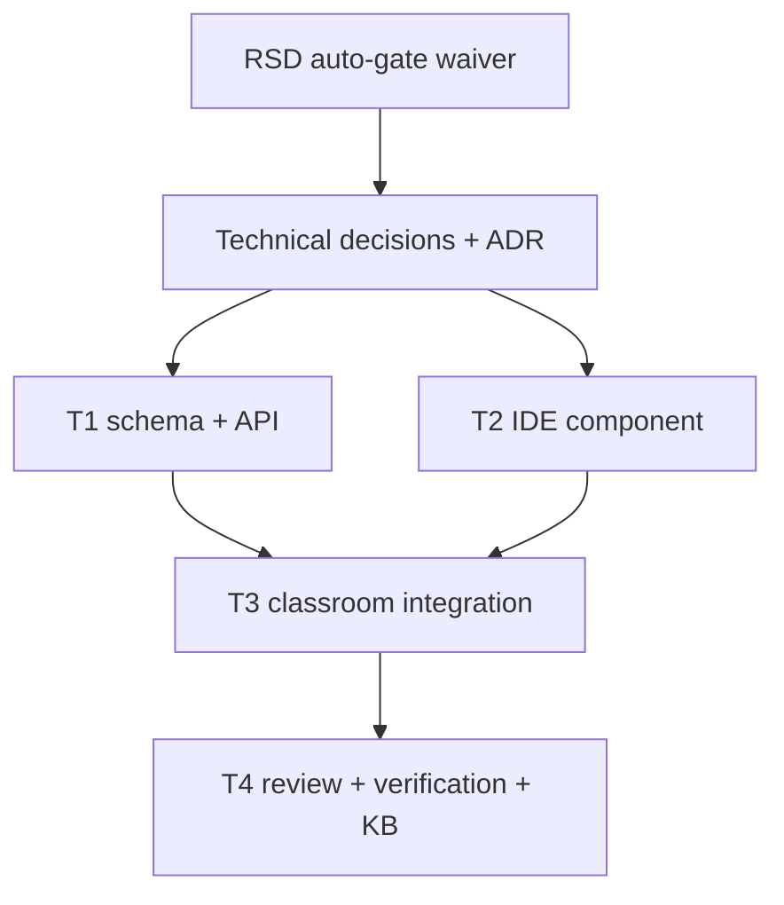

# Trainer Team Dashboard IDE Monitor Task Plan

Status: Approved
Task ID: trainer-team-dashboard-ide-monitor-20260725
Last updated: 2026-07-25
Delivery mode: Auto

## Mode and Gate Policy

Gates waited on: none. Gates skipped: task-plan approval. Waiver: `mode:auto` permits continuing after recording scope, dependencies, and risks.

## Documentation and Knowledge Used

- Source: `docs/rsd/trainer-team-dashboard-ide-monitor-20260725-rsd.md`
  Used for: task scope and acceptance checks.
  Evidence: topic editor, assignment visibility, team dashboard, IDE monitor, and no runner are required.
  Confidence: High
- Source: `docs/decisions/trainer-team-dashboard-ide-monitor-20260725-technical-decisions.md`
  Used for: write scope and architecture.
  Evidence: CodeMirror client component, session/event tables, and separate monitor endpoint were selected.
  Confidence: High
- Source: `docs/adr/0005-classroom-ide-monitoring.md`
  Used for: schema/API tasks.
  Evidence: latest session row plus append-only event rows are accepted.
  Confidence: High
- Source: `docs/knowledge-base/patterns.md`
  Used for: work mode.
  Evidence: overlapping classroom resource/topic work should run serially in main workspace.
  Confidence: High
- Source: `rsd-orchestrator-agent/references/hci-design-rules.md`
  Used for: UI checks.
  Evidence: monitoring state and disabled run state must be explicit.
  Confidence: High
- Source: `rsd-orchestrator-agent/references/code-quality-rules.md`
  Used for: complexity checks.
  Evidence: small cohesive modules and no unrelated refactors.
  Confidence: High

## Dependency Graph

## Tasks

### T1: IDE Schema and Server Endpoints

Purpose:
Persist current IDE code state and recent behavior events.

Depends on:
TD-003 and ADR-0005.

Write scope:
`server/src/utils/dbInit.ts`, `server/src/controllers/classroomController.ts`, `server/src/routes/classroomRoute.ts`.

Agent:
Main agent, serial.

Branch/worktree:
Main workspace on `master`; no parallel worktree because controller/page/schema scopes overlap.

Acceptance checks:

- [ ] `classroom_ide_sessions` and `classroom_ide_events` are initialized.
- [ ] Student activity endpoint requires classroom access and rejects trainer/admin monitor writes.
- [ ] Trainer activity endpoint requires trainer/admin management access.
- [ ] Events are normalized and bounded.

HCI checks:

- [ ] Server event labels support clear trainer display.

Code-quality checks:

- [ ] Policy checks stay server-side.
- [ ] Endpoint payloads are small and bounded.

Verification:
`bun build src/index.ts --target=bun --outdir .codex-build-ide-monitor` from `server/`.

### T2: Client IDE Component

Purpose:
Provide a browser IDE with intellisense/autocomplete, monitoring telemetry, and disabled runner.

Depends on:
TD-004.

Write scope:
`client/src/app/classroom/live/[id]/ClassroomIdePanel.jsx`.

Agent:
Main agent, serial.

Branch/worktree:
Main workspace on `master`.

Acceptance checks:

- [ ] CodeMirror editor renders client-side.
- [ ] Autocomplete/intellisense support is enabled.
- [ ] Run button is disabled and coming soon.
- [ ] Focus, blur, visibility, paste, large insert, language change, and code updates are logged.
- [ ] Student sees monitoring status.

HCI checks:

- [ ] Run unavailable state is explicit.
- [ ] Saved/logging state is visible.

Code-quality checks:

- [ ] Editor implementation is isolated from the already-large classroom page.

Verification:
Targeted ESLint/build from `client/`.

### T3: Classroom Live Integration

Purpose:
Connect topic resource editor, assignment visibility, team dashboard, student IDE, and trainer monitor.

Depends on:
T1, T2.

Write scope:
`client/src/app/classroom/live/[id]/ClassroomLiveClient.js`.

Agent:
Main agent, serial.

Branch/worktree:
Main workspace on `master`.

Acceptance checks:

- [ ] Topic resource content uses `EditorWrapper`.
- [ ] Topic cards use aggregate assignment counts, not team names.
- [ ] Trainer analytics tab shows whole-team dashboard with IDE monitor.
- [ ] Student view shows IDE panel.

HCI checks:

- [ ] Team dashboard is scannable and dense.
- [ ] Monitor evidence is not framed as automatic guilt.

Code-quality checks:

- [ ] Local pure helpers for dashboard aggregation.
- [ ] No unrelated route/API churn.

Verification:
Targeted ESLint/build from `client/`.

### T4: Review, Verification, Knowledge Base

Purpose:
Confirm traceability, security, HCI, code quality, and repository memory updates.

Depends on:
T1, T2, T3.

Write scope:
`docs/reviews/`, `docs/knowledge-base/`.

Agent:
Main agent, serial.

Branch/worktree:
Main workspace on `master`.

Acceptance checks:

- [ ] Implementation review created.
- [ ] Knowledge base records IDE monitor and assignment visibility rules.
- [ ] Mistake/near-miss note records monitor limitations.
- [ ] Verification results recorded.

Verification:
`git diff --check`, server bundle check, targeted client lint, client build if feasible.

## Final Git Integration Plan

- Base ref: current `master`.
- Integration branch or main worktree: main workspace.
- Branches/worktrees to merge: none.
- Merge order: serial direct integration.
- Full verification after integration:
  - `git diff --check`
  - `Set-Location server; bun build src/index.ts --target=bun --outdir .codex-build-ide-monitor`
  - `Set-Location client; npx eslint src/app/classroom/live/[id]/ClassroomLiveClient.js src/app/classroom/live/[id]/ClassroomIdePanel.jsx`
  - `Set-Location client; npm run build` if feasible
