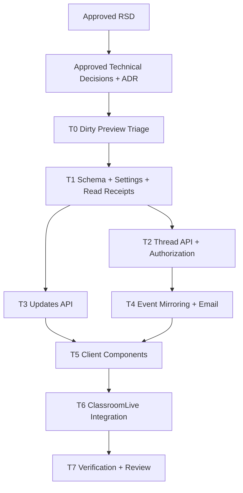

# Trainer Updates and Problem Threads Task Plan

Status: Approved
Task ID: trainer-updates-problem-threads-20260728
Last updated: 2026-07-29
Delivery mode: Manual

## Mode and Gate Policy

RSD gate was approved on 2026-07-28.
Technical decisions and ADR gate was approved on 2026-07-28.
This task plan was approved on 2026-07-29 before implementation.

## Documentation and Knowledge Used

- Source: `docs/rsd/trainer-updates-problem-threads-20260728-rsd.md`
  Used for: task requirements and acceptance checks
  Evidence: Updates is first/default tab; per-problem threads replace generic messaging; emails respect classroom settings.
  Confidence: High
- Source: `docs/decisions/trainer-updates-problem-threads-20260728-technical-decisions.md`
  Used for: implementation boundaries and sequencing
  Evidence: load/action-only Updates, event-backed emails, explicit thread references, no destructive table drops.
  Confidence: High
- Source: `docs/adr/0007-classroom-problem-thread-update-model.md`
  Used for: durable data/API model
  Evidence: thread/update model avoids polling and loose problem ids.
  Confidence: High
- Source: `AGENTS.md`
  Used for: gates, verification, and knowledge-base updates
  Evidence: manual mode requires approval after task plan and implementation review.
  Confidence: High
- Source: `docs/knowledge-base/project-index.md`
  Used for: entry points and approved requirement memory
  Evidence: classroom live work centers on `ClassroomLiveClient.js`, `classroomController.ts`, and `classroomRoute.ts`.
  Confidence: High
- Source: `docs/knowledge-base/decisions.md`
  Used for: no-polling and notification/email decisions
  Evidence: old notification path removed; new Updates must not revive it.
  Confidence: High
- Source: `docs/knowledge-base/mistakes.md`
  Used for: cleanup task
  Evidence: preview work placed destructive chat table drops in `ensurePreEnrollmentSchema()`.
  Confidence: High
- Source: `references/worktree-parallelism.md`
  Used for: branch/worktree plan
  Evidence: parallel worktrees require disjoint write scopes and clean-enough state.
  Confidence: High
- Source: `references/hci-design-rules.md`
  Used for: UI task checks
  Evidence: discoverability, feedback, error recovery, accessibility, and signifiers are blocking checks.
  Confidence: High
- Source: `references/code-quality-rules.md`
  Used for: implementation shape
  Evidence: avoid broad rewrites, speculative abstractions, unrelated destructive churn, and duplicated policy.
  Confidence: High
- Source: `server/src/controllers/classroomController.ts`
  Used for: backend write scope and current submission workflows
  Evidence: live/topic submission and trainer verification paths already exist and must remain authoritative.
  Confidence: High
- Source: `client/src/app/classroom/live/[id]/ClassroomLiveClient.js`
  Used for: frontend integration
  Evidence: trainer and student tabs are controlled and currently overlap with preview edits.
  Confidence: High

## Dependency Graph

## Parallelization and Git Plan

Implementation should run serially in the main workspace.

Reason:
- The worktree is already dirty with preview-generated edits in `ClassroomLiveClient.js`, `classroomController.ts`, `classroomRoute.ts`, and `classroomPreEnrollment.ts`.
- The approved tasks overlap heavily across backend authorization, schema, email, and classroom UI.
- Parallel worktrees would require copying or reverting dirty preview edits and would create high merge risk.

Branch/worktree:
- Use the current main workspace after task-plan approval.
- Do not create parallel worktrees for this task.
- Before implementation, record `git status --short` and preserve unrelated/user changes.

Final integration:
- No branch merge is planned unless the user requests a branch.
- If a branch is later requested, use prefix `codex/` and follow app Git directive rules after successful branch creation.

## Tasks

### T0: Dirty Preview Triage and Safety Cleanup

Purpose:
Review existing preview-generated source changes, keep only behavior that matches approved decisions, and remove unsafe/incomplete pieces.

Depends on:
- Approved task plan.

Write scope:
- `server/src/utils/classroomPreEnrollment.ts`
- `server/src/controllers/classroomController.ts`
- `server/src/routes/classroomRoute.ts`
- `client/src/app/classroom/live/[id]/ClassroomLiveClient.js`
- Superseded preview docs only if a correction is needed.

Acceptance checks:
- [ ] Remove chat table `DROP TABLE` statements from `ensurePreEnrollmentSchema()`.
- [ ] Identify missing imported client components and either create them in later tasks or remove temporary imports until ready.
- [ ] Remove or replace incomplete preview controller functions/routes that do not match approved schema and authorization.
- [ ] No unrelated user changes are reverted.

HCI checks:
- [ ] The active classroom UI should not expose broken buttons, missing components, or dead chat affordances.

Code-quality checks:
- [ ] No destructive DDL in unrelated runtime helpers.
- [ ] No partial implementation that compiles only by accident.

Verification:
- `git diff --check`
- Targeted search for `DROP TABLE IF EXISTS public.classroom_messages` outside approved migrations.

### T1: Schema, User Settings, and Read Receipts Backend

Purpose:
Add safe runtime schema support, authenticated classroom update settings, and per-user read receipts.

Depends on:
- T0

Write scope:
- `server/src/controllers/userController.ts`
- `server/src/routes/userRoute.ts`
- New or existing server schema helper location chosen during implementation.
- `server/src/controllers/classroomController.ts` only for shared constants/helpers if needed.

Acceptance checks:
- [ ] `user_settings` exists with namespaced classroom fields.
- [ ] Thread/message/reaction tables exist with explicit live/topic references and indexes.
- [ ] `classroom_update_read_receipts` exists with per-user/per-classroom stable update keys.
- [ ] `/user/classroom-settings` GET returns defaults for users without rows.
- [ ] `/user/classroom-settings` POST validates priority values and boolean toggle.
- [ ] User settings are derived from JWT identity only.

HCI checks:
- [ ] API errors are specific enough for settings UI recovery.

Code-quality checks:
- [ ] Centralize valid update types and defaults.
- [ ] Keep migration helper idempotent and non-destructive.

Verification:
- `Set-Location server; bun build src/index.ts --target=bun --outdir ../.codex-build/server-settings`

### T2: Problem Thread API and Authorization

Purpose:
Implement scoped thread read/post/reaction endpoints with server-side participant checks.

Depends on:
- T1

Write scope:
- `server/src/controllers/classroomController.ts`
- `server/src/routes/classroomRoute.ts`

Acceptance checks:
- [ ] Fetch thread messages for authorized trainer/substitute, target student, or assigned topic group member.
- [ ] Reject unrelated users.
- [ ] Post messages with length validation and thread scope validation.
- [ ] Toggle reactions with allowed reaction values and uniqueness.
- [ ] Return reaction counts and current-user reaction state.
- [ ] Topic threads do not leak hidden group assignment mappings.

HCI checks:
- [ ] API supports clear empty, forbidden, and validation states for the UI.

Code-quality checks:
- [ ] Thread access logic is a cohesive helper, not duplicated SQL fragments.
- [ ] Thread target/deep-link metadata is returned from one helper shape so cards and emails do not invent their own access model.
- [ ] Avoid loose text polymorphism for problem identity.

Verification:
- `Set-Location server; bun build src/index.ts --target=bun --outdir ../.codex-build/server-thread`
- Manual route-shape review.

### T3: Updates API

Purpose:
Implement load/action-only prioritized Updates endpoint for trainer and student views.

Depends on:
- T1

Write scope:
- `server/src/controllers/classroomController.ts`
- `server/src/routes/classroomRoute.ts`

Acceptance checks:
- [ ] Trainer updates include `time_exceeded`, `student_solution_submitted`, `student_needs_review`, `problem_progress_changed`, and `thread_reply`.
- [ ] Student updates include `new_problem`, `teacher_feedback`, `thread_reply`, `solution_status_changed`, and `topic_or_resource_updated`.
- [ ] Sorting uses saved priority order then newest timestamp.
- [ ] Returned items include server-generated `update_key`, `is_read`, and `read_at`.
- [ ] Endpoint performs one request per user action/load and does not create email side effects.
- [ ] Returned items include safe deep-link metadata.
- [ ] `POST /classroom/:id/updates/read` marks specified visible update keys as read for the current user.
- [ ] `POST /classroom/:id/updates/read-all` derives and marks all currently visible update keys for the current user.

HCI checks:
- [ ] Data supports type badges, urgency labels, actor names, timestamps, and next actions.

Code-quality checks:
- [ ] Query helpers stay bounded and role-aware.
- [ ] Mark-read writes validate update visibility server-side.
- [ ] Unknown update types cannot crash sorting.

Verification:
- `Set-Location server; bun build src/index.ts --target=bun --outdir ../.codex-build/server-updates`
- Search for `setInterval`/visibility refetch additions in client after integration.

### T4: Event Mirroring and Classroom Email Helper

Purpose:
Mirror successful mutations into thread events and send classroom update emails when recipient settings allow it.

Depends on:
- T2
- T3

Write scope:
- `server/src/controllers/classroomController.ts`
- `server/src/sendEmail.ts`
- Optional new server helper under `server/src/utils/`

Acceptance checks:
- [ ] New problem assignments can notify assigned students.
- [ ] Student solution submissions can notify trainer.
- [ ] Trainer feedback/status changes can notify the student.
- [ ] Thread replies can notify the counterpart participant(s).
- [ ] `time_exceeded` does not send email in v1.
- [ ] Disabled classroom email setting suppresses classroom update emails.
- [ ] Email failures do not fail the originating request.
- [ ] Email HTML escapes user content and omits full solution code.
- [ ] SMTP credentials are not logged.

HCI checks:
- [ ] Email subject/body clearly identifies classroom, problem, actor, and next action.

Code-quality checks:
- [ ] One helper owns preference checks, content escaping, truncation, and fire-and-forget dispatch.
- [ ] Controllers do not duplicate email formatting.

Verification:
- `Set-Location server; bun build src/index.ts --target=bun --outdir ../.codex-build/server-email`
- Static review for secret logging and code leakage.

### T5: Client Components

Purpose:
Build focused UI components for Updates, problem threads, and settings.

Depends on:
- T2
- T3
- T4

Write scope:
- `client/src/components/UpdatesTab.jsx` or `.js`
- `client/src/components/ProblemThread.jsx` or `.js`
- `client/src/components/ClassroomUpdateSettings.jsx` or `.js`
- Reusable local helper file only if necessary.

Acceptance checks:
- [ ] Updates displays loading, empty, error, and refresh states.
- [ ] Updates cards show type, actor, timestamp, problem title, and read-state action.
- [ ] Updates cards visually distinguish unread/read state and expose `Mark as read` for unread items.
- [ ] Updates header exposes `Mark all as read` when unread items exist.
- [ ] Problem thread displays messages, event badges, reactions, composer, loading, empty, and errors.
- [ ] Settings displays email toggle and drag reorder with keyboard move controls.
- [ ] Components use existing shadcn/Radix/Tailwind/lucide patterns.

HCI checks:
- [ ] Controls are discoverable and accessible by keyboard.
- [ ] Color is not the only indicator of update type or priority.
- [ ] Save/post actions show immediate progress and result feedback.
- [ ] Read actions show immediate feedback and do not unexpectedly erase context.

Code-quality checks:
- [ ] Components are cohesive and do not create a broad notification framework.
- [ ] Props are domain-shaped and minimal.

Verification:
- `Set-Location client; npm run lint`
- `Set-Location client; npm run build` if integration risk remains high.

### T6: ClassroomLive Integration and Generic Messaging Removal

Purpose:
Wire approved components into trainer/student classroom tabs and remove generic messaging from the active UI.

Depends on:
- T5

Write scope:
- `client/src/app/classroom/live/[id]/ClassroomLiveClient.js`
- Related client imports only when required.

Acceptance checks:
- [ ] Trainer `Updates` tab is first and default active tab.
- [ ] Student `Updates` tab is first and default active tab.
- [ ] Live class problem cards expose scoped threads.
- [ ] Topic problem cards expose scoped threads with assignment-aware context.
- [ ] Updates cards do not open/focus threads; users open threads from live/topic/challenge problem cards or lists.
- [ ] Classroom deep links can select the target tab/problem and open/focus the thread when authorized.
- [ ] Unauthorized or unavailable thread deep links show a recoverable message.
- [ ] Existing solution submission dialogs still work and remain source of truth.
- [ ] Generic classroom chat/pet messaging affordance is gone from active classroom UI.
- [ ] No polling/visibility refetch is added.

HCI checks:
- [ ] Thread and settings placement is visible but does not crowd core problem actions.
- [ ] Deep links from Updates can guide users to relevant problem/thread context.
- [ ] The access model is visible: users can tell the thread belongs to a specific problem.

Code-quality checks:
- [ ] Keep edits narrow in `ClassroomLiveClient.js`.
- [ ] Remove dead imports/state from generic chat cleanup.

Verification:
- `Set-Location client; npm run lint`
- `Set-Location client; npm run build`

### T7: Verification, Review, and Knowledge-Base Update

Purpose:
Run checks, perform required reviews, and create the implementation review artifact for the final approval gate.

Depends on:
- T6

Write scope:
- `docs/reviews/trainer-updates-problem-threads-20260728-implementation-review.md`
- `docs/knowledge-base/project-index.md`
- `docs/knowledge-base/patterns.md`
- `docs/knowledge-base/decisions.md`
- `docs/knowledge-base/hci-rules.md`
- `docs/knowledge-base/quality-rules.md`
- `docs/knowledge-base/doc-usage.md`
- `docs/knowledge-base/mistakes.md`

Acceptance checks:
- [ ] Implementation review traces every RSD acceptance criterion.
- [ ] Security review covers auth, permissions, data exposure, injection, secrets, logging, dependencies, and unsafe defaults.
- [ ] HCI review covers discoverability, signifiers, feedback, mapping, error recovery, accessibility, and mode clarity.
- [ ] Code-quality review covers complexity, interfaces, duplication, smells, and abstractions.
- [ ] Documentation-learning audit names docs used and stale/missing docs found.
- [ ] Knowledge base updated with durable lessons and at least one mistake/near-miss note.

Verification:
- `git diff --check`
- `Set-Location server; bun build src/index.ts --target=bun --outdir ../.codex-build/server-final`
- `Set-Location client; npm run lint`
- `Set-Location client; npm run build`

## Review Checkpoints

- After T0: confirm unsafe preview DDL is gone and no broken imports remain.
- After T2/T3/T4: review backend authorization and email safety before client wiring.
- After T6: inspect UI states and absence of polling.
- After T7: present implementation review and ask for final merge/integration approval.

## Known Residual Risks Before Implementation

- Full client lint may still expose unrelated existing lint issues; if so, run targeted checks and document blockers honestly.
- Authenticated trainer/student email behavior may need environment-specific SMTP verification; build checks cannot prove delivery.
- Existing preview-generated source edits must be reconciled carefully without reverting unrelated user changes.

## Gate Request

Manual-mode task-plan gate was approved on 2026-07-29. Implementation proceeded serially in the main workspace.
