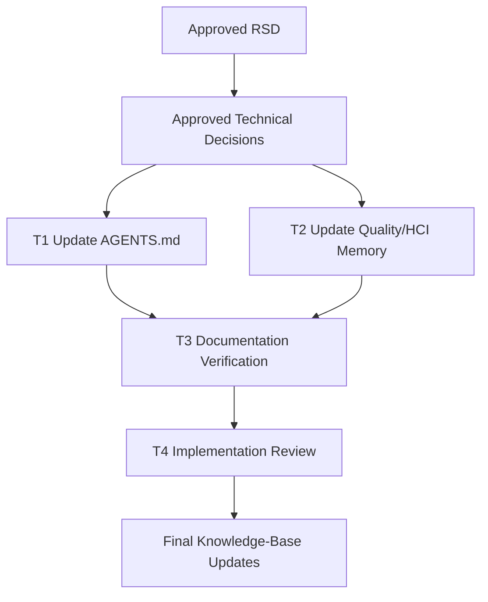

# Vercel Web Interface Guidelines Agent Policy Task Plan

Status: Approved
Task ID: vercel-web-interface-guidelines-20260802
Last updated: 2026-08-02
Approved: 2026-08-02 by user

## Documentation and Knowledge Used

- Source: `docs/rsd/vercel-web-interface-guidelines-20260802-rsd.md`
  Used for: approved requirements, scope, non-goals, and acceptance criteria.
  Confidence: High

- Source: `docs/decisions/vercel-web-interface-guidelines-20260802-technical-decisions.md`
  Used for: approved technical constraints and implementation approach.
  Confidence: High

- Source: `AGENTS.md`
  Used for: target location for future agent instructions and required repository workflow.
  Confidence: High

- Source: `docs/knowledge-base/quality-rules.md`, `docs/knowledge-base/hci-rules.md`, `docs/knowledge-base/decisions.md`
  Used for: durable project memory format and existing UI-quality rules.
  Confidence: High

- Source: `https://vercel.com/design/guidelines`
  Used for: canonical Vercel Web Interface Guidelines reference.
  Confidence: High

- Source: `https://raw.githubusercontent.com/vercel-labs/web-interface-guidelines/main/AGENTS.md`
  Used for: concise agent-oriented checklist categories.
  Confidence: High

## Dependency Graph

## Work Strategy

Work serially in the current workspace. This is a documentation and agent-policy change with overlapping repository memory files, so parallel worktrees would add coordination cost without useful isolation.

## T1: Add Standing Agent Guidance

Purpose:
Make future Codex page design consistently consult and apply Vercel's Web Interface Guidelines.

Write scope:
- `AGENTS.md`

Implementation steps:
- Add a clearly named section for Vercel Web Interface Guidelines.
- Link to `https://vercel.com/design/guidelines` as the canonical source.
- State that new pages and major page redesigns must follow the guideline unless an approved RSD records a deliberate exception.
- Require generated-interface review before final handoff across interaction, accessibility, responsive layout, content states, forms, animation, performance, contrast, and visual polish.
- Preserve existing project-specific design decisions and local shadcn/Radix/Tailwind/lucide patterns.
- State that this rule does not approve retroactive cleanup of existing pages.

Acceptance checks:
- [ ] `AGENTS.md` has a concise Vercel Web Interface Guidelines section.
- [ ] The section applies to new pages and major page redesigns.
- [ ] The section links to the canonical Vercel source.
- [ ] The section preserves local design/RSD decisions.

## T2: Record Durable Quality Memory

Purpose:
Make the rule discoverable through project memory during future planning and review.

Write scope:
- `docs/knowledge-base/quality-rules.md`
- `docs/knowledge-base/hci-rules.md` if interaction-specific wording belongs there
- `docs/knowledge-base/decisions.md`

Implementation steps:
- Add a dated quality rule with source references, applicability, and non-overgeneralization notes.
- Prefer `quality-rules.md` for the main rule because it is a quality baseline across generated pages.
- Add an `hci-rules.md` entry only if needed to capture interaction-specific concerns not already clear from `AGENTS.md`.
- Ensure decision memory already points to both the RSD and approved technical decisions.

Acceptance checks:
- [ ] Project memory records the Vercel guideline baseline.
- [ ] The memory entry explains when it applies.
- [ ] The memory entry says it does not authorize broad retroactive redesign.

## T3: Documentation Verification

Purpose:
Confirm the policy update satisfies the approved scope without unintended edits.

Commands/checks:
- `git diff -- AGENTS.md docs/knowledge-base/quality-rules.md docs/knowledge-base/hci-rules.md docs/knowledge-base/decisions.md docs/rsd/vercel-web-interface-guidelines-20260802-rsd.md docs/decisions/vercel-web-interface-guidelines-20260802-technical-decisions.md docs/tasks/vercel-web-interface-guidelines-20260802-task-plan.md`
- `git diff --check`

Checks:
- [ ] No application code, dependencies, server files, routes, API strings, schema, or auth logic changed.
- [ ] No external installer or review command added.
- [ ] Diff contains only approved documentation/policy files.

## T4: Implementation Review And Final Memory

Purpose:
Complete the repo workflow with traceability and a final implementation review.

Write scope:
- `docs/reviews/vercel-web-interface-guidelines-20260802-implementation-review.md`
- Final updates to `docs/knowledge-base/quality-rules.md`, `docs/knowledge-base/hci-rules.md`, or `docs/knowledge-base/decisions.md` only if verification reveals a needed correction.

Review checks:
- [ ] Requirement satisfaction.
- [ ] Correctness and scope control.
- [ ] Maintainability of agent guidance.
- [ ] Security/privacy checklist confirms documentation-only change with no application behavior impact.
- [ ] Verification results and residual risks are recorded.

## Rollback

Revert the added Vercel guideline section in `AGENTS.md` and this task's documentation/memory updates. No code, dependency, API, database, or deployment rollback is needed.

## Approval Gate

Full task plan and dependency graph approved by user on 2026-08-02.
